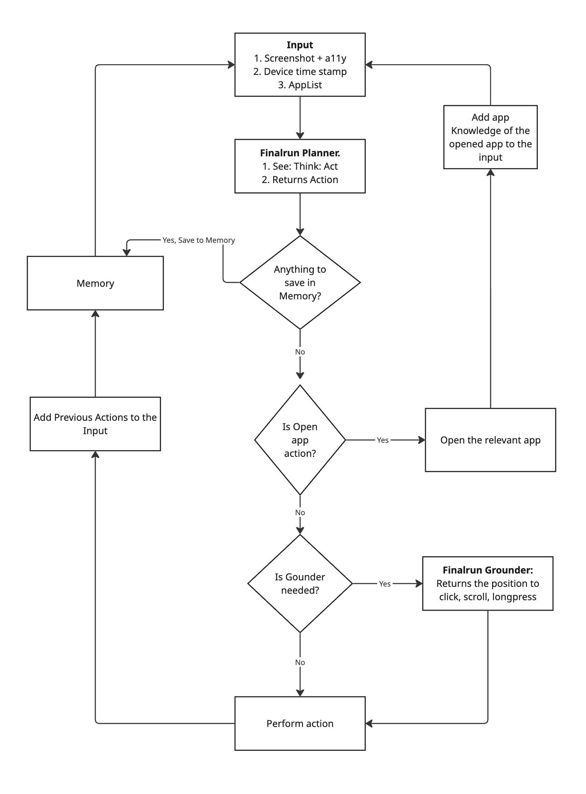
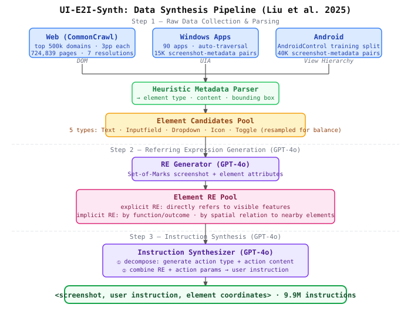
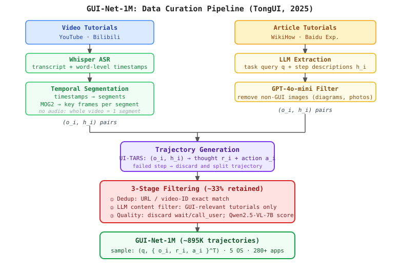

## Agentic frameworks
inspect AndroidWorld leaderboard
- [mobilerun](agentic_framework/mobilerun/index.html): claims 91.4% with gpt5 & gemini 2.5 pro. 8.4k stars on github. code for androidworld available.
    - use manager + executor. [details](agentic_framework/mobilerun/index.html)
    - test result: 
        - tried with gpt-4o: 38/116 tasks ~ 33%
        - tried with qwen3-4b-vl-instruct: 19%
- [autodevice](agentic_framework/autodevice/index.html): claims 94.8%, using gemini 3 pro + sonnet 4.5
    - prompts tuned for claude, test with gpt models --> always fail due to app not opened.
- [finalrun](https://github.com/final-run/finalrun-agent): claims 97.4%, no code for androidworld. 
## Datasets

### Offline benchmarks

#### Grounding

- [ScreenSpot](https://huggingface.co/datasets/rootsautomation/ScreenSpot) ([paper](https://arxiv.org/abs/2401.10935), [github](https://github.com/njucckevin/SeeClick)) (Cheng et al. 2024):
    - 1,272 samples (test-only, no train split)
    - each sample: screenshot + natural language instruction + bounding box + element type label
    - platforms: Mobile (iOS, Android), Desktop (macOS, Windows), Web
    - 6 evaluation splits: Mobile Text, Mobile Icon/Widget, Desktop Text, Desktop Icon/Widget, Web Text, Web Icon/Widget

- [ScreenSpot-V2](https://huggingface.co/datasets/OS-Copilot/ScreenSpot-v2) ([paper](https://arxiv.org/abs/2410.23218), [github](https://github.com/OS-Copilot/OS-Atlas)) (Wu et al. 2024):
    - 1,272 samples (same count as v1 — corrected annotations, not expanded)
    - each sample: screenshot + natural language instruction (rewritten to be more natural) + bounding box + element type label
    - same 6 splits as v1; ~11% of annotations corrected (spelling, ambiguity, near-duplicates, mislabeled bboxes)
    - platforms: Mobile (iOS, Android), Desktop (macOS, Windows), Web

- [ScreenSpot-Pro](https://arxiv.org/abs/2504.07981) ([paper](https://arxiv.org/abs/2504.07981)) (Li et al. 2025a):
    - 1,581 samples; each sample: screenshot + instruction + bounding box, split into Text and Icon/Widget subtasks
    - desktop UI only (three operating systems: Windows, macOS, Linux)
    - 23 professional applications:
        - Development & Programming: Visual Studio Code, PyCharm, Android Studio, Quartus, VMware
        - Creative: Photoshop, Premiere, Adobe Illustrator, Blender, FruitLoops Studio, Unreal Engine, DaVinci Resolve
        - CAD & Engineering: AutoCAD, SolidWorks, Inventor, Vivado
        - Scientific & Analytical: MATLAB, Origin, Stata, EViews
        - Office Suite: Word, PowerPoint, Excel
    - best model scores only 18.9%

- [UIVision](https://huggingface.co/datasets/ServiceNow/ui-vision) ([paper](https://arxiv.org/abs/2503.15661), [github](https://github.com/uivision/UI-Vision)) (Nayak et al. 2025):
    - 1,464 samples; each sample: screenshot + instruction + bounding box / action annotation
    - desktop UI; 83 applications
    - 3 evaluation categories: Element Grounding (basic, functional, spatial), Layout Grounding, Action Prediction

#### Navigation / Action

- [AITW / AndroidInTheWild](https://github.com/google-research/google-research/tree/master/android_in_the_wild) ([paper](https://arxiv.org/abs/2307.10088)) (Rawles et al. 2023):
    - 715,142 episodes (5.69M step-level samples); each step: screenshot + instruction + gesture action (touch coords, scroll type)
    - mobile (Android v10–v13, 8 Pixel device types)
    - 5 subsets: GoogleApps (625K eps), WebShopping (28K), Install (26K), Single (26K), General (9K)
    - 4 OOD test splits: Unseen Android Version, Unseen Subject, Unseen Verb, Unseen Domain

- [Mind2Web](https://huggingface.co/datasets/osunlp/Mind2Web) ([paper](https://arxiv.org/abs/2306.06070), [github](https://github.com/OSU-NLP-Group/Mind2Web)) (Deng et al. 2023):
    - 2,350 tasks (1,009 train + 3 test splits); each sample: task description + action sequence + HTML/DOM per step + correct + distractor elements
    - web only; 137 real websites, 31 domains; avg 7.3 actions/task
    - 3 test splits: Cross-Task (252), Cross-Website (177), Cross-Domain (912)
    - DOM-only by default; Multimodal-Mind2Web variant adds screenshots

### Online benchmarks

- [MiniWob++](https://github.com/Farama-Foundation/miniwob-plusplus) ([paper](https://arxiv.org/abs/1802.08802)) (Shi et al. 2017):
    - 100+ browser task environments (not a static dataset — live interaction)
    - each task: HTML environment + natural language instruction + RL reward signal; supports Gymnasium API
    - web (browser); task categories: clicking, text input, drag-and-drop, form filling, email, date selection, etc.

- [Android-Lab](https://github.com/THUDM/Android-Lab) ([paper](https://arxiv.org/abs/2410.24024)):
    - 138 tasks across 9 apps (offline Android apps, no internet/login required)
    - each task: NL instruction + sub-goals; metrics: Success Rate, Sub-Goal SR, Redundancy Ratio, Reasonable Operation Ratio
    - apps: Bluecoins, Calendar, Cantook, Clock, Contacts, Maps.me, PiMusic, Settings, Zoom
    - baseline LMM SR: 1.93%; after fine-tuning: 13.28%

- [AndroidWorld](https://github.com/google-research/android_world) ([paper](https://arxiv.org/abs/2405.14573)):
    - 116 programmatic tasks (dynamically parameterized → effectively unlimited variations); 20 real-world apps
    - each task: NL instruction + live Android emulator interaction + programmatic success verification
    - best baseline agent: 30.6% success rate

### Training datasets

- [GUI Odyssey](https://huggingface.co/datasets/hflqf88888/GUIOdyssey) ([paper](https://arxiv.org/abs/2406.08451), [github](https://github.com/OpenGVLab/GUI-Odyssey)) — 7K, Mobile, Android:
    - 8,834 episodes (avg 15.3 steps); each step: screenshot + action + instruction + semantic reasoning annotation + action/screenshot history
    - mobile (Android, 6 device types); 212 apps; 1,357+ cross-app combinations
    - 6 cross-app task categories (communication, entertainment, productivity, etc.)

- [AndroidControl](https://huggingface.co/datasets/google-research-datasets/AndroidControl) ([paper](https://arxiv.org/abs/2406.03679)) (Li et al. 2025b):
    - 15,283 episodes (14,548 unique tasks); each episode: screenshots + accessibility tree + high-level goal + per-step low-level instructions + actions
    - mobile (Android); 833 apps across 40 categories
    - in-domain and out-of-domain evaluation splits; key finding: high-level OOD performance scales slowly with data

- [AgentTrek](https://huggingface.co/datasets/xlangai/AgentTrek) ([paper](https://arxiv.org/abs/2412.09605), [github](https://github.com/xlang-ai/AgentTrek)) — 10.4K, Web, multi-OS:
    - ~10,398 trajectories (52,594 dialogue turns); each turn: task + HTML/AXTree observation or screenshot → action + chain-of-thought
    - web (127 real websites); trajectories synthetically generated by replaying web tutorials
    - two modalities: text-based (HTML + function-calling) and vision-based (screenshots + pixel actions)

- [AGUVIS](https://huggingface.co/datasets/xlangai/aguvis-stage1) ([paper](https://arxiv.org/abs/2412.04454), [github](https://github.com/xlang-ai/aguvis)) — 35K, Web+Mobile, Android+Windows+Linux:
    - ~35K samples across two stages; each sample: screenshot + instruction → pyautogui action with normalized coordinates
    - Stage 1 (grounding): screenshot + instruction + action (click/double-click/right-click/moveTo/dragTo)
    - Stage 2 (trajectory): multi-turn screenshot sequences with full task history
    - platforms: Web + Mobile (Android); pure-vision (no accessibility tree)

- [AITW](https://github.com/google-research/google-research/tree/master/android_in_the_wild) ([paper](https://arxiv.org/abs/2307.10088)) — 715K, Web+Mobile, Android: *(see offline benchmarks above)*

- [ShowUI](https://huggingface.co/datasets/showlab/ShowUI-desktop) ([paper](https://arxiv.org/abs/2411.17465), [github](https://github.com/showlab/ShowUI)) — 137K, Web+Mobile, Windows+Linux+iOS:
    - 137K samples; each sample: screenshot + instruction + bounding box + point + element description type (4 types per element: name, appearance, spatial, functional)
    - platforms: Web + Mobile; sources: OmniAct (desktop), AITW (mobile nav), Mind2Web (web nav), MiniWob (online)
    - curated with resampling to handle type imbalances

- [GUI-Net-1M](https://huggingface.co/datasets/Bofeee5675/GUI-Net-1M) ([paper](https://arxiv.org/abs/2504.12679), [github](https://github.com/TongUI-agent/TongUI-agent)) — 1M, Desktop+Web+Mobile, all 5 OS:
    - ~895K samples (described as ~1M); each sample: multi-turn conversation with 1–3 screenshots per step + action history → next action
    - platforms: Desktop + Web + Mobile; all 5 OS (Android, Windows, Linux, macOS, iOS)
    - >280 applications; English + Chinese bilingual; sourced from Baidu Jingyan web tutorials + GUI video recordings

## Data curation

### UI-E2I-Synth ([paper](https://arxiv.org/abs/2504.11257))

Pipeline overview: 

Task: **GUI instruction grounding** — given a screenshot + user instruction, predict the element coordinates. Vision-only (no metadata at inference). Microsoft Research Asia + Peking University (AAAI 2026).

Three challenges addressed:
- **(a) Element-to-screen ratio**: existing benchmarks have larger elements than real 1080p/1440p displays → models overestimate performance
- **(b) Unbalanced element types**: Text/Button dominates; Icon, Toggle, Dropdown underrepresented
- **(c) Implicit instructions**: user refers to element by function or spatial relationship, not by visible text

**Step 1 — Raw Data Collection & Parsing**
- **Web**: top 500k domains from CommonCrawl (3 pages each) → filter non-English/errors → 724,839 pages, re-rendered at 7 resolutions (1 mobile + 6 landscape desktop)
- **Windows**: 90 apps, automated traversal (click all buttons, record UI transitions) → 15K screenshot-metadata pairs (UIA format)
- **Android**: AndroidControl training split → 40K screenshot-metadata pairs (View Hierarchy format)
- Heuristic parser unifies all formats into 3 key attributes per element: **type, content, bounding box**
- 5 element types: Text · Inputfield · Dropdown · Icon · Toggle
- Resampling to balance type distribution → element candidates pool

**Step 2 — Referring Expression Generation (GPT-4o)**
- Input: Set-of-Marks screenshot (bounding boxes overlaid with IDs) + parsed element attribute list
- GPT-4o generates 3 referring expressions (REs) per element:
  - `explicitRefer` — directly references visible features
  - `implicitReferByElementFunction` — references function/expected outcome, avoids visible features
  - `implicitReferByNearElement` — references spatial relationship with nearby elements
- Attribute-enhanced prompting (providing type + content) mitigates hallucinations from pure visual captioning

**Step 3 — Instruction Synthesis (GPT-4o)**
- Problem: asking LLM to write a user instruction from scratch yields "assistant-role" phrasing ("Click to check your profile")
- Solution: **parametrize** the instruction — GPT-4o first generates `actionType` (CLICK/TYPE/SELECT) + `actionContent`, then combines with RE to synthesize a first-person user instruction
- Produces 2 final instructions per element (one from each implicit RE type) + 1 explicit
- Output format: `<screenshot, user instruction, element coordinates>`

**Dataset: UI-E2I-Synth** (9.9M instructions total)

| Source | Platform | Screenshots | Instructions |
|---|---|---|---|
| UI-E2I-Synth-Web | Web | 1,536,200 | 9,097,736 |
| UI-E2I-Synth-Desktop | Desktop | 14,087 | 334,397 |
| UI-E2I-Synth-AndroidControl | Mobile | 40,199 | 109,126 |
| MOTIF (external) | Mobile | 30,699 | 320,219 |
| WidgetCaption (external) | Mobile | 14,409 | 38,103 |
| **Total** | | **1,635,594** | **9,899,581** |

23% non-text elements (vs 8.7% in SeeClick); 37% of elements have ratio < 0.02 (vs 11% in SeeClick).

**Benchmark: UI-I2E-Bench** (1,477 samples)
- Web + Windows + Android; semi-automated: pipeline generates candidates, human annotators verify + correct
- Annotations: element type (5 types), element-to-screen ratio, instruction implicitness
- 63% implicit instructions; landscape element-to-screen ratio 0.042 (vs 0.088 in ScreenSpot)

**Results** (UI-I2E-VLM-7B, fine-tuned Qwen2-VL-7B on 9.9M instructions):

| Model | #Train | ScreenSpot | UI-I2E-Bench | ScreenSpot-Pro | Avg |
|---|---|---|---|---|---|
| OS-Atlas-7B | 13.6M | 82.5% | 58.6% | 18.9% | 53.3% |
| **UI-I2E-VLM-7B** | **9.9M** | **82.5%** | **69.5%** | **23.6%** | **58.5%** |

+9.7% relative avg improvement over OS-Atlas with 28% less training data. Strongest gains on implicit instructions (+12.1pp over OS-Atlas on UI-I2E-Bench implicit split).

### GUI-Net-1M ([paper](https://arxiv.org/abs/2504.12679), [github](https://github.com/TongUI-agent/TongUI-agent))

Curation data from online tutorials. 

Pipeline overview: 

**Sources**: YouTube, Bilibili (video tutorials); WikiHow, Baidu Experience (article tutorials).

**Video branch**
1. Extract audio → **Whisper** ASR → transcript with word-level timestamps
2. **Segment** video at transcript boundaries → each segment = one potential task step
   - Fallback (no audio): whole video treated as one segment
3. **Key-frame extraction** per segment via MOG2 background subtraction (picks frames with significant visual change)
4. Yields **(o_i, h_i)** pairs: o_i = key frame(s), h_i = transcript text for that segment

**Article branch**
1. **Parse** article: images become the observation sequence o_i (already discrete steps); title + text → LLM extracts task query q and rough per-step descriptions h_i
2. **GPT-4o-mini image filter**: removes non-GUI images (diagrams, comics, natural photos)
3. Yields the same **(o_i, h_i)** pairs as the video branch

**Trajectory generation**
- Each (o_i, h_i) is fed to a pretrained GUI agent (**UI-TARS**) as observation + query
- Agent generates: **r_i** (chain-of-thought reasoning) and **a_i** (executable action: click, type, scroll, …)
- If the agent fails to produce a valid action: that step is discarded and the trajectory is split, turning one long sequence into multiple shorter valid ones

**3-stage filtering** (~33% of data retained overall)
1. **Dedup**: exact-match on video ID / URL
2. **Content filter**: LLM checks title + transcript/text and discards tutorials not about GUI interaction
3. **Trajectory quality filter**: discard steps with `wait` or `call_user` actions; Qwen2.5-VL-7B scores remaining trajectories and removes low-quality ones

**Output format**: **(q, {o_i, r_i, a_i}^T_{i=1})** — task query + a sequence of (screenshot, reasoning, action) triples. Trained with SFT (NLL loss over all T steps).

**Scale**: ~895K trajectories (~1M claimed); 5 OS (Android, Windows, Linux, macOS, iOS); 280+ apps; English + Chinese.

from qgenie import QGenieClient

client = QGenieClient()  # reads QGENIE_API_KEY from env
resp = client.chat(
    model="vertexai::gemini-2.5-flash",
    messages=[{"role": "user", "content": "Summarize: QGenie routes to Vertex AI Gemini."}],
    temperature=0.0, top_p=0.0, top_k=1, max_tokens=512, stream=False,
)
print(resp.first_content)

Streaming example

from qgenie import QGenieClient
client = QGenieClient()

for chunk in client.chat(
    model="vertexai::gemini-2.5-flash",
    messages=[{"role": "user", "content": "Write a 2‑sentence haiku about chips."}],
    stream=True, temperature=0.7, max_tokens=256,
):
    if chunk.first_content:
        print(chunk.first_content, end="")

 