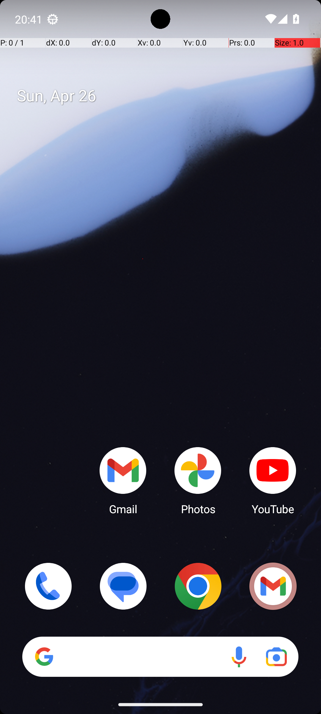

# BrowserMultiply

## Quick links
- **Goal:** "Open the file task.html in Downloads in the file manager; when prompted open it with Chrome. Then click the button 5 times, remember the numbers displayed, and enter their product in the form."
- **History:** F/F/F/F/F
- **Step budget:** 22
- **Steps R0-R4:** 19/19/22/19/22
- **Termination:** max-steps
- **Determinism:** D3 unstable
- **Tags:** math_counting, memorization, screen_reading
- **Evaluator:** [`BrowserMultiply class / inherited is_successful`](../../MARS-Voyager/androidworld/android_world/task_evals/single/browser.py#L331) - evaluator source link or inherited evaluator class.
- **Setup:** [`BrowserMultiply class / inherited initialize_task`](../../MARS-Voyager/androidworld/android_world/task_evals/single/browser.py#L331) - setup source link or inherited setup class.
- **Trajectory folder:** [formatted traces](../../MARS-Voyager/eval_results/UI-Voyager/results/20260426203107_reformatted/BrowserMultiply)
- **Image folder:** [screenshots](../../MARS-Voyager/eval_results/UI-Voyager/results/20260426203107/BrowserMultiply/images)

## What success requires

The evaluator must observe the task-specific post-condition for: "Open the file task.html in Downloads in the file manager; when prompted open it with Chrome. Then click the button 5 times, remember the numbers displayed, and enter their product in the form.". The task template is: "Open the file task.html in Downloads in the file manager; when prompted open it with Chrome. Then click the button 5 times, remember the numbers displayed, and enter their product in the form.". In practical terms, the report should judge success by the source-linked evaluator rather than by the agent's self-report; a `terminate(success)` or `answer` action is only meaningful if the app state or returned answer matches that evaluator.

## Cross-round behavior

| Round | Steps | Terminal action | Wall-step action |
|---|---:|---|---|
| R0 | 19 | terminate {'action': 'terminate', 'status': 'success'} | Swipe up from the bottom of the screen to open the app drawer and locate the file manager. |
| R1 | 19 | terminate {'action': 'terminate', 'status': 'success'} | Swipe up from the bottom of the screen to open the app drawer and locate the file manager. |
| R2 | 22 | click {'action': 'click', 'coordinate': [858, 174]} | Swipe up from the bottom of the screen to open the app drawer and locate the file manager. |
| R3 | 19 | terminate {'action': 'terminate', 'status': 'success'} | Swipe up from the bottom of the screen to open the app drawer and locate the file manager. |
| R4 | 22 | click {'action': 'click', 'coordinate': [188, 69]} | Swipe up on the file manager to scroll down and search for the task.html file. |

First divergent assistant step across available rounds: **step 1**. The wall step used for this file is **step 1** because it is the first durable point where the trace commits to the failure mode represented by `canvas/game-capability; visual-grounding; compound-task; task-constraint-missed`.

## Wall step

### Round 0

*R0 step 1 - wall-step screenshot associated with the action below.*

Agent thought: "To open the file 'task.html' from the Downloads folder, I need to access the file manager first. Since it's not visible on the home screen, I should navigate to the app drawer or use a file management app."

Agent action: `Swipe up from the bottom of the screen to open the app drawer and locate the file manager.`

Tool call: `swipe {'action': 'swipe', 'coordinate': [499, 775], 'coordinate2': [491, 328]}`

### Round 4

*R4 step 1 - comparison screenshot at the same wall-step index when available.*

Agent thought: "The task.html file is not visible in the current view of the file manager, so I need to scroll down to locate it. Once found, I can proceed with opening it in Chrome as per the user's request."

Agent action: `Swipe up on the file manager to scroll down and search for the task.html file.`

Tool call: `swipe {'action': 'swipe', 'coordinate': [499, 817], 'coordinate2': [491, 219]}`

## What actually happened

The run reaches the browser/game-style interaction but does not produce the exact canvas/grid/numeric state required by the evaluator. The R0 wall-step action is `Swipe up from the bottom of the screen to open the app drawer and locate the file manager.`. The representative comparison round records `Swipe up on the file manager to scroll down and search for the task.html file.` at the same step index, while the final available round ends with `Click on the 'X: 0.0' field to access the main content of the task.html file.`. This is enough to identify the repeated failure mechanism, but any claim about fine-grained UI state should be checked against the embedded screenshots and the raw image directory.

## Root cause and category

Categories: `canvas/game-capability`: the task requires browser canvas/game interaction or multi-step visual memory that the current agent does not handle reliably; `visual-grounding`: the failure depends on reading a UI state, icon, checkbox, slider, canvas, or numeric value more precisely than the agent manages; `compound-task`: the task has multiple sequential legs or repeated item operations, and the trace completes only part of the required workflow; `task-constraint-missed`: the agent misses a stated constraint such as all items, ordering, filtering, exact duplicate handling, date range, or recipient/content matching.

Verdict: **retry sometimes explores variants but all fail**. The proximate failure is `canvas/game-capability; visual-grounding; compound-task; task-constraint-missed`; the upstream issue is that the policy lacks the reliable procedure needed for this class of task before it exhausts the budget or finalizes prematurely.

## Suggested fix

Treat browser canvas/game tasks as a separate capability gap; add task-specific tooling or visual grid extraction rather than generic tapping. Improve state readback prompts and use UI/a11y text or detail screens where available instead of guessing from icons or pixels.
