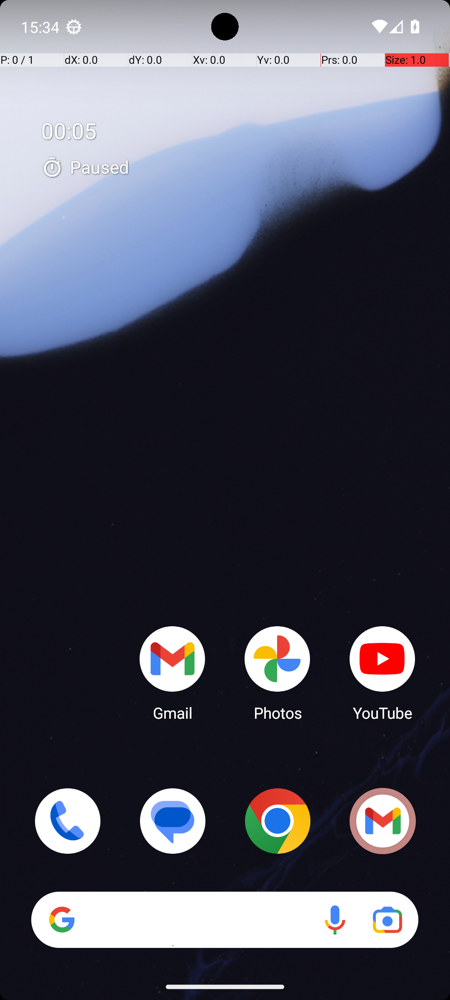

# MarkorAddNoteHeader

## Quick links
- **Goal:** "Update the Markor note eager_rose_edited.txt by adding the following text, along with a new blank line before the existing content: "0KO12j9E27GAOsdmWUwX", and rename it to quick_pig_2023_04_05.txt."
- **History:** F/F/F/F/F
- **Step budget:** 12
- **Steps R0-R4:** 12/12/12/12/12
- **Termination:** max-steps
- **Determinism:** D3 unstable
- **Tags:** data_entry, parameterized
- **Evaluator:** [`MarkorAddNoteHeader.is_successful`](../../MARS-Voyager/androidworld/android_world/task_evals/single/markor.py#L784) - evaluator source link or inherited evaluator class.
- **Setup:** [`MarkorAddNoteHeader.initialize_task`](../../MARS-Voyager/androidworld/android_world/task_evals/single/markor.py#L754) - setup source link or inherited setup class.
- **Trajectory folder:** [formatted traces](../../MARS-Voyager/eval_results/UI-Voyager/results/20260426203107_reformatted/MarkorAddNoteHeader)
- **Image folder:** [screenshots](../../MARS-Voyager/eval_results/UI-Voyager/results/20260426203107/MarkorAddNoteHeader/images)

## What success requires

The evaluator must observe the task-specific post-condition for: "Update the Markor note eager_rose_edited.txt by adding the following text, along with a new blank line before the existing content: "0KO12j9E27GAOsdmWUwX", and rename it to quick_pig_2023_04_05.txt.". The task template is: "Update the Markor note {file_name} by adding the following text, along with a new blank line before the existing content: "{header}".". In practical terms, the report should judge success by the source-linked evaluator rather than by the agent's self-report; a `terminate(success)` or `answer` action is only meaningful if the app state or returned answer matches that evaluator.

## Cross-round behavior

| Round | Steps | Terminal action | Wall-step action |
|---|---:|---|---|
| R0 | 12 | click {'action': 'click', 'coordinate': [719, 925]} | I swiped up to open the app drawer to locate the Markor app. |
| R1 | 12 | click {'action': 'click', 'coordinate': [724, 80]} | I swiped up to open the app drawer to find the Markor app. |
| R2 | 12 | click {'action': 'click', 'coordinate': [725, 87]} | Swipe up from the bottom of the screen to open the app drawer and locate the Markor app. |
| R3 | 12 | type {'action': 'type', 'text': 'quick_pig_2023_04_05.txt'} | Swipe up from the bottom of the screen to open the app drawer and locate the Markor app. |
| R4 | 12 | swipe {'action': 'swipe', 'coordinate': [499, 142], 'coordinate2': [499, 541]} | Swipe up from the bottom of the screen to open the app drawer and locate the Markor app. |

First divergent assistant step across available rounds: **step 1**. The wall step used for this file is **step 1** because it is the first durable point where the trace commits to the failure mode represented by `compound-task; task-constraint-missed`.

## Wall step

### Round 0

*R0 step 1 - wall-step screenshot associated with the action below.*

Agent thought: "I need to update the Markor note "eager_rose_edited.txt" by adding a specific text and renaming it. To do this, I first need to locate and open the Markor app. Since it's not visible on the home screen, I performed a swipe up gesture to access the app drawer where all installed apps are listed. This will help me find and open Markor."

Agent action: `I swiped up to open the app drawer to locate the Markor app.`

Tool call: `swipe {'action': 'swipe', 'coordinate': [499, 742], 'coordinate2': [493, 320]}`

### Round 4

*R4 step 1 - comparison screenshot at the same wall-step index when available.*

Agent thought: "I need to open the Markor app to edit the file. Since it's not visible in the current view, I should look for it in the app drawer or swipe up to access more apps."

Agent action: `Swipe up from the bottom of the screen to open the app drawer and locate the Markor app.`

Tool call: `swipe {'action': 'swipe', 'coordinate': [499, 742], 'coordinate2': [491, 320]}`

## What actually happened

The trace spends its budget on only part of a multi-leg or repeated-item workflow, leaving later constraints unresolved. The R0 wall-step action is `I swiped up to open the app drawer to locate the Markor app.`. The representative comparison round records `Swipe up from the bottom of the screen to open the app drawer and locate the Markor app.` at the same step index, while the final available round ends with `Swipe up on the screen to scroll through the list of files and locate 'eager_rose_edited.txt'.`. This is enough to identify the repeated failure mechanism, but any claim about fine-grained UI state should be checked against the embedded screenshots and the raw image directory.

## Root cause and category

Categories: `compound-task`: the task has multiple sequential legs or repeated item operations, and the trace completes only part of the required workflow; `task-constraint-missed`: the agent misses a stated constraint such as all items, ordering, filtering, exact duplicate handling, date range, or recipient/content matching.

Verdict: **retry sometimes explores variants but all fail**. The proximate failure is `compound-task; task-constraint-missed`; the upstream issue is that the policy lacks the reliable procedure needed for this class of task before it exhausts the budget or finalizes prematurely.

## Suggested fix

Add a lightweight checklist/planning scaffold for multi-leg tasks and repeated item loops so completion is tracked before termination. Make the agent restate and check every explicit constraint before finalizing.
