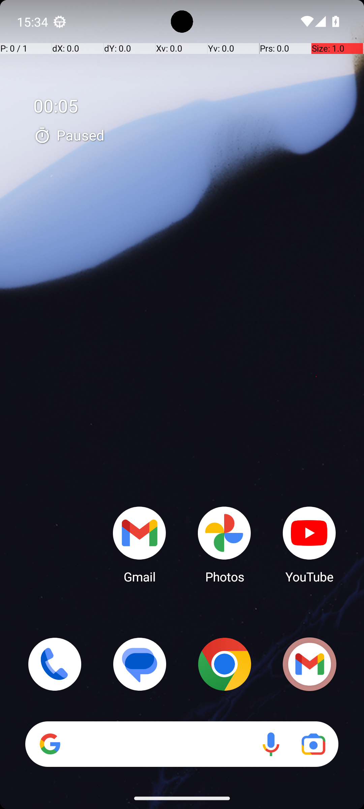

# MarkorTranscribeVideo

## Quick links
- **Goal:** "Transcribe the contents of video scene_56_4K_2023_06_01.mp4 by watching it in VLC player (located in Download) and writing the sequence of strings shown on each frame to the text file scene_56_4K_2023_06_01_transcription.txt in Markor as a comma separated list. For example, if the first frame shows the text "edna" and the second frame shows the text "pineapple", then the text file should contain only the following text: "edna, pineapple"."
- **History:** F/F/F/F/F
- **Step budget:** 20
- **Steps R0-R4:** 20/20/20/20/20
- **Termination:** max-steps
- **Determinism:** D3 unstable
- **Tags:** multi_app, transcription, requires_setup, memorization, screen_reading, parameterized
- **Evaluator:** [`MarkorTranscribeVideo.is_successful`](../../MARS-Voyager/androidworld/android_world/task_evals/single/markor.py#L919) - evaluator source link or inherited evaluator class.
- **Setup:** [`MarkorTranscribeVideo.initialize_task`](../../MARS-Voyager/androidworld/android_world/task_evals/single/markor.py#L899) - setup source link or inherited setup class.
- **Trajectory folder:** [formatted traces](../../MARS-Voyager/eval_results/UI-Voyager/results/20260426203107_reformatted/MarkorTranscribeVideo)
- **Image folder:** [screenshots](../../MARS-Voyager/eval_results/UI-Voyager/results/20260426203107/MarkorTranscribeVideo/images)

## What success requires

The evaluator must observe the task-specific post-condition for: "Transcribe the contents of video scene_56_4K_2023_06_01.mp4 by watching it in VLC player (located in Download) and writing the sequence of strings shown on each frame to the text file scene_56_4K_2023_06_01_transcription.txt in Markor as a comma separated list. For example, if the first frame shows the text "edna" and the second frame shows the text "pineapple", then the text file should contain only the following text: "edna, pineapple".". The task template is: "Transcribe the contents of video {video_name} by watching it in VLC player (located in Download) and writing the sequence of strings shown on each frame to the text file {file_name} in Markor as a comma separated list. For example, if the first frame shows the text "edna" and the second frame shows the text "pineapple", then the text file should contains only the following text: "edna, pineapple".". In practical terms, the report should judge success by the source-linked evaluator rather than by the agent's self-report; a `terminate(success)` or `answer` action is only meaningful if the app state or returned answer matches that evaluator.

## Cross-round behavior

| Round | Steps | Terminal action | Wall-step action |
|---|---:|---|---|
| R0 | 20 | click {'action': 'click', 'coordinate': [499, 499]} | I swiped up to open the app drawer to find the VLC Player app. |
| R1 | 20 | click {'action': 'click', 'coordinate': [300, 493]} | Swipe up from the bottom of the screen to open the app drawer and locate the VLC player app. |
| R2 | 20 | click {'action': 'click', 'coordinate': [69, 80]} | Swipe up from the bottom of the screen to access the app drawer. |
| R3 | 20 | click {'action': 'click', 'coordinate': [255, 493]} | Swipe up from the bottom of the screen to access the app drawer. |
| R4 | 20 | swipe {'action': 'swipe', 'coordinate': [499, 817], 'coordinate2': [491, 292]} | Swipe up or access the app drawer to find and open the VLC app. |

First divergent assistant step across available rounds: **step 1**. The wall step used for this file is **step 1** because it is the first durable point where the trace commits to the failure mode represented by `app-not-found; compound-task; task-constraint-missed`.

## Wall step

### Round 0

*R0 step 1 - wall-step screenshot associated with the action below.*

Agent thought: "I need to transcribe the contents of a specific video scene using VLC Player. To do this, I first need to locate and open the VLC Player app from my home screen. Since it's not visible here, I performed a swipe up gesture to access the app drawer where all installed apps are listed."

Agent action: `I swiped up to open the app drawer to find the VLC Player app.`

Tool call: `swipe {'action': 'swipe', 'coordinate': [499, 738], 'coordinate2': [493, 287]}`

### Round 4

*R4 step 1 - comparison screenshot at the same wall-step index when available.*

Agent thought: "I need to watch the video file 'scene_56_4K_2023_06_01.mp4' in the VLC player. Since I'm currently on the home screen, my next step should be to locate and open the VLC app."

Agent action: `Swipe up or access the app drawer to find and open the VLC app.`

Tool call: `swipe {'action': 'swipe', 'coordinate': [499, 738], 'coordinate2': [493, 322]}`

## What actually happened

The trajectory repeatedly tries to locate the target app and exhausts the available budget (20/20/20/20/20) before reaching the evaluator-relevant screen. The R0 wall-step action is `I swiped up to open the app drawer to find the VLC Player app.`. The representative comparison round records `Swipe up or access the app drawer to find and open the VLC app.` at the same step index, while the final available round ends with `Swipe up on the screen to scroll down and reveal more apps in the app drawer.`. This is enough to identify the repeated failure mechanism, but any claim about fine-grained UI state should be checked against the embedded screenshots and the raw image directory.

## Root cause and category

Categories: `app-not-found`: the agent moves into launcher/app-drawer search behavior and spends the budget swiping or looking for the target app instead of using a reliable app search/open strategy; `compound-task`: the task has multiple sequential legs or repeated item operations, and the trace completes only part of the required workflow; `task-constraint-missed`: the agent misses a stated constraint such as all items, ordering, filtering, exact duplicate handling, date range, or recipient/content matching.

Verdict: **retry sometimes explores variants but all fail**. The proximate failure is `app-not-found; compound-task; task-constraint-missed`; the upstream issue is that the policy lacks the reliable procedure needed for this class of task before it exhausts the budget or finalizes prematurely.

## Suggested fix

Teach the agent to use launcher search or an explicit app-open primitive after one failed visual scan instead of repeated drawer swipes. Add a lightweight checklist/planning scaffold for multi-leg tasks and repeated item loops so completion is tracked before termination.
