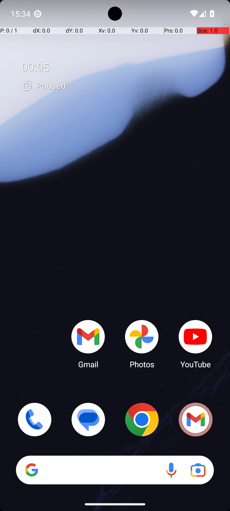

# NotesTodoItemCount

## Quick links
- **Goal:** "How many to-dos do I have in the 'Health' folder in the Joplin app? Express your answer as just a single number."
- **History:** F/F/F/F/F
- **Step budget:** 10
- **Steps R0-R4:** 10/10/10/10/10
- **Termination:** max-steps
- **Determinism:** D3 unstable
- **Tags:** information_retrieval, math_counting, parameterized
- **Evaluator:** [`NotesTodoItemCount dynamic task / InformationRetrieval.is_successful`](../../MARS-Voyager/androidworld/android_world/task_evals/information_retrieval/information_retrieval.py#L109) - dynamic task; prompt and criteria are defined in [tasks.textproto](../../MARS-Voyager/androidworld/android_world/task_evals/information_retrieval/proto/tasks.textproto#L3435).
- **Setup:** [`NotesTodoItemCount dynamic task / InformationRetrieval.initialize_task`](../../MARS-Voyager/androidworld/android_world/task_evals/information_retrieval/information_retrieval.py#L82) - initializes app-specific state from the task proto.
- **Trajectory folder:** [formatted traces](../../MARS-Voyager/eval_results/UI-Voyager/results/20260426203107_reformatted/NotesTodoItemCount)
- **Image folder:** [screenshots](../../MARS-Voyager/eval_results/UI-Voyager/results/20260426203107/NotesTodoItemCount/images)

## What success requires

The evaluator must observe the task-specific post-condition for: "How many to-dos do I have in the 'Health' folder in the Joplin app? Express your answer as just a single number.". The task template is: "How many to-dos do I have in the '{folder}' folder in the Joplin app? Express your answer as just a single number.". In practical terms, the report should judge success by the source-linked evaluator rather than by the agent's self-report; a `terminate(success)` or `answer` action is only meaningful if the app state or returned answer matches that evaluator.

## Cross-round behavior

| Round | Steps | Terminal action | Wall-step action |
|---|---:|---|---|
| R0 | 10 | click {'action': 'click', 'coordinate': [107, 265]} | Swipe up from the bottom of the screen to open the app drawer and locate the Joplin app. |
| R1 | 10 | click {'action': 'click', 'coordinate': [107, 265]} | Swipe up from the bottom of the screen to open the app drawer and locate the Joplin app. |
| R2 | 10 | click {'action': 'click', 'coordinate': [107, 265]} | Swipe up from the bottom of the screen to open the app drawer and locate the Joplin app. |
| R3 | 10 | click {'action': 'click', 'coordinate': [107, 265]} | Swipe up from the bottom of the screen to open the app drawer and locate the Joplin app. |
| R4 | 10 | swipe {'action': 'swipe', 'coordinate': [499, 775], 'coordinate2': [491, 328]} | Swipe up from the bottom of the screen to open the app drawer and locate the Joplin app. |

First divergent assistant step across available rounds: **step 2**. The wall step used for this file is **step 1** because it is the first durable point where the trace commits to the failure mode represented by `app-not-found; visual-grounding`.

## Wall step

### Round 0

*R0 step 1 - wall-step screenshot associated with the action below.*

Agent thought: "I need to access the Joplin app to check the number of to-dos in the 'Health' folder. Since the app is not visible on the home screen, I should look for it by swiping up or accessing the app drawer."

Agent action: `Swipe up from the bottom of the screen to open the app drawer and locate the Joplin app.`

Tool call: `swipe {'action': 'swipe', 'coordinate': [499, 742], 'coordinate2': [491, 320]}`

### Round 4

*R4 step 1 - comparison screenshot at the same wall-step index when available.*

Agent thought: "I need to access the Joplin app to check the number of to-dos in the 'Health' folder. Since the app is not visible on the home screen, I should look for it by swiping up or accessing the app drawer."

Agent action: `Swipe up from the bottom of the screen to open the app drawer and locate the Joplin app.`

Tool call: `swipe {'action': 'swipe', 'coordinate': [499, 742], 'coordinate2': [491, 320]}`

## What actually happened

The trajectory repeatedly tries to locate the target app and exhausts the available budget (10/10/10/10/10) before reaching the evaluator-relevant screen. The R0 wall-step action is `Swipe up from the bottom of the screen to open the app drawer and locate the Joplin app.`. The representative comparison round records `Swipe up from the bottom of the screen to open the app drawer and locate the Joplin app.` at the same step index, while the final available round ends with `Swipe up from the bottom of the screen to open the app drawer and locate the Joplin app.`. This is enough to identify the repeated failure mechanism, but any claim about fine-grained UI state should be checked against the embedded screenshots and the raw image directory.

## Root cause and category

Categories: `app-not-found`: the agent moves into launcher/app-drawer search behavior and spends the budget swiping or looking for the target app instead of using a reliable app search/open strategy; `visual-grounding`: the failure depends on reading a UI state, icon, checkbox, slider, canvas, or numeric value more precisely than the agent manages.

Verdict: **retry sometimes explores variants but all fail**. The proximate failure is `app-not-found; visual-grounding`; the upstream issue is that the policy lacks the reliable procedure needed for this class of task before it exhausts the budget or finalizes prematurely.

## Suggested fix

Teach the agent to use launcher search or an explicit app-open primitive after one failed visual scan instead of repeated drawer swipes. Improve state readback prompts and use UI/a11y text or detail screens where available instead of guessing from icons or pixels.
