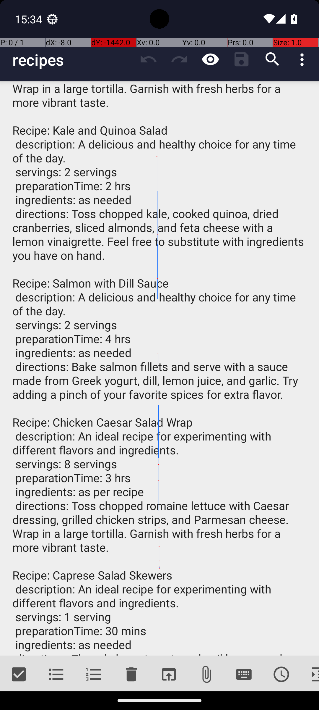

# RecipeAddMultipleRecipesFromMarkor2

## Quick links
- **Goal:** "Add the recipes from recipes.txt in Markor that take 3 hrs to prepare into the Broccoli recipe app."
- **History:** F/F/F/F/F
- **Step budget:** 60
- **Steps R0-R4:** 6/60/60/60/10
- **Termination:** agent-done
- **Determinism:** D3 unstable
- **Tags:** parameterized, screen_reading, complex_ui_understanding, repetition, multi_app, data_entry, information_retrieval
- **Evaluator:** [`RecipeAddMultipleRecipesFromMarkor2 class / inherited is_successful`](../../MARS-Voyager/androidworld/android_world/task_evals/single/recipe.py#L458) - evaluator source link or inherited evaluator class.
- **Setup:** [`RecipeAddMultipleRecipesFromMarkor2.initialize_task`](../../MARS-Voyager/androidworld/android_world/task_evals/single/recipe.py#L473) - setup source link or inherited setup class.
- **Trajectory folder:** [formatted traces](../../MARS-Voyager/eval_results/UI-Voyager/results/20260426203107_reformatted/RecipeAddMultipleRecipesFromMarkor2)
- **Image folder:** [screenshots](../../MARS-Voyager/eval_results/UI-Voyager/results/20260426203107/RecipeAddMultipleRecipesFromMarkor2/images)

## What success requires

The evaluator must observe the task-specific post-condition for: "Add the recipes from recipes.txt in Markor that take 3 hrs to prepare into the Broccoli recipe app.". The task template is: "Add the recipes from recipes.txt in Markor that take {prep_time} to prepare into the Broccoli recipe app.". In practical terms, the report should judge success by the source-linked evaluator rather than by the agent's self-report; a `terminate(success)` or `answer` action is only meaningful if the app state or returned answer matches that evaluator.

## Cross-round behavior

| Round | Steps | Terminal action | Wall-step action |
|---|---:|---|---|
| R0 | 6 | answer {'action': 'answer', 'text': 'Chicken Caesar Salad Wrap'} | I identified the \"Chicken Caesar Salad Wrap\" recipe as it takes 3 hours to prepare. |
| R1 | 60 | swipe {'action': 'swipe', 'coordinate': [499, 817], 'coordinate2': [491, 206]} | Scroll down the list to look for recipes that take 3 hours to prepare. |
| R2 | 60 | click {'action': 'click', 'coordinate': [375, 561]} | Tap on the three-dot menu icon at the top right corner to access additional options for this recipe. |
| R3 | 60 | click {'action': 'click', 'coordinate': [328, 517]} | Tap on the 'preparationTime' field to view the details of the 'Chicken Caesar Salad Wrap' recipe. |
| R4 | 10 | terminate {'action': 'terminate', 'status': 'success'} | Navigate to the folder containing the recipe files. |

First divergent assistant step across available rounds: **step 1**. The wall step used for this file is **step 6** because it is the first durable point where the trace commits to the failure mode represented by `premature-success; compound-task; task-constraint-missed`.

## Wall step

### Round 0

*R0 step 6 - wall-step screenshot associated with the action below.*

Agent thought: "I am currently reviewing the list of recipes in Markor to identify which ones take 3 hours to prepare. I've scrolled through the list and found a recipe labeled "Chicken Caesar Salad Wrap" with a preparation time of 3 hours. This seems to be the relevant recipe for adding to the Broccoli app."

Agent action: `I identified the \"Chicken Caesar Salad Wrap\" recipe as it takes 3 hours to prepare.`

Tool call: `answer {'action': 'answer', 'text': 'Chicken Caesar Salad Wrap'}`

### Round 4

*R4 step 6 - comparison screenshot at the same wall-step index when available.*

Agent thought: "I need to add recipes from the file "recipes.txt" in Markor that take 3 hours to prepare into the Broccoli recipe app. The current screen shows the Markor app, but it seems to be at the beginning of the process. I should first ensure I'm in the correct directory where the recipe files are located."

Agent action: `Navigate to the folder containing the recipe files.`

Tool call: `swipe {'action': 'swipe', 'coordinate': [499, 706], 'coordinate2': [491, 206]}`

## What actually happened

The final action is `agent-done`, so the run ends before the trace shows a verified evaluator post-condition. The R0 wall-step action is `I identified the \"Chicken Caesar Salad Wrap\" recipe as it takes 3 hours to prepare.`. The representative comparison round records `Navigate to the folder containing the recipe files.` at the same step index, while the final available round ends with `The task is completed successfully.`. This is enough to identify the repeated failure mechanism, but any claim about fine-grained UI state should be checked against the embedded screenshots and the raw image directory.

## Root cause and category

Categories: `premature-success`: the agent declares success or answers before observing the evaluator-relevant post-condition; `compound-task`: the task has multiple sequential legs or repeated item operations, and the trace completes only part of the required workflow; `task-constraint-missed`: the agent misses a stated constraint such as all items, ordering, filtering, exact duplicate handling, date range, or recipient/content matching.

Verdict: **retry sometimes explores variants but all fail**. The proximate failure is `premature-success; compound-task; task-constraint-missed`; the upstream issue is that the policy lacks the reliable procedure needed for this class of task before it exhausts the budget or finalizes prematurely.

## Suggested fix

Require a verification observation immediately before `terminate(success)` or `answer`, tied to the evaluator post-condition. Add a lightweight checklist/planning scaffold for multi-leg tasks and repeated item loops so completion is tracked before termination.
