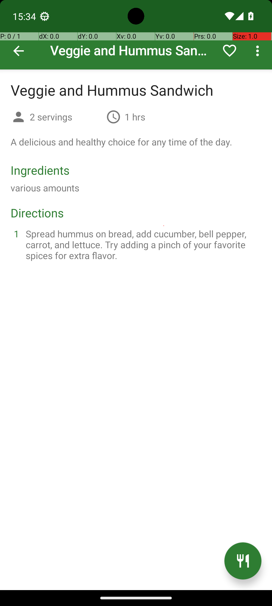

# RecipeDeleteDuplicateRecipes2

## Quick links
- **Goal:** "Delete all but one of any recipes in the Broccoli app that are exact duplicates, ensuring at least one instance of each unique recipe remains"
- **History:** F/F/F/F/F
- **Step budget:** 24
- **Steps R0-R4:** 9/11/11/9/24
- **Termination:** max-steps
- **Determinism:** D3 unstable
- **Tags:** repetition, data_edit, parameterized
- **Evaluator:** [`RecipeDeleteDuplicateRecipes2 class / inherited is_successful`](../../MARS-Voyager/androidworld/android_world/task_evals/single/recipe.py#L229) - evaluator source link or inherited evaluator class.
- **Setup:** [`RecipeDeleteDuplicateRecipes2 class / inherited initialize_task`](../../MARS-Voyager/androidworld/android_world/task_evals/single/recipe.py#L229) - setup source link or inherited setup class.
- **Trajectory folder:** [formatted traces](../../MARS-Voyager/eval_results/UI-Voyager/results/20260426203107_reformatted/RecipeDeleteDuplicateRecipes2)
- **Image folder:** [screenshots](../../MARS-Voyager/eval_results/UI-Voyager/results/20260426203107/RecipeDeleteDuplicateRecipes2/images)

## What success requires

The evaluator must observe the task-specific post-condition for: "Delete all but one of any recipes in the Broccoli app that are exact duplicates, ensuring at least one instance of each unique recipe remains". The task template is: "Delete all but one of any recipes in the Broccoli app that are exact duplicates, ensuring at least one instance of each unique recipe remains". In practical terms, the report should judge success by the source-linked evaluator rather than by the agent's self-report; a `terminate(success)` or `answer` action is only meaningful if the app state or returned answer matches that evaluator.

## Cross-round behavior

| Round | Steps | Terminal action | Wall-step action |
|---|---:|---|---|
| R0 | 9 | terminate {'action': 'terminate', 'status': 'success'} | The task is completed successfully. |
| R1 | 11 | terminate {'action': 'terminate', 'status': 'success'} | Tap on the 'DELETE' button to confirm the deletion of the duplicate recipe. |
| R2 | 11 | terminate {'action': 'terminate', 'status': 'success'} | Tap on the 'DELETE' button to confirm the deletion of the duplicate recipe. |
| R3 | 9 | terminate {'action': 'terminate', 'status': 'success'} | The task is completed successfully. |
| R4 | 24 | click {'action': 'click', 'coordinate': [188, 69]} | Tap on the 'Recipes' tab or navigate to the section containing all recipes to view and manage them. |

First divergent assistant step across available rounds: **step 1**. The wall step used for this file is **step 9** because it is the first durable point where the trace commits to the failure mode represented by `premature-success; compound-task; task-constraint-missed`.

## Wall step

### Round 0

*R0 step 9 - wall-step screenshot associated with the action below.*

Agent thought: "I have successfully deleted one of the duplicate 'Veggie and Hummus Sandwich' recipes, leaving at least one instance of this unique recipe intact. The task was to ensure that all but one of any exact duplicates are removed, and I have achieved this for the current recipe."

Agent action: `The task is completed successfully.`

Tool call: `terminate {'action': 'terminate', 'status': 'success'}`

### Round 4

*R4 step 9 - comparison screenshot at the same wall-step index when available.*

Agent thought: "The goal is to delete duplicate recipes in the Broccoli app while keeping at least one instance of each unique recipe. To proceed, I need to access the list of recipes. The current screen shows a header with various fields, but it doesn't display the recipes directly. I should navigate to the section where recipes are listed."

Agent action: `Tap on the 'Recipes' tab or navigate to the section containing all recipes to view and manage them.`

Tool call: `click {'action': 'click', 'coordinate': [167, 69]}`

## What actually happened

The final action is `max-steps`, so the run ends before the trace shows a verified evaluator post-condition. The R0 wall-step action is `The task is completed successfully.`. The representative comparison round records `Tap on the 'Recipes' tab or navigate to the section containing all recipes to view and manage them.` at the same step index, while the final available round ends with `Tap on the 'X: 0.0' field to filter or search for recipes.`. This is enough to identify the repeated failure mechanism, but any claim about fine-grained UI state should be checked against the embedded screenshots and the raw image directory.

## Root cause and category

Categories: `premature-success`: the agent declares success or answers before observing the evaluator-relevant post-condition; `compound-task`: the task has multiple sequential legs or repeated item operations, and the trace completes only part of the required workflow; `task-constraint-missed`: the agent misses a stated constraint such as all items, ordering, filtering, exact duplicate handling, date range, or recipient/content matching.

Verdict: **retry sometimes explores variants but all fail**. The proximate failure is `premature-success; compound-task; task-constraint-missed`; the upstream issue is that the policy lacks the reliable procedure needed for this class of task before it exhausts the budget or finalizes prematurely.

## Suggested fix

Require a verification observation immediately before `terminate(success)` or `answer`, tied to the evaluator post-condition. Add a lightweight checklist/planning scaffold for multi-leg tasks and repeated item loops so completion is tracked before termination.
