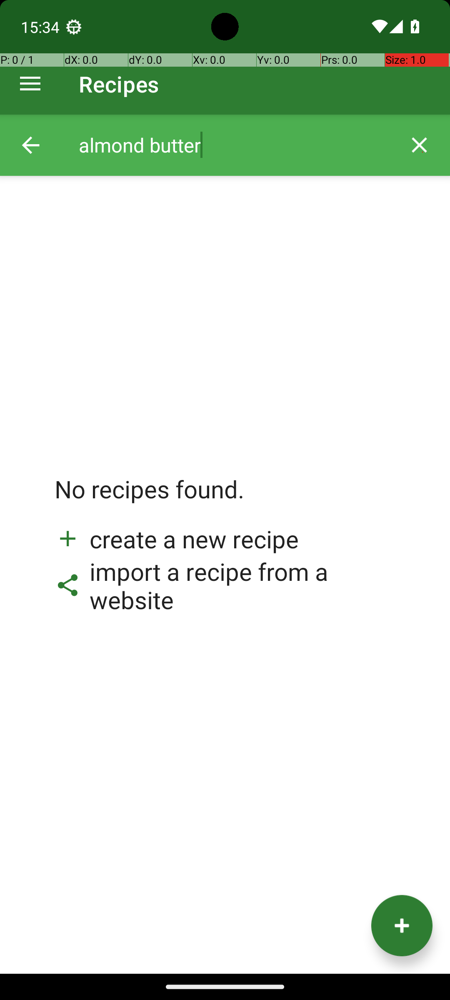

# RecipeDeleteMultipleRecipesWithConstraint

## Quick links
- **Goal:** "Delete the recipes from Broccoli app that use almond butter in the directions."
- **History:** F/F/F/F/F
- **Step budget:** 40
- **Steps R0-R4:** 5/5/5/5/40
- **Termination:** max-steps
- **Determinism:** D3 unstable
- **Tags:** screen_reading, repetition, parameterized
- **Evaluator:** [`RecipeDeleteMultipleRecipesWithConstraint class / inherited is_successful`](../../MARS-Voyager/androidworld/android_world/task_evals/single/recipe.py#L133) - evaluator source link or inherited evaluator class.
- **Setup:** [`RecipeDeleteMultipleRecipesWithConstraint class / inherited initialize_task`](../../MARS-Voyager/androidworld/android_world/task_evals/single/recipe.py#L133) - setup source link or inherited setup class.
- **Trajectory folder:** [formatted traces](../../MARS-Voyager/eval_results/UI-Voyager/results/20260426203107_reformatted/RecipeDeleteMultipleRecipesWithConstraint)
- **Image folder:** [screenshots](../../MARS-Voyager/eval_results/UI-Voyager/results/20260426203107/RecipeDeleteMultipleRecipesWithConstraint/images)

## What success requires

The evaluator must observe the task-specific post-condition for: "Delete the recipes from Broccoli app that use almond butter in the directions.". The task template is: "Delete the recipes from Broccoli app that use {ingredient} in the directions.". In practical terms, the report should judge success by the source-linked evaluator rather than by the agent's self-report; a `terminate(success)` or `answer` action is only meaningful if the app state or returned answer matches that evaluator.

## Cross-round behavior

| Round | Steps | Terminal action | Wall-step action |
|---|---:|---|---|
| R0 | 5 | terminate {'action': 'terminate', 'status': 'success'} | The task is completed successfully. |
| R1 | 5 | terminate {'action': 'terminate', 'status': 'success'} | The task is completed successfully. |
| R2 | 5 | terminate {'action': 'terminate', 'status': 'success'} | The task is completed successfully. |
| R3 | 5 | terminate {'action': 'terminate', 'status': 'success'} | The task is completed successfully. |
| R4 | 40 | click {'action': 'click', 'coordinate': [166, 69]} | Swipe up on the screen to scroll down and reveal more apps in the app drawer. |

First divergent assistant step across available rounds: **step 2**. The wall step used for this file is **step 5** because it is the first durable point where the trace commits to the failure mode represented by `premature-success; compound-task; visual-grounding; task-constraint-missed`.

## Wall step

### Round 0

*R0 step 5 - wall-step screenshot associated with the action below.*

Agent thought: "Since the search for recipes using almond butter returned no results, there are no recipes to delete. The task is complete as there are no relevant items to act upon."

Agent action: `The task is completed successfully.`

Tool call: `terminate {'action': 'terminate', 'status': 'success'}`

### Round 4

*R4 step 5 - comparison screenshot at the same wall-step index when available.*

Agent thought: "I need to continue scrolling through the app drawer to locate recipes that use almond butter. The current view is not revealing any relevant recipes, so I should keep scrolling to find them."

Agent action: `Swipe up on the screen to scroll down and reveal more apps in the app drawer.`

Tool call: `swipe {'action': 'swipe', 'coordinate': [499, 817], 'coordinate2': [491, 292]}`

## What actually happened

The final action is `max-steps`, so the run ends before the trace shows a verified evaluator post-condition. The R0 wall-step action is `The task is completed successfully.`. The representative comparison round records `Swipe up on the screen to scroll down and reveal more apps in the app drawer.` at the same step index, while the final available round ends with `Tap on the Broccoli app icon to open it.`. This is enough to identify the repeated failure mechanism, but any claim about fine-grained UI state should be checked against the embedded screenshots and the raw image directory.

## Root cause and category

Categories: `premature-success`: the agent declares success or answers before observing the evaluator-relevant post-condition; `compound-task`: the task has multiple sequential legs or repeated item operations, and the trace completes only part of the required workflow; `visual-grounding`: the failure depends on reading a UI state, icon, checkbox, slider, canvas, or numeric value more precisely than the agent manages; `task-constraint-missed`: the agent misses a stated constraint such as all items, ordering, filtering, exact duplicate handling, date range, or recipient/content matching.

Verdict: **retry sometimes explores variants but all fail**. The proximate failure is `premature-success; compound-task; visual-grounding; task-constraint-missed`; the upstream issue is that the policy lacks the reliable procedure needed for this class of task before it exhausts the budget or finalizes prematurely.

## Suggested fix

Require a verification observation immediately before `terminate(success)` or `answer`, tied to the evaluator post-condition. Add a lightweight checklist/planning scaffold for multi-leg tasks and repeated item loops so completion is tracked before termination.
