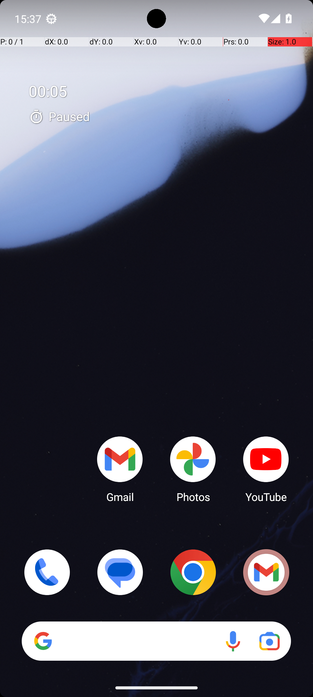

# RetroPlaylistDuration

## Quick links
- **Goal:** "Create a playlist in Retro Music titled "Country Classics 417" with a duration between 45 and 50 minutes using the provided songs."
- **History:** F/F/F/F/F
- **Step budget:** 30
- **Steps R0-R4:** 23/30/30/30/30
- **Termination:** max-steps
- **Determinism:** D3 unstable
- **Tags:** math_counting, complex_ui_understanding, repetition, parameterized
- **Evaluator:** [`RetroPlaylistDuration.is_successful`](../../MARS-Voyager/androidworld/android_world/task_evals/single/retro_music.py#L286) - evaluator source link or inherited evaluator class.
- **Setup:** [`RetroPlaylistDuration.initialize_task`](../../MARS-Voyager/androidworld/android_world/task_evals/single/retro_music.py#L260) - setup source link or inherited setup class.
- **Trajectory folder:** [formatted traces](../../MARS-Voyager/eval_results/UI-Voyager/results/20260426203107_reformatted/RetroPlaylistDuration)
- **Image folder:** [screenshots](../../MARS-Voyager/eval_results/UI-Voyager/results/20260426203107/RetroPlaylistDuration/images)

## What success requires

The evaluator must observe the task-specific post-condition for: "Create a playlist in Retro Music titled "Country Classics 417" with a duration between 45 and 50 minutes using the provided songs.". The task template is: "Create a playlist in Retro Music titled "{playlist_name}" with a duration between 45 and 50 minutes using the provided songs.". In practical terms, the report should judge success by the source-linked evaluator rather than by the agent's self-report; a `terminate(success)` or `answer` action is only meaningful if the app state or returned answer matches that evaluator.

## Cross-round behavior

| Round | Steps | Terminal action | Wall-step action |
|---|---:|---|---|
| R0 | 23 | terminate {'action': 'terminate', 'status': 'success'} | Swipe up from the bottom of the screen to access the app drawer and locate the Retro Music app. |
| R1 | 30 | click {'action': 'click', 'coordinate': [79, 97]} | Swipe up from the bottom of the screen to access the app drawer and locate the Retro Music app. |
| R2 | 30 | type {'action': 'type', 'text': '45-50 minutes'} | Swipe up from the bottom of the screen to access the app drawer and locate the Retro Music app. |
| R3 | 30 | swipe {'action': 'swipe', 'coordinate': [499, 817], 'coordinate2': [499, 219]} | Swipe up from the bottom of the screen to access the app drawer and locate the Retro Music app. |
| R4 | 30 | swipe {'action': 'swipe', 'coordinate': [499, 742], 'coordinate2': [491, 320]} | Swipe up from the bottom of the screen to access the app drawer and locate the Retro Music app. |

First divergent assistant step across available rounds: **step 2**. The wall step used for this file is **step 1** because it is the first durable point where the trace commits to the failure mode represented by `app-not-found; compound-task; task-constraint-missed`.

## Wall step

### Round 0

*R0 step 1 - wall-step screenshot associated with the action below.*

Agent thought: "I need to open the Retro Music app to create a playlist. Since it's not visible on the home screen, I should look for it by swiping up or accessing the app drawer to find and open the app."

Agent action: `Swipe up from the bottom of the screen to access the app drawer and locate the Retro Music app.`

Tool call: `swipe {'action': 'swipe', 'coordinate': [499, 742], 'coordinate2': [491, 320]}`

### Round 4

*R4 step 1 - comparison screenshot at the same wall-step index when available.*

Agent thought: "I need to open the Retro Music app to create a playlist. Since it's not visible on the home screen, I should look for it by swiping up or accessing the app drawer to find and open the app."

Agent action: `Swipe up from the bottom of the screen to access the app drawer and locate the Retro Music app.`

Tool call: `swipe {'action': 'swipe', 'coordinate': [499, 742], 'coordinate2': [491, 320]}`

## What actually happened

The trajectory repeatedly tries to locate the target app and exhausts the available budget (23/30/30/30/30) before reaching the evaluator-relevant screen. The R0 wall-step action is `Swipe up from the bottom of the screen to access the app drawer and locate the Retro Music app.`. The representative comparison round records `Swipe up from the bottom of the screen to access the app drawer and locate the Retro Music app.` at the same step index, while the final available round ends with `Swipe up from the bottom of the screen to open the app drawer and locate the Retro Music app.`. This is enough to identify the repeated failure mechanism, but any claim about fine-grained UI state should be checked against the embedded screenshots and the raw image directory.

## Root cause and category

Categories: `app-not-found`: the agent moves into launcher/app-drawer search behavior and spends the budget swiping or looking for the target app instead of using a reliable app search/open strategy; `compound-task`: the task has multiple sequential legs or repeated item operations, and the trace completes only part of the required workflow; `task-constraint-missed`: the agent misses a stated constraint such as all items, ordering, filtering, exact duplicate handling, date range, or recipient/content matching.

Verdict: **retry sometimes explores variants but all fail**. The proximate failure is `app-not-found; compound-task; task-constraint-missed`; the upstream issue is that the policy lacks the reliable procedure needed for this class of task before it exhausts the budget or finalizes prematurely.

## Suggested fix

Teach the agent to use launcher search or an explicit app-open primitive after one failed visual scan instead of repeated drawer swipes. Add a lightweight checklist/planning scaffold for multi-leg tasks and repeated item loops so completion is tracked before termination.
