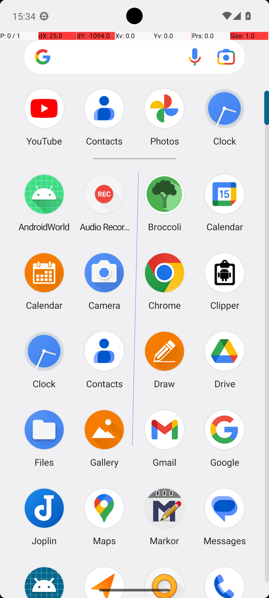

# SimpleCalendarEventsInNextWeek

## Quick links
- **Goal:** "What events do I have in the next week in Simple Calendar Pro? Assume the week starts from Monday. Answer with the titles only. If there are multiples titles, format your answer in a comma separated list."
- **History:** F/F/F/F/F
- **Step budget:** 10
- **Steps R0-R4:** 10/9/10/10/10
- **Termination:** max-steps
- **Determinism:** D3 unstable
- **Tags:** data_entry, parameterized
- **Evaluator:** [`SimpleCalendarEventsInNextWeek dynamic task / InformationRetrieval.is_successful`](../../MARS-Voyager/androidworld/android_world/task_evals/information_retrieval/information_retrieval.py#L109) - dynamic task; prompt and criteria are defined in [tasks.textproto](../../MARS-Voyager/androidworld/android_world/task_evals/information_retrieval/proto/tasks.textproto#L714).
- **Setup:** [`SimpleCalendarEventsInNextWeek dynamic task / InformationRetrieval.initialize_task`](../../MARS-Voyager/androidworld/android_world/task_evals/information_retrieval/information_retrieval.py#L82) - initializes app-specific state from the task proto.
- **Trajectory folder:** [formatted traces](../../MARS-Voyager/eval_results/UI-Voyager/results/20260426203107_reformatted/SimpleCalendarEventsInNextWeek)
- **Image folder:** [screenshots](../../MARS-Voyager/eval_results/UI-Voyager/results/20260426203107/SimpleCalendarEventsInNextWeek/images)

## What success requires

The evaluator must observe the task-specific post-condition for: "What events do I have in the next week in Simple Calendar Pro? Assume the week starts from Monday. Answer with the titles only. If there are multiples titles, format your answer in a comma separated list.". The task template is: "What events do I have in the next week in Simple Calendar Pro? Answer with the titles only. If there are multiples titles, format your answer in a comma separated list.". In practical terms, the report should judge success by the source-linked evaluator rather than by the agent's self-report; a `terminate(success)` or `answer` action is only meaningful if the app state or returned answer matches that evaluator.

## Cross-round behavior

| Round | Steps | Terminal action | Wall-step action |
|---|---:|---|---|
| R0 | 10 | answer {'action': 'answer', 'text': 'Quarterly review, Quarterly review'} | I opened the Simple Calendar Pro app to view my upcoming events. |
| R1 | 9 | answer {'action': 'answer', 'text': 'Catch up on Campaign, Review session for Annual Report, Call with HR'} | I opened the Simple Calendar Pro app to view my upcoming events. |
| R2 | 10 | answer {'action': 'answer', 'text': 'Quarterly review, Quarterly review'} | I opened the Simple Calendar Pro app to view my upcoming events. |
| R3 | 10 | answer {'action': 'answer', 'text': 'Quarterly review, Quarterly review'} | I opened the Simple Calendar Pro app to view my upcoming events. |
| R4 | 10 | click {'action': 'click', 'coordinate': [100, 100]} | I swiped up in the app drawer to find the Simple Calendar Pro app. |

First divergent assistant step across available rounds: **step 2**. The wall step used for this file is **step 2** because it is the first durable point where the trace commits to the failure mode represented by `compound-task; task-constraint-missed`.

## Wall step

### Round 0

*R0 step 2 - wall-step screenshot associated with the action below.*

Agent thought: "I opened the app drawer and located the Simple Calendar Pro app. By tapping on it, I intended to access my calendar to check for any events scheduled for the next week, starting from Monday."

Agent action: `I opened the Simple Calendar Pro app to view my upcoming events.`

Tool call: `click {'action': 'click', 'coordinate': [150, 462]}`

### Round 4

*R4 step 2 - comparison screenshot at the same wall-step index when available.*

Agent thought: "I opened the app drawer by swiping up on the home screen. Now, I need to locate and open the Simple Calendar Pro app to check my events for the next week."

Agent action: `I swiped up in the app drawer to find the Simple Calendar Pro app.`

Tool call: `swipe {'action': 'swipe', 'coordinate': [499, 738], 'coordinate2': [493, 322]}`

## What actually happened

The trace spends its budget on only part of a multi-leg or repeated-item workflow, leaving later constraints unresolved. The R0 wall-step action is `I opened the Simple Calendar Pro app to view my upcoming events.`. The representative comparison round records `I swiped up in the app drawer to find the Simple Calendar Pro app.` at the same step index, while the final available round ends with `I tapped the right arrow to navigate to the next day in the calendar.`. This is enough to identify the repeated failure mechanism, but any claim about fine-grained UI state should be checked against the embedded screenshots and the raw image directory.

## Root cause and category

Categories: `compound-task`: the task has multiple sequential legs or repeated item operations, and the trace completes only part of the required workflow; `task-constraint-missed`: the agent misses a stated constraint such as all items, ordering, filtering, exact duplicate handling, date range, or recipient/content matching.

Verdict: **retry sometimes explores variants but all fail**. The proximate failure is `compound-task; task-constraint-missed`; the upstream issue is that the policy lacks the reliable procedure needed for this class of task before it exhausts the budget or finalizes prematurely.

## Suggested fix

Add a lightweight checklist/planning scaffold for multi-leg tasks and repeated item loops so completion is tracked before termination. Make the agent restate and check every explicit constraint before finalizing.
