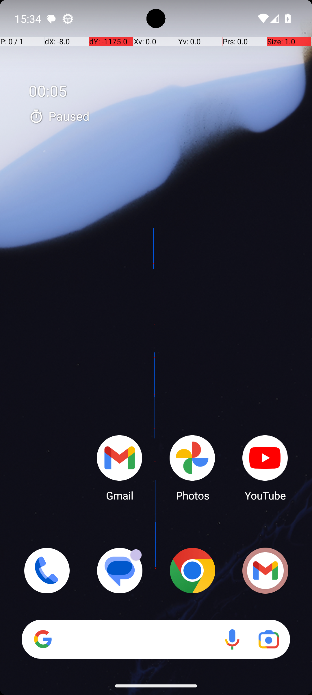

# SimpleSmsReplyMostRecent

## Quick links
- **Goal:** "Reply to the most recent text message using Simple SMS Messenger with message: Wedding anniversary on the 30th. Make reservations!"
- **History:** F/F/F/F/F
- **Step budget:** 12
- **Steps R0-R4:** 12/12/12/12/12
- **Termination:** max-steps
- **Determinism:** D3 unstable
- **Tags:** parameterized
- **Evaluator:** [`SimpleSmsReplyMostRecent class / inherited is_successful`](../../MARS-Voyager/androidworld/android_world/task_evals/single/sms.py#L57) - evaluator source link or inherited evaluator class.
- **Setup:** [`SimpleSmsReplyMostRecent.initialize_task`](../../MARS-Voyager/androidworld/android_world/task_evals/single/sms.py#L71) - setup source link or inherited setup class.
- **Trajectory folder:** [formatted traces](../../MARS-Voyager/eval_results/UI-Voyager/results/20260426203107_reformatted/SimpleSmsReplyMostRecent)
- **Image folder:** [screenshots](../../MARS-Voyager/eval_results/UI-Voyager/results/20260426203107/SimpleSmsReplyMostRecent/images)

## What success requires

The evaluator must observe the task-specific post-condition for: "Reply to the most recent text message using Simple SMS Messenger with message: Wedding anniversary on the 30th. Make reservations!". The task template is: "Reply to the most recent text message using Simple SMS Messenger with message: {message}". In practical terms, the report should judge success by the source-linked evaluator rather than by the agent's self-report; a `terminate(success)` or `answer` action is only meaningful if the app state or returned answer matches that evaluator.

## Cross-round behavior

| Round | Steps | Terminal action | Wall-step action |
|---|---:|---|---|
| R0 | 12 | swipe {'action': 'swipe', 'coordinate': [499, 796], 'coordinate2': [491, 328]} | Swipe up from the bottom of the screen to open the app drawer and find Simple SMS Messenger. |
| R1 | 12 | swipe {'action': 'swipe', 'coordinate': [499, 796], 'coordinate2': [491, 328]} | Swipe up from the bottom of the screen to open the app drawer and find Simple SMS Messenger. |
| R2 | 12 | swipe {'action': 'swipe', 'coordinate': [499, 796], 'coordinate2': [491, 328]} | Swipe up from the bottom of the screen to open the app drawer and find Simple SMS Messenger. |
| R3 | 12 | swipe {'action': 'swipe', 'coordinate': [499, 796], 'coordinate2': [491, 328]} | Swipe up from the bottom of the screen to open the app drawer and find Simple SMS Messenger. |
| R4 | 12 | swipe {'action': 'swipe', 'coordinate': [499, 796], 'coordinate2': [491, 328]} | Swipe up from the bottom of the screen to open the app drawer and find Simple SMS Messenger. |

First divergent assistant step across available rounds: **step 2**. The wall step used for this file is **step 1** because it is the first durable point where the trace commits to the failure mode represented by `app-not-found`.

## Wall step

### Round 0

*R0 step 1 - wall-step screenshot associated with the action below.*

Agent thought: "I need to open the Simple SMS Messenger app to reply to the most recent text message. Since it's not visible on the home screen, I should swipe up or access the app drawer to locate and open the app."

Agent action: `Swipe up from the bottom of the screen to open the app drawer and find Simple SMS Messenger.`

Tool call: `swipe {'action': 'swipe', 'coordinate': [499, 749], 'coordinate2': [499, 249]}`

### Round 4

*R4 step 1 - comparison screenshot at the same wall-step index when available.*

Agent thought: "I need to open the Simple SMS Messenger app to reply to the most recent text message. Since it's not visible on the home screen, I should swipe up or access the app drawer to locate and open the app."

Agent action: `Swipe up from the bottom of the screen to open the app drawer and find Simple SMS Messenger.`

Tool call: `swipe {'action': 'swipe', 'coordinate': [499, 749], 'coordinate2': [499, 249]}`

## What actually happened

The trajectory repeatedly tries to locate the target app and exhausts the available budget (12/12/12/12/12) before reaching the evaluator-relevant screen. The R0 wall-step action is `Swipe up from the bottom of the screen to open the app drawer and find Simple SMS Messenger.`. The representative comparison round records `Swipe up from the bottom of the screen to open the app drawer and find Simple SMS Messenger.` at the same step index, while the final available round ends with `Swipe up in the app drawer to reveal more apps and find Simple SMS Messenger.`. This is enough to identify the repeated failure mechanism, but any claim about fine-grained UI state should be checked against the embedded screenshots and the raw image directory.

## Root cause and category

Categories: `app-not-found`: the agent moves into launcher/app-drawer search behavior and spends the budget swiping or looking for the target app instead of using a reliable app search/open strategy.

Verdict: **retry sometimes explores variants but all fail**. The proximate failure is `app-not-found`; the upstream issue is that the policy lacks the reliable procedure needed for this class of task before it exhausts the budget or finalizes prematurely.

## Suggested fix

Teach the agent to use launcher search or an explicit app-open primitive after one failed visual scan instead of repeated drawer swipes.
