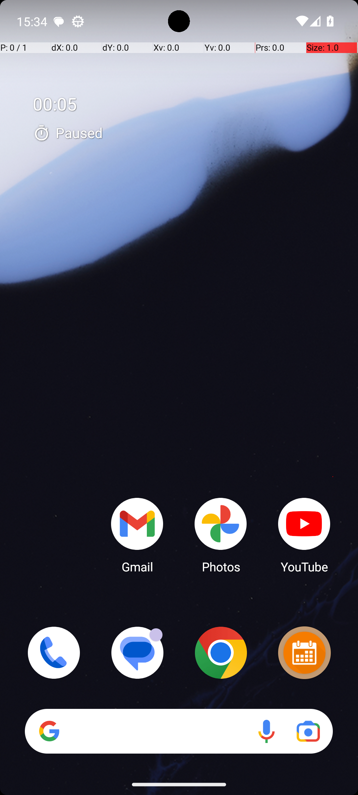

# SimpleSmsSend

## Quick links
- **Goal:** "Send a text message using Simple SMS Messenger to +14632272737 with message: Hello, World!"
- **History:** F/F/F/F/F
- **Step budget:** 12
- **Steps R0-R4:** 12/12/12/12/12
- **Termination:** max-steps
- **Determinism:** D3 unstable
- **Tags:** parameterized
- **Evaluator:** [`SimpleSmsSend class / inherited is_successful`](../../MARS-Voyager/androidworld/android_world/task_evals/single/sms.py#L28) - evaluator source link or inherited evaluator class.
- **Setup:** [`SimpleSmsSend class / inherited initialize_task`](../../MARS-Voyager/androidworld/android_world/task_evals/single/sms.py#L28) - setup source link or inherited setup class.
- **Trajectory folder:** [formatted traces](../../MARS-Voyager/eval_results/UI-Voyager/results/20260426203107_reformatted/SimpleSmsSend)
- **Image folder:** [screenshots](../../MARS-Voyager/eval_results/UI-Voyager/results/20260426203107/SimpleSmsSend/images)

## What success requires

The evaluator must observe the task-specific post-condition for: "Send a text message using Simple SMS Messenger to +14632272737 with message: Hello, World!". The task template is: "Send a text message using Simple SMS Messenger to {number} with message: {message}". In practical terms, the report should judge success by the source-linked evaluator rather than by the agent's self-report; a `terminate(success)` or `answer` action is only meaningful if the app state or returned answer matches that evaluator.

## Cross-round behavior

| Round | Steps | Terminal action | Wall-step action |
|---|---:|---|---|
| R0 | 12 | swipe {'action': 'swipe', 'coordinate': [499, 817], 'coordinate2': [491, 328]} | Swipe up from the bottom of the screen to access the app drawer and locate the Simple SMS Messenger app. |
| R1 | 12 | swipe {'action': 'swipe', 'coordinate': [499, 817], 'coordinate2': [491, 328]} | Swipe up from the bottom of the screen to access the app drawer and locate the Simple SMS Messenger app. |
| R2 | 12 | swipe {'action': 'swipe', 'coordinate': [499, 817], 'coordinate2': [491, 328]} | Swipe up from the bottom of the screen to access the app drawer and locate the Simple SMS Messenger app. |
| R3 | 12 | swipe {'action': 'swipe', 'coordinate': [499, 817], 'coordinate2': [491, 328]} | Swipe up from the bottom of the screen to access the app drawer and locate the Simple SMS Messenger app. |
| R4 | 12 | click {'action': 'click', 'coordinate': [499, 499]} | Swipe up from the bottom of the screen to open the app drawer and locate the Simple SMS Messenger app. |

First divergent assistant step across available rounds: **step 1**. The wall step used for this file is **step 1** because it is the first durable point where the trace commits to the failure mode represented by `app-not-found`.

## Wall step

### Round 0

*R0 step 1 - wall-step screenshot associated with the action below.*

Agent thought: "I need to send a text message using the Simple SMS Messenger app. Since it's not visible on the home screen, I should look for it by swiping up or accessing the app drawer to find and open the app."

Agent action: `Swipe up from the bottom of the screen to access the app drawer and locate the Simple SMS Messenger app.`

Tool call: `swipe {'action': 'swipe', 'coordinate': [499, 742], 'coordinate2': [491, 320]}`

### Round 4

*R4 step 1 - comparison screenshot at the same wall-step index when available.*

Agent thought: "I need to send a text message using the Simple SMS Messenger app. Since I'm currently on the home screen, my first step should be to locate and open the Simple SMS Messenger app. To do this, I will swipe up or access the app drawer to find the app."

Agent action: `Swipe up from the bottom of the screen to open the app drawer and locate the Simple SMS Messenger app.`

Tool call: `swipe {'action': 'swipe', 'coordinate': [499, 742], 'coordinate2': [491, 320]}`

## What actually happened

The trajectory repeatedly tries to locate the target app and exhausts the available budget (12/12/12/12/12) before reaching the evaluator-relevant screen. The R0 wall-step action is `Swipe up from the bottom of the screen to access the app drawer and locate the Simple SMS Messenger app.`. The representative comparison round records `Swipe up from the bottom of the screen to open the app drawer and locate the Simple SMS Messenger app.` at the same step index, while the final available round ends with `I tapped on the Simple SMS Messenger app icon to open it.`. This is enough to identify the repeated failure mechanism, but any claim about fine-grained UI state should be checked against the embedded screenshots and the raw image directory.

## Root cause and category

Categories: `app-not-found`: the agent moves into launcher/app-drawer search behavior and spends the budget swiping or looking for the target app instead of using a reliable app search/open strategy.

Verdict: **retry sometimes explores variants but all fail**. The proximate failure is `app-not-found`; the upstream issue is that the policy lacks the reliable procedure needed for this class of task before it exhausts the budget or finalizes prematurely.

## Suggested fix

Teach the agent to use launcher search or an explicit app-open primitive after one failed visual scan instead of repeated drawer swipes.
