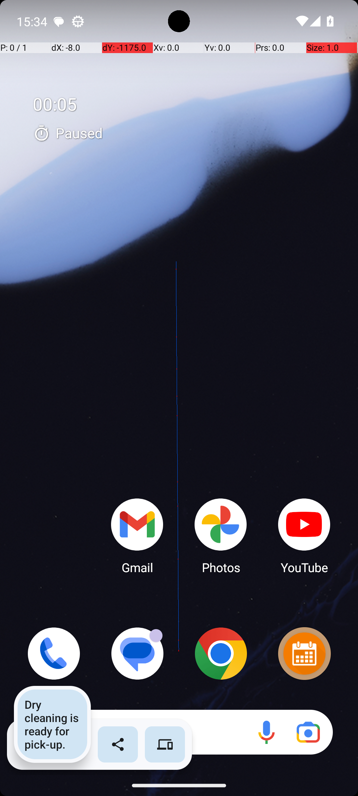
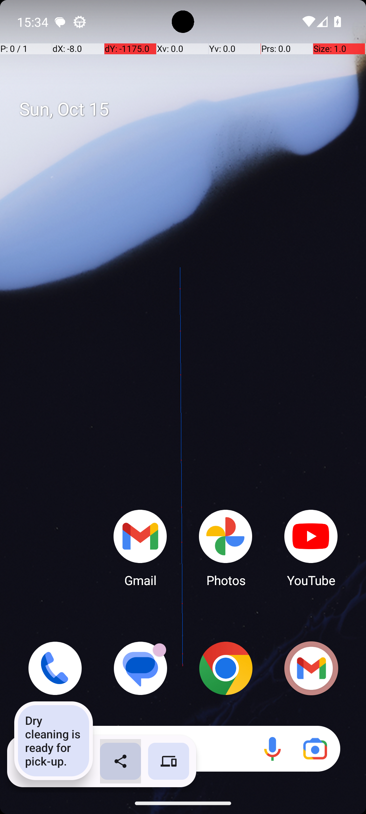

# SimpleSmsSendClipboardContent

## Quick links
- **Goal:** "Send a message to +13204046764 with the clipboard content in Simple SMS Messenger"
- **History:** F/F/F/F/F
- **Step budget:** 12
- **Steps R0-R4:** 12/12/12/12/-
- **Termination:** max-steps
- **Determinism:** D1 strict
- **Tags:** data_entry, parameterized
- **Evaluator:** [`SimpleSmsSendClipboardContent class / inherited is_successful`](../../MARS-Voyager/androidworld/android_world/task_evals/single/sms.py#L158) - evaluator source link or inherited evaluator class.
- **Setup:** [`SimpleSmsSendClipboardContent.initialize_task`](../../MARS-Voyager/androidworld/android_world/task_evals/single/sms.py#L168) - setup source link or inherited setup class.
- **Trajectory folder:** [formatted traces](../../MARS-Voyager/eval_results/UI-Voyager/results/20260426203107_reformatted/SimpleSmsSendClipboardContent)
- **Image folder:** [screenshots](../../MARS-Voyager/eval_results/UI-Voyager/results/20260426203107/SimpleSmsSendClipboardContent/images)

## What success requires

The evaluator must observe the task-specific post-condition for: "Send a message to +13204046764 with the clipboard content in Simple SMS Messenger". The task template is: "Send a message to {number} with the clipboard content in Simple SMS Messenger". In practical terms, the report should judge success by the source-linked evaluator rather than by the agent's self-report; a `terminate(success)` or `answer` action is only meaningful if the app state or returned answer matches that evaluator.

## Cross-round behavior

| Round | Steps | Terminal action | Wall-step action |
|---|---:|---|---|
| R0 | 12 | swipe {'action': 'swipe', 'coordinate': [499, 817], 'coordinate2': [491, 328]} | Swipe up from the bottom of the screen to access the app drawer and locate the Simple SMS Messenger app. |
| R1 | 12 | swipe {'action': 'swipe', 'coordinate': [499, 817], 'coordinate2': [491, 328]} | Swipe up from the bottom of the screen to access the app drawer and locate the Simple SMS Messenger app. |
| R2 | 12 | swipe {'action': 'swipe', 'coordinate': [499, 817], 'coordinate2': [491, 328]} | Swipe up from the bottom of the screen to access the app drawer and locate the Simple SMS Messenger app. |
| R3 | 12 | swipe {'action': 'swipe', 'coordinate': [499, 817], 'coordinate2': [491, 328]} | Swipe up from the bottom of the screen to access the app drawer and locate the Simple SMS Messenger app. |
| R4 | - | missing trajectory file | - |

First divergent assistant step across available rounds: **none; all available assistant outputs are byte-identical**. The wall step used for this file is **step 1** because it is the first durable point where the trace commits to the failure mode represented by `app-not-found`.

## Wall step

### Round 0

*R0 step 1 - wall-step screenshot associated with the action below.*

Agent thought: "I need to send a message using the Simple SMS Messenger app. Since it is not visible on the home screen, I should look for it by swiping up or accessing the app drawer to find and open the Simple SMS Messenger app."

Agent action: `Swipe up from the bottom of the screen to access the app drawer and locate the Simple SMS Messenger app.`

Tool call: `swipe {'action': 'swipe', 'coordinate': [499, 742], 'coordinate2': [491, 320]}`

### Round 3

*R3 step 1 - comparison screenshot at the same wall-step index when available.*

Agent thought: "I need to send a message using the Simple SMS Messenger app. Since it is not visible on the home screen, I should look for it by swiping up or accessing the app drawer to find and open the Simple SMS Messenger app."

Agent action: `Swipe up from the bottom of the screen to access the app drawer and locate the Simple SMS Messenger app.`

Tool call: `swipe {'action': 'swipe', 'coordinate': [499, 742], 'coordinate2': [491, 320]}`

## What actually happened

The trajectory repeatedly tries to locate the target app and exhausts the available budget (12/12/12/12/-) before reaching the evaluator-relevant screen. The R0 wall-step action is `Swipe up from the bottom of the screen to access the app drawer and locate the Simple SMS Messenger app.`. The representative comparison round records `Swipe up from the bottom of the screen to access the app drawer and locate the Simple SMS Messenger app.` at the same step index, while the final available round ends with `Scroll down further in the app drawer to locate the Simple SMS Messenger app.`. This is enough to identify the repeated failure mechanism, but any claim about fine-grained UI state should be checked against the embedded screenshots and the raw image directory.

## Root cause and category

Categories: `app-not-found`: the agent moves into launcher/app-drawer search behavior and spends the budget swiping or looking for the target app instead of using a reliable app search/open strategy.

Verdict: **retry cannot help**. The proximate failure is `app-not-found`; the upstream issue is that the policy lacks the reliable procedure needed for this class of task before it exhausts the budget or finalizes prematurely.

## Suggested fix

Teach the agent to use launcher search or an explicit app-open primitive after one failed visual scan instead of repeated drawer swipes.
