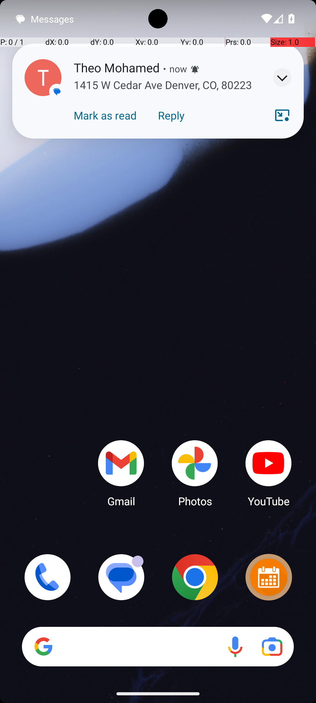
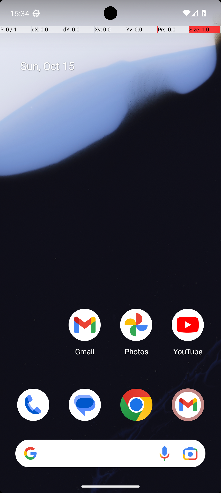

# SimpleSmsSendReceivedAddress

## Quick links
- **Goal:** "Text the address of the event to Leon Ibrahim that Theo Mohamed just sent me in Simple SMS Messenger"
- **History:** F/F/F/F/F
- **Step budget:** 18
- **Steps R0-R4:** 18/18/18/18/18
- **Termination:** max-steps
- **Determinism:** D3 unstable
- **Tags:** information_retrieval, parameterized
- **Evaluator:** [`SimpleSmsSendReceivedAddress class / inherited is_successful`](../../MARS-Voyager/androidworld/android_world/task_evals/single/sms.py#L173) - evaluator source link or inherited evaluator class.
- **Setup:** [`SimpleSmsSendReceivedAddress.initialize_task`](../../MARS-Voyager/androidworld/android_world/task_evals/single/sms.py#L216) - setup source link or inherited setup class.
- **Trajectory folder:** [formatted traces](../../MARS-Voyager/eval_results/UI-Voyager/results/20260426203107_reformatted/SimpleSmsSendReceivedAddress)
- **Image folder:** [screenshots](../../MARS-Voyager/eval_results/UI-Voyager/results/20260426203107/SimpleSmsSendReceivedAddress/images)

## What success requires

The evaluator must observe the task-specific post-condition for: "Text the address of the event to Leon Ibrahim that Theo Mohamed just sent me in Simple SMS Messenger". The task template is: "Text the address of the event to {name1} that {name2} just sent me in Simple SMS Messenger". In practical terms, the report should judge success by the source-linked evaluator rather than by the agent's self-report; a `terminate(success)` or `answer` action is only meaningful if the app state or returned answer matches that evaluator.

## Cross-round behavior

| Round | Steps | Terminal action | Wall-step action |
|---|---:|---|---|
| R0 | 18 | swipe {'action': 'swipe', 'coordinate': [499, 796], 'coordinate2': [491, 328]} | Swipe up from the bottom of the screen to open the app drawer and locate Simple SMS Messenger. |
| R1 | 18 | swipe {'action': 'swipe', 'coordinate': [499, 796], 'coordinate2': [491, 328]} | Swipe up from the bottom of the screen to open the app drawer and locate Simple SMS Messenger. |
| R2 | 18 | swipe {'action': 'swipe', 'coordinate': [499, 796], 'coordinate2': [491, 328]} | Swipe up from the bottom of the screen to open the app drawer and locate Simple SMS Messenger. |
| R3 | 18 | swipe {'action': 'swipe', 'coordinate': [499, 796], 'coordinate2': [491, 328]} | Swipe up from the bottom of the screen to open the app drawer and locate Simple SMS Messenger. |
| R4 | 18 | swipe {'action': 'swipe', 'coordinate': [499, 796], 'coordinate2': [491, 328]} | Swipe up from the bottom of the screen to open the app drawer and locate Simple SMS Messenger. |

First divergent assistant step across available rounds: **step 2**. The wall step used for this file is **step 1** because it is the first durable point where the trace commits to the failure mode represented by `app-not-found; task-constraint-missed`.

## Wall step

### Round 0

*R0 step 1 - wall-step screenshot associated with the action below.*

Agent thought: "I need to access the Simple SMS Messenger app to find the message from Theo Mohamed and then text the address to Leon Ibrahim. Since the app is not visible on the home screen, I should open the app drawer or search for it."

Agent action: `Swipe up from the bottom of the screen to open the app drawer and locate Simple SMS Messenger.`

Tool call: `swipe {'action': 'swipe', 'coordinate': [499, 749], 'coordinate2': [499, 249]}`

### Round 4

*R4 step 1 - comparison screenshot at the same wall-step index when available.*

Agent thought: "I need to access the Simple SMS Messenger app to find the message from Theo Mohamed and then text the address to Leon Ibrahim. Since the app is not visible on the home screen, I should open the app drawer or search for it."

Agent action: `Swipe up from the bottom of the screen to open the app drawer and locate Simple SMS Messenger.`

Tool call: `swipe {'action': 'swipe', 'coordinate': [499, 749], 'coordinate2': [499, 249]}`

## What actually happened

The trajectory repeatedly tries to locate the target app and exhausts the available budget (18/18/18/18/18) before reaching the evaluator-relevant screen. The R0 wall-step action is `Swipe up from the bottom of the screen to open the app drawer and locate Simple SMS Messenger.`. The representative comparison round records `Swipe up from the bottom of the screen to open the app drawer and locate Simple SMS Messenger.` at the same step index, while the final available round ends with `Swipe up in the app drawer to scroll down and locate the Simple SMS Messenger app.`. This is enough to identify the repeated failure mechanism, but any claim about fine-grained UI state should be checked against the embedded screenshots and the raw image directory.

## Root cause and category

Categories: `app-not-found`: the agent moves into launcher/app-drawer search behavior and spends the budget swiping or looking for the target app instead of using a reliable app search/open strategy; `task-constraint-missed`: the agent misses a stated constraint such as all items, ordering, filtering, exact duplicate handling, date range, or recipient/content matching.

Verdict: **retry sometimes explores variants but all fail**. The proximate failure is `app-not-found; task-constraint-missed`; the upstream issue is that the policy lacks the reliable procedure needed for this class of task before it exhausts the budget or finalizes prematurely.

## Suggested fix

Teach the agent to use launcher search or an explicit app-open primitive after one failed visual scan instead of repeated drawer swipes. Make the agent restate and check every explicit constraint before finalizing.
