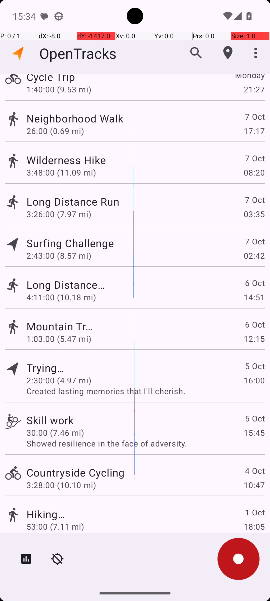

# SportsTrackerActivitiesOnDate

## Quick links
- **Goal:** "What activities did I do October 05 2023 in the OpenTracks app? Answer with the activity type only. If there are multiple types, format your answer in a comma separated list."
- **History:** F/F/F/F/F
- **Step budget:** 6
- **Steps R0-R4:** 6/6/5/6/5
- **Termination:** answer
- **Determinism:** D3 unstable
- **Tags:** search, complex_ui_understanding, screen_reading, information_retrieval, transcription, parameterized
- **Evaluator:** [`SportsTrackerActivitiesOnDate dynamic task / InformationRetrieval.is_successful`](../../MARS-Voyager/androidworld/android_world/task_evals/information_retrieval/information_retrieval.py#L109) - dynamic task; prompt and criteria are defined in [tasks.textproto](../../MARS-Voyager/androidworld/android_world/task_evals/information_retrieval/proto/tasks.textproto#L1826).
- **Setup:** [`SportsTrackerActivitiesOnDate dynamic task / InformationRetrieval.initialize_task`](../../MARS-Voyager/androidworld/android_world/task_evals/information_retrieval/information_retrieval.py#L82) - initializes app-specific state from the task proto.
- **Trajectory folder:** [formatted traces](../../MARS-Voyager/eval_results/UI-Voyager/results/20260426203107_reformatted/SportsTrackerActivitiesOnDate)
- **Image folder:** [screenshots](../../MARS-Voyager/eval_results/UI-Voyager/results/20260426203107/SportsTrackerActivitiesOnDate/images)

## What success requires

The evaluator must observe the task-specific post-condition for: "What activities did I do October 05 2023 in the OpenTracks app? Answer with the activity type only. If there are multiple types, format your answer in a comma separated list.". The task template is: "What activities did I do {date} in the OpenTracks app? Answer with the category only. If there are multiples categories, format your answer in a comma separated list.". In practical terms, the report should judge success by the source-linked evaluator rather than by the agent's self-report; a `terminate(success)` or `answer` action is only meaningful if the app state or returned answer matches that evaluator.

## Cross-round behavior

| Round | Steps | Terminal action | Wall-step action |
|---|---:|---|---|
| R0 | 6 | answer {'action': 'answer', 'text': 'Cycling, Cycling'} | I identified the activities on October 05, 2023, as \"Cycling\" and \"Cycling.\ |
| R1 | 6 | answer {'action': 'answer', 'text': 'Cycling, Cycling'} | I identified the activities on October 05, 2023, as \"Cycling\" and \"Cycling.\ |
| R2 | 5 | answer {'action': 'answer', 'text': 'Navigation, Trying...'} | I identified the activity on October 05, 2023, as \"Navigation\" and \"Trying...\". |
| R3 | 6 | answer {'action': 'answer', 'text': 'Cycling, Cycling'} | I identified the activities on October 05, 2023, as \"Cycling\" and \"Cycling.\ |
| R4 | 5 | answer {'action': 'answer', 'text': 'Cycling, Cycling'} | I identified the activities on October 05, 2023, as \"Cycling\" and \"Cycling.\ |

First divergent assistant step across available rounds: **step 1**. The wall step used for this file is **step 6** because it is the first durable point where the trace commits to the failure mode represented by `premature-success; visual-grounding`.

## Wall step

### Round 0

*R0 step 6 - wall-step screenshot associated with the action below.*

Agent thought: "I am looking for activities on October 05, 2023. I've scrolled through the list and found two activities dated October 5th: "Trying..." and "Skill work." The type of the first activity is not fully visible, but it appears to be a cycling activity based on the icon. The second activity, "Skill work," is also likely a cycling activity, as indicated by the bicycle icon. Therefore, the activities on October 05, 2023, are "Cycling" and "Cycling.""

Agent action: `I identified the activities on October 05, 2023, as \"Cycling\" and \"Cycling.\`

Tool call: `answer {'action': 'answer', 'text': 'Cycling, Cycling'}`

### Round 3

*R3 step 6 - comparison screenshot at the same wall-step index when available.*

Agent thought: "I am looking for activities on October 05, 2023. I've scrolled through the list and found two activities dated October 5th: "Trying..." and "Skill work." The type of the first activity is not fully visible, but it appears to be a cycling activity based on the icon. The second activity, "Skill work," is also likely a cycling activity, as indicated by the bicycle icon. Therefore, the activities on October 05, 2023, are "Cycling" and "Cycling.""

Agent action: `I identified the activities on October 05, 2023, as \"Cycling\" and \"Cycling.\`

Tool call: `answer {'action': 'answer', 'text': 'Cycling, Cycling'}`

## What actually happened

The final action is `answer`, so the run ends before the trace shows a verified evaluator post-condition. The R0 wall-step action is `I identified the activities on October 05, 2023, as \"Cycling\" and \"Cycling.\`. The representative comparison round records `I identified the activities on October 05, 2023, as \"Cycling\" and \"Cycling.\` at the same step index, while the final available round ends with `I identified the activities on October 05, 2023, as \"Cycling\" and \"Cycling.\`. This is enough to identify the repeated failure mechanism, but any claim about fine-grained UI state should be checked against the embedded screenshots and the raw image directory.

## Root cause and category

Categories: `premature-success`: the agent declares success or answers before observing the evaluator-relevant post-condition; `visual-grounding`: the failure depends on reading a UI state, icon, checkbox, slider, canvas, or numeric value more precisely than the agent manages.

Verdict: **retry sometimes explores variants but all fail**. The proximate failure is `premature-success; visual-grounding`; the upstream issue is that the policy lacks the reliable procedure needed for this class of task before it exhausts the budget or finalizes prematurely.

## Suggested fix

Require a verification observation immediately before `terminate(success)` or `answer`, tied to the evaluator post-condition. Improve state readback prompts and use UI/a11y text or detail screens where available instead of guessing from icons or pixels.
