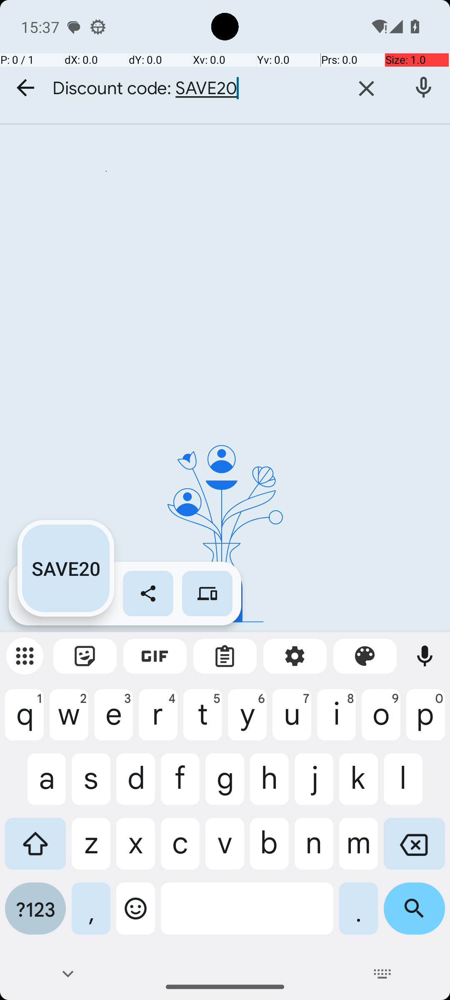
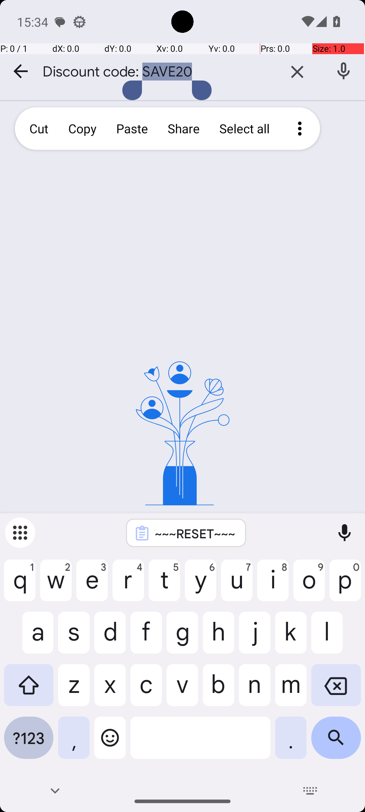

# SystemCopyToClipboard

## Quick links
- **Goal:** "Copy the following text to the clipboard: Discount code: SAVE20"
- **History:** F/F/F/F/F
- **Step budget:** 8
- **Steps R0-R4:** 7/8/8/8/8
- **Termination:** agent-done
- **Determinism:** D3 unstable
- **Tags:** data_entry, parameterized
- **Evaluator:** [`SystemCopyToClipboard.is_successful`](../../MARS-Voyager/androidworld/android_world/task_evals/single/system.py#L325) - evaluator source link or inherited evaluator class.
- **Setup:** [`SystemCopyToClipboard.initialize_task`](../../MARS-Voyager/androidworld/android_world/task_evals/single/system.py#L321) - setup source link or inherited setup class.
- **Trajectory folder:** [formatted traces](../../MARS-Voyager/eval_results/UI-Voyager/results/20260426203107_reformatted/SystemCopyToClipboard)
- **Image folder:** [screenshots](../../MARS-Voyager/eval_results/UI-Voyager/results/20260426203107/SystemCopyToClipboard/images)

## What success requires

The evaluator must observe the task-specific post-condition for: "Copy the following text to the clipboard: Discount code: SAVE20". The task template is: "Copy the following text to the clipboard: {clipboard_content}". In practical terms, the report should judge success by the source-linked evaluator rather than by the agent's self-report; a `terminate(success)` or `answer` action is only meaningful if the app state or returned answer matches that evaluator.

## Cross-round behavior

| Round | Steps | Terminal action | Wall-step action |
|---|---:|---|---|
| R0 | 7 | terminate {'action': 'terminate', 'status': 'success'} | I copied the text 'Discount code: SAVE20' to the clipboard. |
| R1 | 8 | terminate {'action': 'terminate', 'status': 'success'} | I tapped on the \"Copy\" option to copy the text to the clipboard. |
| R2 | 8 | terminate {'action': 'terminate', 'status': 'success'} | I tapped on the \"Copy\" option to copy the text to the clipboard. |
| R3 | 8 | terminate {'action': 'terminate', 'status': 'success'} | I tapped on the \"Copy\" option to copy the text to the clipboard. |
| R4 | 8 | terminate {'action': 'terminate', 'status': 'success'} | I tapped on the \"Copy\" option to copy the text to the clipboard. |

First divergent assistant step across available rounds: **step 1**. The wall step used for this file is **step 7** because it is the first durable point where the trace commits to the failure mode represented by `premature-success`.

## Wall step

### Round 0

*R0 step 7 - wall-step screenshot associated with the action below.*

Agent thought: "I have successfully copied the text "Discount code: SAVE20" to the clipboard. The presence of the text in the clipboard is confirmed by the notification that appears, indicating that the copy operation was completed. My next step would be to save this clipboard content to ensure it is not lost."

Agent action: `I copied the text 'Discount code: SAVE20' to the clipboard.`

Tool call: `terminate {'action': 'terminate', 'status': 'success'}`

### Round 4

*R4 step 7 - comparison screenshot at the same wall-step index when available.*

Agent thought: "I have already selected the text "Discount code: SAVE20" for copying. Now, I need to confirm the copy action by tapping on the "Copy" option in the context menu. This will ensure that the text is copied to the clipboard, which is my goal."

Agent action: `I tapped on the \"Copy\" option to copy the text to the clipboard.`

Tool call: `click {'action': 'click', 'coordinate': [236, 171]}`

## What actually happened

The final action is `agent-done`, so the run ends before the trace shows a verified evaluator post-condition. The R0 wall-step action is `I copied the text 'Discount code: SAVE20' to the clipboard.`. The representative comparison round records `I tapped on the \"Copy\" option to copy the text to the clipboard.` at the same step index, while the final available round ends with `I copied the text 'Discount code: SAVE20' to the clipboard.`. This is enough to identify the repeated failure mechanism, but any claim about fine-grained UI state should be checked against the embedded screenshots and the raw image directory.

## Root cause and category

Categories: `premature-success`: the agent declares success or answers before observing the evaluator-relevant post-condition.

Verdict: **retry sometimes explores variants but all fail**. The proximate failure is `premature-success`; the upstream issue is that the policy lacks the reliable procedure needed for this class of task before it exhausts the budget or finalizes prematurely.

## Suggested fix

Require a verification observation immediately before `terminate(success)` or `answer`, tied to the evaluator post-condition.
