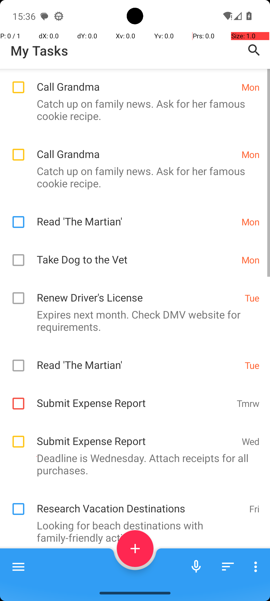
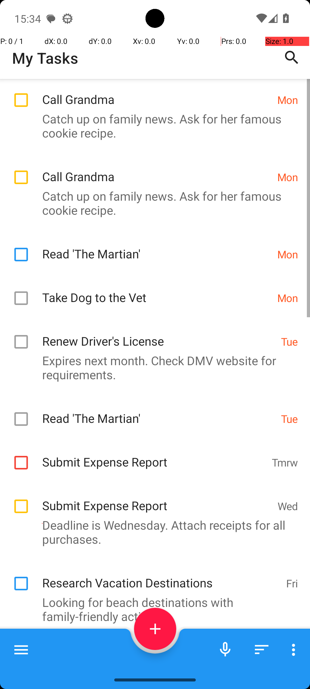

# TasksCompletedTasksForDate

## Quick links
- **Goal:** "Which tasks have I completed for Tuesday in Tasks app? Answer with the titles only. If there are multiples titles, format your answer in a comma separated list."
- **History:** F/F/F/F/F
- **Step budget:** 4
- **Steps R0-R4:** 4/4/4/4/4
- **Termination:** answer
- **Determinism:** D3 unstable
- **Tags:** information_retrieval, search, parameterized
- **Evaluator:** [`TasksCompletedTasksForDate dynamic task / InformationRetrieval.is_successful`](../../MARS-Voyager/androidworld/android_world/task_evals/information_retrieval/information_retrieval.py#L109) - dynamic task; prompt and criteria are defined in [tasks.textproto](../../MARS-Voyager/androidworld/android_world/task_evals/information_retrieval/proto/tasks.textproto#L1527).
- **Setup:** [`TasksCompletedTasksForDate dynamic task / InformationRetrieval.initialize_task`](../../MARS-Voyager/androidworld/android_world/task_evals/information_retrieval/information_retrieval.py#L82) - initializes app-specific state from the task proto.
- **Trajectory folder:** [formatted traces](../../MARS-Voyager/eval_results/UI-Voyager/results/20260426203107_reformatted/TasksCompletedTasksForDate)
- **Image folder:** [screenshots](../../MARS-Voyager/eval_results/UI-Voyager/results/20260426203107/TasksCompletedTasksForDate/images)

## What success requires

The evaluator must observe the task-specific post-condition for: "Which tasks have I completed for Tuesday in Tasks app? Answer with the titles only. If there are multiples titles, format your answer in a comma separated list.". The task template is: "Which tasks have I completed for {date} in Tasks app? Answer with the titles only. If there are multiples titles, format your answer in a comma separated list.". In practical terms, the report should judge success by the source-linked evaluator rather than by the agent's self-report; a `terminate(success)` or `answer` action is only meaningful if the app state or returned answer matches that evaluator.

## Cross-round behavior

| Round | Steps | Terminal action | Wall-step action |
|---|---:|---|---|
| R0 | 4 | answer {'action': 'answer', 'text': "Renew Driver's License, Read 'The Martian'"} | The completed tasks for Tuesday are: Renew Driver's License, Read 'The Martian'. |
| R1 | 4 | answer {'action': 'answer', 'text': "Renew Driver's License, Read 'The Martian'"} | The completed tasks for Tuesday are: Renew Driver's License, Read 'The Martian'. |
| R2 | 4 | answer {'action': 'answer', 'text': "Renew Driver's License, Read 'The Martian'"} | The completed tasks for Tuesday are: Renew Driver's License, Read 'The Martian'. |
| R3 | 4 | answer {'action': 'answer', 'text': "Renew Driver's License, Read 'The Martian'"} | The completed tasks for Tuesday are: Renew Driver's License, Read 'The Martian'. |
| R4 | 4 | answer {'action': 'answer', 'text': "Renew Driver's License, Read 'The Martian'"} | The completed tasks for Tuesday are: Renew Driver's License, Read 'The Martian'. |

First divergent assistant step across available rounds: **step 3**. The wall step used for this file is **step 4** because it is the first durable point where the trace commits to the failure mode represented by `premature-success; visual-grounding`.

## Wall step

### Round 0

*R0 step 4 - wall-step screenshot associated with the action below.*

Agent thought: "I need to identify which tasks are due for Tuesday and have been completed. From the screenshot, I can see that there are two tasks marked as "Renew Driver's License" and "Read 'The Martian'" under the Tuesday category. Since these tasks are not checked off, they indicate that they have been completed."

Agent action: `The completed tasks for Tuesday are: Renew Driver's License, Read 'The Martian'.`

Tool call: `answer {'action': 'answer', 'text': "Renew Driver's License, Read 'The Martian'"}`

### Round 4

*R4 step 4 - comparison screenshot at the same wall-step index when available.*

Agent thought: "I need to identify which tasks are due for Tuesday and have been completed. From the screenshot, I can see that there are two tasks marked as "Renew Driver's License" and "Read 'The Martian'" under the Tuesday category. Since these tasks are not checked off, they indicate that they have been completed."

Agent action: `The completed tasks for Tuesday are: Renew Driver's License, Read 'The Martian'.`

Tool call: `answer {'action': 'answer', 'text': "Renew Driver's License, Read 'The Martian'"}`

## What actually happened

The final action is `answer`, so the run ends before the trace shows a verified evaluator post-condition. The R0 wall-step action is `The completed tasks for Tuesday are: Renew Driver's License, Read 'The Martian'.`. The representative comparison round records `The completed tasks for Tuesday are: Renew Driver's License, Read 'The Martian'.` at the same step index, while the final available round ends with `The completed tasks for Tuesday are: Renew Driver's License, Read 'The Martian'.`. This is enough to identify the repeated failure mechanism, but any claim about fine-grained UI state should be checked against the embedded screenshots and the raw image directory.

## Root cause and category

Categories: `premature-success`: the agent declares success or answers before observing the evaluator-relevant post-condition; `visual-grounding`: the failure depends on reading a UI state, icon, checkbox, slider, canvas, or numeric value more precisely than the agent manages.

Verdict: **retry sometimes explores variants but all fail**. The proximate failure is `premature-success; visual-grounding`; the upstream issue is that the policy lacks the reliable procedure needed for this class of task before it exhausts the budget or finalizes prematurely.

## Suggested fix

Require a verification observation immediately before `terminate(success)` or `answer`, tied to the evaluator post-condition. Improve state readback prompts and use UI/a11y text or detail screens where available instead of guessing from icons or pixels.
