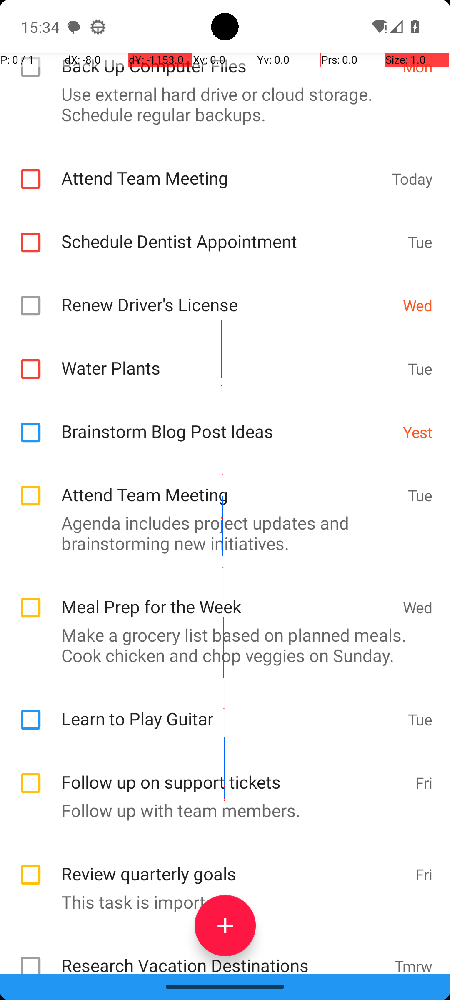
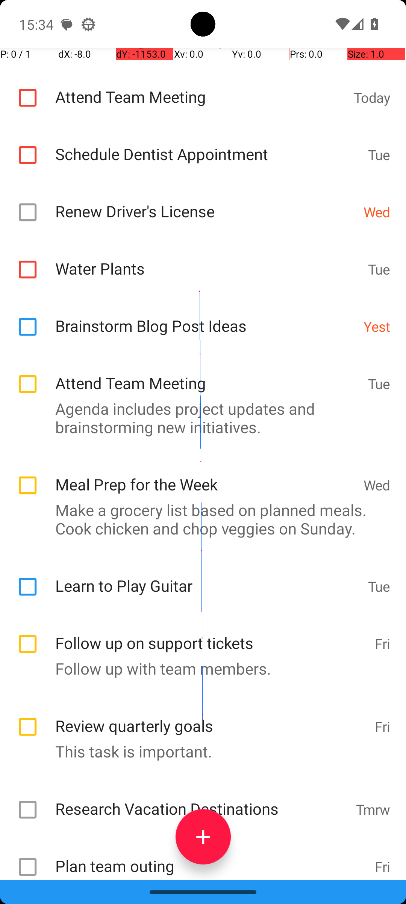

# 01 — TasksDueOnDate

## Quick links

- **Goal:** *"What tasks do I have due Friday in Tasks app? Answer with the titles only. If there are multiples titles, format your answer in a comma separated list."*
- **History:** F → F → F → S (rescued at R3)
- **Step budget:** 10 (`max_n_steps`)
- **Evaluator:** [`InformationRetrieval.is_successful`](../../MARS-Voyager/androidworld/android_world/task_evals/information_retrieval/information_retrieval.py#L109) — string-match the agent's `answer(...)` against the proto-defined expected list.
- **Setup:** [`InformationRetrieval.initialize_task`](../../MARS-Voyager/androidworld/android_world/task_evals/information_retrieval/information_retrieval.py#L82) → [`task_app_utils.setup_task_state`](../../MARS-Voyager/androidworld/android_world/task_evals/information_retrieval/task_app_utils.py#L41) — wipes the Tasks SQLite table and re-inserts a deterministic 3 (target Friday tasks) + 20 (noise) rows, shuffled with the task seed.
- **Trajectory folder:** [`TasksDueOnDate/`](../../MARS-Voyager/eval_results/UI-Voyager/results/20260426203107_reformatted/TasksDueOnDate/)
- **Image folder:** [`images/`](../../MARS-Voyager/eval_results/UI-Voyager/results/20260426203107/TasksDueOnDate/images/)

## What "success" requires (evaluator)

The evaluator reads `env.interaction_cache` — the text the agent passed to `answer(...)` — and runs [`proto_utils.check_agent_answer`](../../MARS-Voyager/androidworld/android_world/task_evals/information_retrieval/proto_utils.py) against the canonical expected list pulled from the task proto. The expected answer for this task is the **set of titles of all 3 Friday tasks** that [`setup_task_state`](../../MARS-Voyager/androidworld/android_world/task_evals/information_retrieval/task_app_utils.py#L41) inserted into the Tasks DB; both presence and equality of the set are required (set semantics — order in the comma-separated list does not matter, but each title must be there exactly once and no extras).

The setup is fully deterministic: [`clear_task_db`](../../MARS-Voyager/androidworld/android_world/task_evals/information_retrieval/task_app_utils.py#L113) wipes the `tasks` SQLite table; [`setup_task_state`](../../MARS-Voyager/androidworld/android_world/task_evals/information_retrieval/task_app_utils.py#L41) then inserts the 3 target Friday tasks (defined in [`tasks.textproto`](../../MARS-Voyager/androidworld/android_world/task_evals/information_retrieval/proto/tasks.textproto) at the `TasksDueOnDate` block) plus 20 noise tasks generated under the fixed task seed. **All 4 rounds therefore have the exact same 23 rows in the Tasks DB.**

## What the agent saw at the divergence step

Steps 0–3 (the JSONL records for "Step 1" through "Step 4") are byte-identical across all four rounds: same swipes from the home screen, same scroll inside the app drawer, same tap on the Tasks icon at almost-identical coordinates, same scroll-down inside the Tasks app. The divergence is the **outcome of the step-4 swipe** (which produces the screenshot the agent reasons over for the final `answer` call):

| Round 0 (FAIL) | Round 3 (PASS) |
|---|---|
|  |  |
| *R0 step 4 — list scrolled to show "Follow up on support tickets — Fri" and "Review quarterly goals — Fri" as the bottom-most visible Friday rows; the next item is "Research Vacation Destinations — Tmrw"* | *R3 step 4 — same list, same items, scrolled ~one row further; "Plan team outing — Fri" is now visible at the very bottom (just above the red `+` button)* |

**R0 thought (verbatim):** *"I can see two tasks marked as 'Fri': 'Follow up on support tickets' and 'Review quarterly goals.'"*
**R0 action:** `answer text='Follow up on support tickets, Review quarterly goals'`

**R3 thought (verbatim):** *"I can see three tasks marked as 'Fri': 'Follow up on support tickets,' 'Review quarterly goals,' and 'Plan team outing.'"*
**R3 action:** `answer text='Follow up on support tickets, Review quarterly goals, Plan team outing'`

Both answers correctly transcribe what the agent could see — R0 missed "Plan team outing" not because the task wasn't in the database (it was, in all four rounds) but because that row sat just below the visible viewport in R0's scroll outcome.

## What actually happened

Both rounds executed the same swipe `[499, 800] → [491, 320]` on what was — by every signal in the JSONL — an identical Tasks-app screen. R3's scroll happened to land roughly one row deeper than R0's, exposing "Plan team outing" at the bottom edge. The R0 model gave a complete and honest answer for the two Friday rows it could see; the evaluator failed it because the canonical answer requires all three.

It is tempting to attribute the R3 success to a different DB content (e.g. a "cold-start re-initialisation" that added a third Friday task), but that hypothesis is contradicted by the source code: [`setup_task_state`](../../MARS-Voyager/androidworld/android_world/task_evals/information_retrieval/task_app_utils.py#L41) clears and re-populates the `tasks` table at the start of every round, deterministically producing the same 3 Friday tasks + 20 noise tasks (the random seed is set in [`task_eval.initialize_task`](../../MARS-Voyager/androidworld/android_world/task_evals/task_eval.py#L142) before `setup_task_state` runs). The `Skipping app snapshot loading` warning that the worker log emits for both rounds is causally irrelevant to the DB content — `setup_task_state` operates directly on the SQLite file and is not affected by whether the snapshot restore succeeded:

```
[R0] WARNING:absl:Skipping app snapshot loading : Snapshot not found in /data/data/android_world/snapshots/org.tasks.
[R0] WARNING:absl:Could not get a11y tree on attempt 1/5; retrying in 2.0s.
[R3] WARNING:absl:Skipping app snapshot loading : Snapshot not found in /data/data/android_world/snapshots/org.tasks.
[R3] WARNING:absl:Could not get a11y tree on attempt 1/5; retrying in 2.0s.
```

What changed between rounds is the **scroll deceleration outcome** for the same swipe gesture. Android scrolls are physics-based (fling animations whose final position depends on the computed initial velocity, which in turn depends on inter-event timing of the swipe's MotionEvents). The emulator's frame-timing is non-deterministic by tens of milliseconds round-to-round, so the same swipe can end at slightly different scroll offsets. R3 happened to land in the favourable position; R0 did not.

A possible secondary contributor is *aux-table persistence in `shared_prefs`* — the Tasks app records its last sort order and last scroll position there, and `Skipping app snapshot loading` means [`restore_snapshot`](../../MARS-Voyager/androidworld/android_world/utils/app_snapshot.py#L81) was unable to reset that state. So the *starting* scroll position before the step-4 swipe could also have differed slightly between rounds. The R0 step-3 and R3 step-3 screenshots looked visually identical at the row-level granularity I could observe, but the underlying RecyclerView pixel offset could differ by a few pixels without that being visible.

## Android concepts introduced

- **`SharedPreferences` / `shared_prefs/`.** Android's standard key-value store for small bits of app state — written as XML files at `/data/data/<package>/shared_prefs/<name>.xml`. Apps use it for sort order, last-opened view, scroll position, "don't show again" flags, etc. `setup_task_state`'s `clear_task_db` only deletes rows from the `tasks` table — it does NOT touch `shared_prefs`, so any sort/filter/scroll state the Tasks app had persists across rounds whenever the snapshot restore is also skipped.
- **Fling animation / scroll physics.** When you swipe on a scrollable Android view, the framework computes a velocity from the MotionEvents in the gesture and starts a `Scroller` that animates the content with friction-based deceleration to a final resting position. Velocity computation depends on inter-event timing (which is sub-frame-deterministic at best on an emulator under varying load). Two physically-identical swipes can therefore land at offsets that differ by tens of pixels — enough to expose or hide a row.
- **RecyclerView.** The standard Android list widget. It only renders rows that fall inside the viewport plus a small offscreen buffer; rows outside the viewport are not in the a11y tree at all. So if a Friday row is just below the viewport, neither the screenshot nor the a11y tree will include it.

## Root cause and category

**Proximate cause:** identical swipe input produced different scroll outcomes; R0's outcome left the third Friday row just below the viewport, and the agent honestly reported only what it could see.

**Upstream environmental cause:** scroll physics non-determinism (Cat 5 — pixel-level UI fluctuation), with possible secondary contribution from `shared_prefs` persistence across rounds (Cat 2) since `Skipping app snapshot loading` means the Tasks app's pre-existing scroll/sort prefs were not reset.

**Category:** **Cat 5 (primary) + Cat 2 (possible contributor).** Not Cat 1, 3, 4, or 6.

**Verdict:** **env bug — should fix.** The eval cannot rely on the agent answering correctly when the answer key requires items that the env cannot consistently render onto a single screen. The agent's behaviour is not at fault — it answered exactly what was visible.

## Suggested fix

Two complementary fixes; either alone would have rescued this case:

1. **Make the Tasks list show all 3 Friday tasks without scrolling**, by reducing the noise-task count in [`setup_task_state`](../../MARS-Voyager/androidworld/android_world/task_evals/information_retrieval/task_app_utils.py#L41) (currently 20). With ~5 noise tasks the full Friday cohort fits on one screen at default zoom, removing the dependence on scroll-physics determinism. This is a one-line change.
2. **Force a deterministic scroll-to-end** as part of the agent's tooling, or filter the Tasks app to only show Friday entries. Both reduce reliance on physics-based scrolling but require either agent-side or app-side changes.

Longer-term: the same physics-scroll non-determinism will hit any task whose answer depends on items past the first viewport. Hardening the eval would mean ensuring the answer set is always within one viewport, or using a keyboard-driven UI traversal instead of pixel coordinates.
