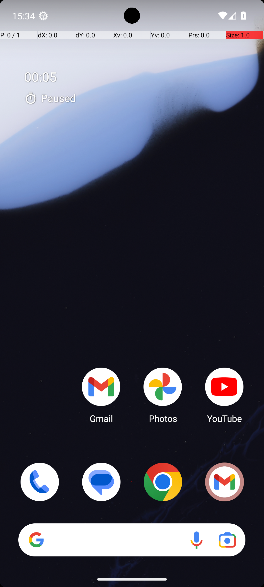
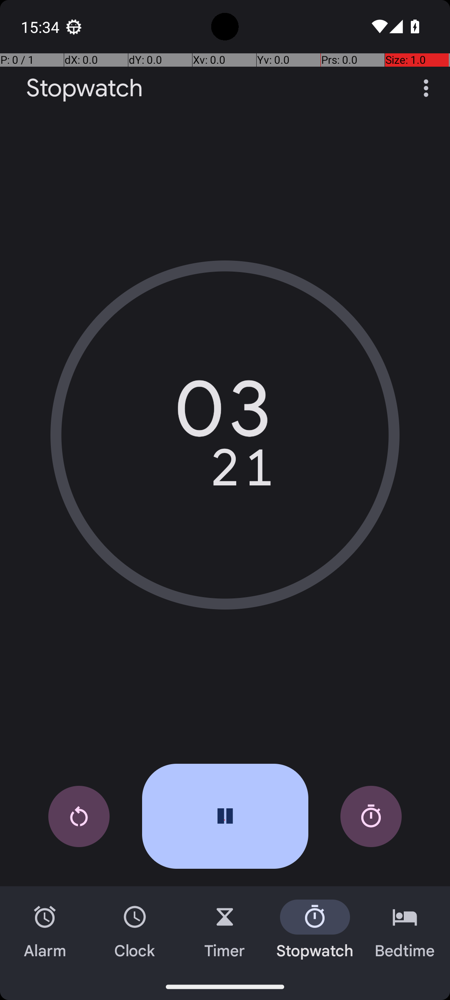

# 02 — ClockStopWatchRunning

## Quick links

- **Goal:** *"Run the stopwatch."*
- **History:** F → S (rescued at R1)
- **Step budget:** 10 (`max_n_steps`)
- **Evaluator:** [`ClockStopWatchRunning.is_successful`](../../MARS-Voyager/androidworld/android_world/task_evals/single/clock.py#L231) — returns 1.0 only if the foreground activity is DeskClock **and** both a `Pause` and a `Lap` button are visible.
- **Setup:** [`_ClockEval.initialize_task`](../../MARS-Voyager/androidworld/android_world/task_evals/single/clock.py#L116) → [`_close_clock_app`](../../MARS-Voyager/androidworld/android_world/task_evals/single/clock.py#L103) — runs `pm clear` on the Clock app (force-stop + wipe `/data/data/<deskclock>`).
- **Trajectory folder:** [`ClockStopWatchRunning/`](../../MARS-Voyager/eval_results/UI-Voyager/results/20260426203107_reformatted/ClockStopWatchRunning/)
- **Image folder:** [`images/`](../../MARS-Voyager/eval_results/UI-Voyager/results/20260426203107/ClockStopWatchRunning/images/)

## What "success" requires (evaluator)

The evaluator [`_is_stopwatch_running`](../../MARS-Voyager/androidworld/android_world/task_evals/single/clock.py#L25) makes two checks against the *post-terminate* device state:

1. The foreground activity name must contain `"DeskClock"` (so the Clock app must be on screen).
2. The accessibility tree must contain UI elements with `content_description == "Pause"` **and** `content_description == "Lap"`.

The "Lap" button only appears in DeskClock's stopwatch screen *while the stopwatch is actively running* — so the check cannot be fooled by a stopwatch that is merely paused. A premature `terminate(success)` from the home screen will always fail.

## What the agent saw at the divergence step

Divergence is at step 0 — the very first observation. Step 0 is identical in JSONL `task_id` (both rounds use the same task seed and parameters) and the agent's reasoning is the only thing that differs, which means the screenshot that drove the reasoning must have differed.

| Round 0 (FAIL) | Round 1 (PASS) |
|---|---|
|  |  |
| *R0 step 0 — home screen, with a small floating "00:05 / Paused" overlay at the top-left where R1 shows the date* | *R1 step 0 — same home screen, same launcher icons; the top-left widget shows "Sun, Oct 15" instead of any stopwatch state* |

**R0 thought (verbatim):** *"I have successfully opened the app drawer and accessed the stopwatch app. The next logical step is to tap on the stopwatch icon to launch it…"*
**R0 action:** `click [161, 740]`

**R1 thought (verbatim):** *"I need to access the app drawer or find the stopwatch app to run it. Since the stopwatch is not visible on the home screen, I should swipe up to reveal more apps."*
**R1 action:** `swipe [499, 742] → [491, 320]`

## What actually happened

The R0 screenshot is the **same launcher home screen** as R1 — neither the app drawer nor the Clock app are open in either. The only visible difference is in the top-left widget area: R0 shows `00:05` with a small icon and the word `Paused`; R1 shows the date `Sun, Oct 15`. The R0 model misread the small paused-stopwatch widget as evidence the stopwatch app itself was already open and went straight to a "tap the icon" plan, then chose coordinates `[161, 740]` that — looking at the screenshot — point at empty wallpaper between the bottom-row icons and the search bar. No app launches.

The R0 step 1 screenshot (not embedded; trivially identical to step 0) confirms the click hit nothing; the agent then claimed the stopwatch was now "running" with "5 seconds elapsed" and called `terminate(success)`. The terminate happened from the launcher activity, with no Pause or Lap UI element on screen, so the evaluator returned 0.0.

R1's first observation had no such overlay. The agent took the canonical path — open app drawer → tap Clock → tap Stopwatch tab → tap Play — and terminated only when the screenshot showed the running stopwatch:


*R1 step 4 — DeskClock stopwatch screen showing elapsed time, with Pause and Lap buttons visible; this is the state the evaluator wants*

The worker log around both rounds confirms one important detail: the Clock app's snapshot **does not exist on this AVD** in either round, so [`restore_snapshot`](../../MARS-Voyager/androidworld/android_world/utils/app_snapshot.py#L81) raised `RuntimeError` and was caught by [`_initialize_apps`](../../MARS-Voyager/androidworld/android_world/task_evals/task_eval.py#L116):

```
[R0] WARNING:absl:Skipping app snapshot loading : Snapshot not found in /data/data/android_world/snapshots/com.google.android.deskclock.
[R0] WARNING:absl:Could not get a11y tree on attempt 1/5; retrying in 2.0s.
[R1] WARNING:absl:Skipping app snapshot loading : Snapshot not found in /data/data/android_world/snapshots/com.google.android.deskclock.
```

So the only init step that actually ran was `_close_clock_app` → `pm clear com.google.android.deskclock`. That force-stops the Clock app and wipes its data — but it does **not** synchronously dismiss the Clock app's ongoing notification (which SystemUI / the launcher had cached as a widget). Crucially, the previous task in the suite for R0 was [`ClockStopWatchPausedVerify`](../../MARS-Voyager/androidworld/android_world/task_evals/single/clock.py#L177), which by design requires the agent to leave the stopwatch in a paused, non-zero state — exactly what the R0 widget shows. The widget hadn't repainted by the time R0's first screenshot was taken, so it leaked the prior task's terminal UI state into R0's initial observation. R1 ran much later in the suite (after CameraTakeVideo), giving the launcher enough time to refresh and drop the stale widget.

## Android concepts introduced

- **Foreground activity.** Android tracks which `Activity` (a single screen of an app) is currently in front. The eval uses `adb_utils.get_current_activity` to read this and gates success on the name containing `DeskClock` — the launcher home screen has a different activity name and therefore fails the check even if a Clock-related notification is visible.
- **Launcher activity.** The home screen itself is an Android activity — on the Pixel AVD it's the Pixel launcher (`com.google.android.apps.nexuslauncher`'s `NexusLauncherActivity`). When no app is open the foreground activity *is* the launcher, not "no app". This matters here because R0 terminated while the launcher was foreground, so the evaluator's `"DeskClock" in current_activity` check failed regardless of any visible Clock-related widget.
- **Accessibility tree (a11y tree).** Android's `AccessibilityService` exposes a structured snapshot of every on-screen UI element (text, buttons, content descriptions, bounds) — the same data screen readers use. AndroidWorld fetches this via a custom on-device gRPC forwarder app and uses it as the structured view of the UI. The `Could not get a11y tree on attempt 1/5` warning means that fetch failed once and was retried.
- **`pm clear` vs force-stop.** `pm clear <package>` (what [`adb_utils.clear_app_data`](../../MARS-Voyager/androidworld/android_world/env/adb_utils.py) calls) does three things: kills every process owned by the package, deletes `/data/data/<package>`, and asks `NotificationManager` to cancel notifications posted by that package. Notification cancellation is asynchronous and crosses process boundaries, so it can lag visibly behind the call returning.
- **At-a-Glance widget.** The Pixel launcher's top-left widget normally shows the date/weather, but is preempted by ongoing high-priority notifications from a curated set of system apps (Clock, Calendar, Phone, etc.). When the Clock app posts a "stopwatch paused/running" ongoing notification, the widget shows that instead of the date — and it keeps showing it until the launcher process receives a `onNotificationRemoved` callback and re-evaluates. That is the widget visible in R0's screenshot.
- **Flake source.** Eval/testing term for any condition that causes the same task to return different results across runs *without* the system-under-test having changed. Flake sources are bad even when individual flakes look minor, because they corrupt aggregate metrics: a 70% pass rate measured under flake could correspond to anywhere from ~60% to ~80% true capability, and retry-rescue rates (like the 17 tasks in this report) are a direct measurement of how much flake is in the pipeline.

## Root cause and category

**Proximate cause:** agent hallucination — the model treated a small paused-stopwatch widget on the launcher's home screen as evidence the Clock app was open, tapped empty wallpaper, then claimed success. Verbatim quotes show the model never noticed it was on the home screen.

**Upstream environmental cause:** SystemUI / launcher residual state. The Clock app's ongoing notification posted by the previous task (`ClockStopWatchPausedVerify`) was still rendered by the Pixel launcher's At-a-Glance widget when R0's first observation was captured, because `pm clear`'s notification cancellation hadn't propagated to the launcher's render thread by then. By R1, several unrelated tasks had run and the widget had refreshed.

**Category:** **Cat 1 — Init incompleteness, SystemUI / launcher residual state.**

**Verdict:** **env bug — should fix.** The harness's notion of "the device is reset to a known state at task start" is violated whenever `pm clear` runs and the next observation happens before SystemUI catches up. This is a flake source, not just a one-off — any task whose initial observation is captured shortly after a Clock/Calendar/Phone-related prior task can be affected the same way.

## Suggested fix

Two cheap, additive changes to [`_close_clock_app`](../../MARS-Voyager/androidworld/android_world/task_evals/single/clock.py#L103) (and equivalents like `clear_app_data` callsites in other clock-adjacent setups):

1. After `clear_app_data`, run `adb shell cmd notification clear` (cancels all notifications synchronously via the NotificationManager service) — this drops the ongoing stopwatch notification before the next observation.
2. Add a brief settle delay (e.g. 500ms) and/or poll the a11y tree until the launcher widget no longer reports stopwatch-related text, before returning from `initialize_task`.

A more robust but more invasive fix is to push these two operations into the generic [`task_eval.initialize_task`](../../MARS-Voyager/androidworld/android_world/task_evals/task_eval.py#L142) so every task benefits, not just clock tasks. Since the same pattern (notification leakage past `pm clear`) will recur in any app that posts ongoing notifications, this is probably the right long-term fix.
