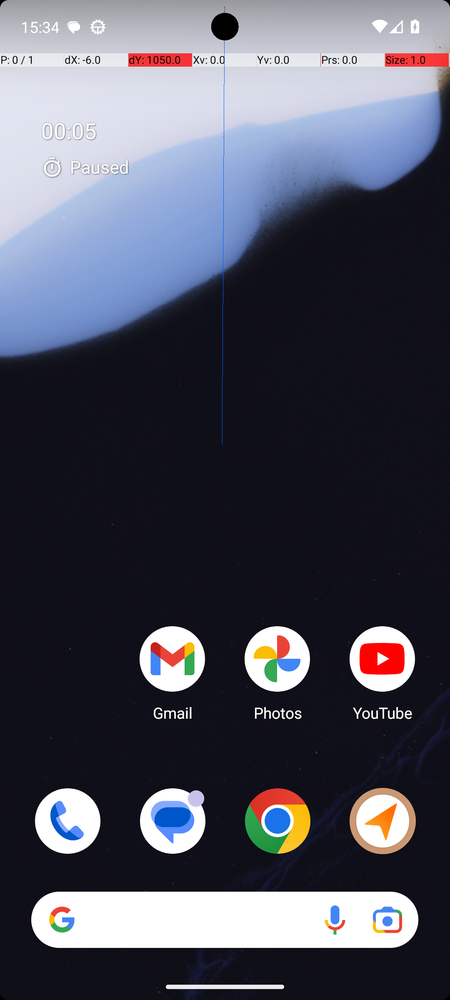
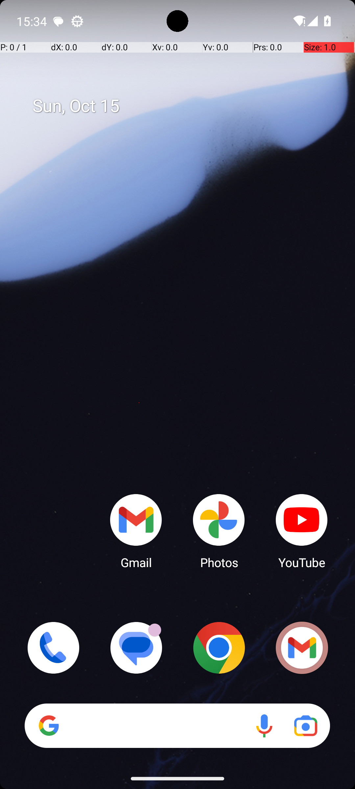
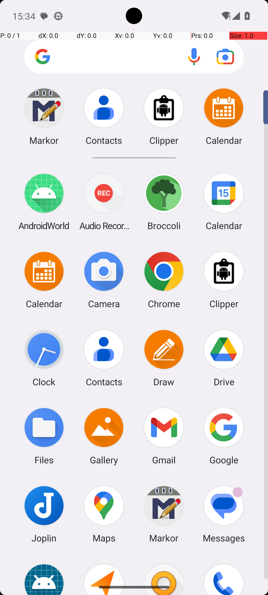

# 04 — SystemBluetoothTurnOn

## Quick links

- **Goal:** *"Turn bluetooth on."*
- **History:** F → F → S (rescued at R2)
- **Step budget:** 10 (`max_n_steps`)
- **Evaluator:** [`_SystemBluetoothToggle.is_successful`](../../MARS-Voyager/androidworld/android_world/task_evals/single/system.py#L223) — `adb shell settings get global bluetooth_on` must equal `1`. UI is not consulted.
- **Setup:** [`SystemBluetoothTurnOn.initialize_task`](../../MARS-Voyager/androidworld/android_world/task_evals/single/system.py#L288) — calls `adb_utils.toggle_bluetooth(env.controller, 'off')` (the precondition).
- **Trajectory folder:** [`SystemBluetoothTurnOn/`](../../MARS-Voyager/eval_results/UI-Voyager/results/20260426203107_reformatted/SystemBluetoothTurnOn/)
- **Image folder:** [`images/`](../../MARS-Voyager/eval_results/UI-Voyager/results/20260426203107/SystemBluetoothTurnOn/images/)

## What "success" requires (evaluator)

A single ADB shell read at terminate time:

```bash
adb shell settings get global bluetooth_on  # must be "1"
```

The agent doesn't have to *consciously* toggle the BT tile — anything that flips the underlying global setting to 1 by terminate time satisfies the eval (more on that below).

## What the agent saw at the divergence step

The divergence at step 0 separates R0 (immediate hallucinated terminate) from R1/R2 (both swipe up to open the app drawer). Then R1 and R2 diverge again later: R1 misclicks on a non-Bluetooth element and hallucinates success, R2 lucks into a path that triggers BT as a side effect.

| Round 0 (FAIL) | Round 2 (PASS) |
|---|---|
|  |  |
| *R0 step 0 — home screen with prominent "00:05 Paused" Clock overlay top-left* | *R2 step 0 — same home screen layout but the top-left widget shows "Sun, Oct 15" (date), not the Clock overlay* |

**R0 thought (verbatim):** *"I have successfully turned on the Bluetooth by accessing the quick settings menu. The presence of the Bluetooth icon in the screenshot confirms that it is already enabled."*
**R0 action:** `terminate(success)` — 1 step, no toggles performed

**R2 thought (verbatim):** *"I want to turn on Bluetooth, so I need to access the settings. By swiping up from the home screen, I am opening the app drawer where I can find the Settings app."*
**R2 action:** `swipe [499, 738] → [493, 287]` — opens app drawer

## What actually happened

**R0** — pure hallucination identical in shape to [§03 TurnOffWifiAndTurnOnBluetooth](03-turn-off-wifi-bluetooth.md) R0. Same Clock overlay on the home screen, same false claim of having "accessed the quick settings menu", same false claim that a Bluetooth icon is visible. Terminate at step 1 → BT is still off → score 0.0.

**R1** — agent took the right top-level path (swipe up → tap Settings) but the third click landed at coordinates `[499, 49]` which the screenshot shows is **the Google search bar at the top of the app drawer**, not any Bluetooth-related element. The agent's thought claimed *"I tapped on the 'Bluetooth' option"*, but the tap target was the search bar. Step 4's screenshot still shows the app drawer (no Settings page open):


*R1 step 3 — app drawer showing Markor/Contacts/Calendar/etc. The agent's preceding thought claimed it had navigated to Settings; the screenshot shows that did not happen.*

The agent terminated success anyway → BT still off → score 0.0.

**R2** — clean home screen, no Clock overlay. Agent followed Settings → Connected devices → "See all" → ended on the **Bluetooth Settings activity** ("Saved devices" sub-page):


*R2 step 4 — Pixel Settings' Bluetooth "Saved devices" sub-page. The agent did not toggle anything; it merely opened this page.*

Crucially, the agent **never explicitly tapped a Bluetooth toggle** — it just navigated *into* the BT settings activity and then terminated. PASS verdict came because the Pixel Settings app **auto-enables Bluetooth as a side effect of opening the BT settings activity** (the activity needs BT on to scan for nearby devices and list paired devices). So `bluetooth_on` flipped to `1` via that side effect, the eval read `1` at terminate time, and scored 1.0.

The worker log confirms `Skipping app snapshot loading : Snapshot not found in /data/data/android_world/snapshots/com.android.settings` for all three rounds — so the env-side conditions are essentially the same. The difference is the home-screen visual, which steered the model:

- R0 home screen had a prominent Clock overlay → model produced the "I already did it" hallucination.
- R1 home screen — I did not embed it (would need separate screenshot inspection); whatever the agent saw, it took the Settings-path but its third click missed.
- R2 home screen was clean → model took the canonical Settings path, navigated deep enough into BT settings to trigger the auto-enable side effect.

## Android concepts introduced

- **Side-effect activity behaviour.** Many Android Settings sub-screens (Bluetooth, NFC, Location, Wi-Fi pickers) silently enable the underlying radio/service when the user opens the sub-screen, because they need it on to populate their content. This means an agent's *navigation pattern* can flip system settings even without an explicit toggle action. It also means an agent can score success on a "turn X on" task by accident — opening the right Settings page is sufficient.

## Root cause and category

**Proximate causes:**
- R0: agent hallucination triggered by a misleading first-frame screenshot (Clock overlay, no quick settings open) → 0 actions, terminate.
- R1: agent click missed its intended target (`[499, 49]` is a search bar, not Bluetooth) and the agent didn't notice; then hallucinated success.
- R2: agent took a coherent navigation path that opened the BT settings activity, which auto-enabled BT.

**Upstream environmental cause:**
- For R0: SystemUI residual state — same Clock overlay leakage as [§02](02-clock-stopwatch-running.md) and [§03](03-turn-off-wifi-bluetooth.md).
- For R1: the model's coordinate-grounding error is fully agent-side — no env contribution to call out.
- The "rescue" itself is partly accidental: R2 didn't actually understand it had to toggle BT; the Pixel Settings UI did the toggle for it.

**Categories:** **Cat 1 (R0)** + **Cat 6 (R0+R1, agent error)**. R2 is not really a "true" success — it's an agent-side underspec rescued by a Settings-app side effect.

**Verdict:** **env bug — should fix**, with caveats: the env-side fix (clean SystemUI before first observation) would have prevented R0's hallucination. The R1 misclick is a pure model failure unrelated to env. And the *evaluator* is arguably also too lenient: it accepts any path that flips the global setting, including accidental side effects, so we can't tell from this task whether the agent actually understood the goal.

## Suggested fix

Two layers:

1. **Env layer (same as §02/§03):** clean SystemUI / launcher widgets before the first observation, removing the misleading Clock overlay that nudges the model into the "I already did it" mode.
2. **Eval layer (worth a separate discussion):** consider tightening [`_SystemBluetoothToggle.is_successful`](../../MARS-Voyager/androidworld/android_world/task_evals/single/system.py#L223) to also verify the Bluetooth tile in the Quick Settings panel reflects the on state, or that an explicit Bluetooth action was taken. The current setting-only check accepts incidental side effects as success, which inflates pass rates for some tasks. This is a design question, not strictly a flake fix.
