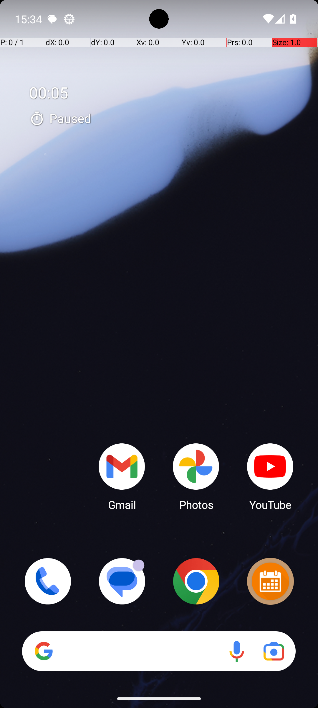
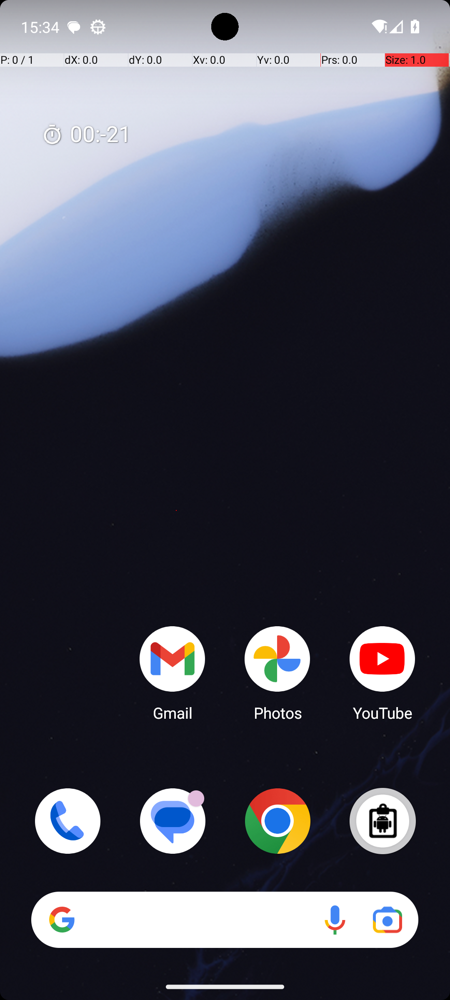
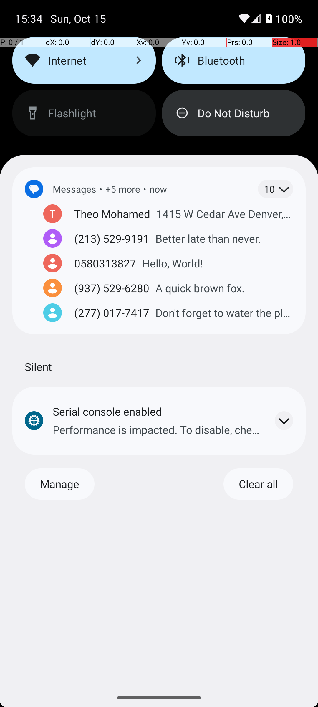
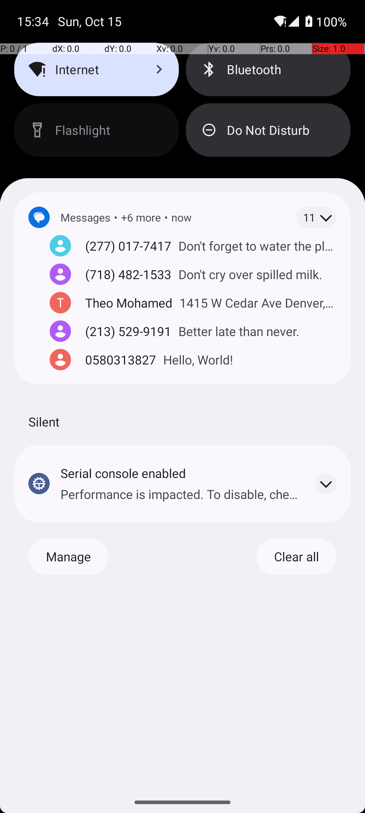

# 05 — SystemBluetoothTurnOff

## Quick links

- **Goal:** *"Turn bluetooth off."*
- **History:** F → S (rescued at R1)
- **Step budget:** 10 (`max_n_steps`)
- **Evaluator:** [`_SystemBluetoothToggle.is_successful`](../../MARS-Voyager/androidworld/android_world/task_evals/single/system.py#L223) — `adb shell settings get global bluetooth_on` must equal `0`. UI is not consulted.
- **Setup:** [`SystemBluetoothTurnOff.initialize_task`](../../MARS-Voyager/androidworld/android_world/task_evals/single/system.py#L273) — calls `adb_utils.toggle_bluetooth(env.controller, 'on')` (the precondition).
- **Trajectory folder:** [`SystemBluetoothTurnOff/`](../../MARS-Voyager/eval_results/UI-Voyager/results/20260426203107_reformatted/SystemBluetoothTurnOff/)
- **Image folder:** [`images/`](../../MARS-Voyager/eval_results/UI-Voyager/results/20260426203107/SystemBluetoothTurnOff/images/)

## What "success" requires (evaluator)

`adb shell settings get global bluetooth_on` must read `0` at terminate time. Same shape as [§04 SystemBluetoothTurnOn](04-system-bluetooth-turn-on.md), inverted target.

## What the agent saw at the divergence step

The two rounds diverge at step 0 only by the home-screen widget area. Both then swipe down to Quick Settings and start tapping the Bluetooth tile — but they tap it a **different number of times**, and parity decides who wins.

| Round 0 (FAIL) | Round 1 (PASS) |
|---|---|
|  |  |
| *R0 step 0 — home screen with prominent "00:05 Paused" Clock overlay* | *R1 step 0 — same home screen, Clock overlay faded to "00:21" without "Paused" label* |

**R0 actions (4 steps):**
1. swipe `[499, 7] → [493, 444]` (open quick settings)
2. click `[719, 85]` (BT tile — toggles BT off)
3. click `[719, 85]` (BT tile — toggles BT back on)
4. terminate(success)

**R1 actions (7 steps):**
1. swipe down (open quick settings)
2. click `[499, 501]` (centre of panel — hits a notification, not BT)
3. swipe down again
4. click `[719, 85]` (BT — off)
5. click `[719, 85]` (BT — on)
6. click `[719, 85]` (BT — off)
7. terminate(success)

## What actually happened

Both rounds confused themselves into tapping the Bluetooth tile multiple times and called success after each round of taps. The eval cares only about the parity of effective BT-tile taps:

- R0 tapped BT exactly **twice** → BT toggled off → on → final state **on** → eval reads `bluetooth_on=1` ≠ `0` → FAIL.
- R1 tapped BT exactly **three** times (steps 4, 5, 6) → BT toggled off → on → off → final state **off** → eval reads `bluetooth_on=0` → PASS.

The terminal screenshots confirm the parity:

| R0 step 3 (terminate) | R1 step 6 (terminate) |
|---|---|
|  |  |
| *R0 — Bluetooth tile is light-blue (active/on)* | *R1 — Bluetooth tile is dark-gray (inactive/off)* |

What pushed the rounds onto different action counts? Two contributing factors I can support from the screenshots:

1. **Step-0 differences nudged R0 toward fewer steps.** The Clock overlay on R0's home screen is the same overlay that triggered hallucinated early termination in [§02](02-clock-stopwatch-running.md), [§03](03-turn-off-wifi-bluetooth.md), and [§04](04-system-bluetooth-turn-on.md). Here it didn't trigger an immediate terminate, but the R0 first thought ("I have successfully turned on the Bluetooth…") shows the same false belief that something prior had already happened — which compresses the action plan.
2. **R1's confused step 2 tap on a notification (not the BT tile)** added an extra step to the trajectory before R1 actually reached the BT tile, which shifted R1's BT-tap count by one parity from R0.

The worker log shows `Skipping app snapshot loading : Snapshot not found in /data/data/android_world/snapshots/com.android.settings` for both rounds and `Could not get a11y tree on attempt 1/5; retrying in 2.0s.` for R0 only. The a11y warning likely contributed to R0's somewhat degraded reasoning at step 0.

## Android concepts introduced

*(no new concepts — see [§02](02-clock-stopwatch-running.md), [§03](03-turn-off-wifi-bluetooth.md), [§04](04-system-bluetooth-turn-on.md))*

## Root cause and category

**Proximate cause:** non-deterministic action sequencing. Both rounds tapped the BT tile some number of times; R0 happened to land on even (no net change), R1 happened to land on odd (toggled). Neither path reflects the agent actually verifying the result of each tap before the next one — both runs are essentially the same incoherent "tap until it feels right" loop with different lengths.

**Upstream environmental cause:** Same [Cat 1](02-clock-stopwatch-running.md#root-cause-and-category) (SystemUI residual state) contributing to step-0 reasoning differences, plus a [Cat 4](conclusion.md) a11y tree retry on R0 that may have degraded R0's step-0 grounding. Neither is the proximate cause; the proximate cause is agent-side incoherence (Cat 6) and the rescue is essentially luck of parity.

**Categories:** **Cat 1 (contributing) + Cat 4 (contributing) + Cat 6 (proximate).**

**Verdict:** **mostly agent error — env mitigation worth doing.** The env didn't determine the outcome here; it nudged the agent's first observation. Cleaning SystemUI before the first observation would not have guaranteed R0 succeeds because the failure mode (over-tapping the toggle) is independent of the home-screen state. But it's still worth doing for tasks like §02–§04 where the env contribution is decisive.

## Suggested fix

This task's proximate failure mode (toggle-and-untoggle until terminate) cannot be fixed env-side. Possible mitigations:

1. **Tighten `is_successful` to also require an idempotent path:** verify that the agent's last action involving the BT tile/setting matches the goal (i.e., a "turn off" task should fail if the agent toggled BT on as its last visible action). This is a stricter eval but catches the "lucky parity" rescues.
2. **Provide the agent with the tile state in the input prompt** (the a11y tree already has it; making it salient in the agent's observation might prevent the over-tapping pattern). This is an agent-side change, out of scope for this report.

For env-side hygiene, apply the same SystemUI-clean fix from §02 — useful for adjacent tasks even if it doesn't directly rescue this one.
