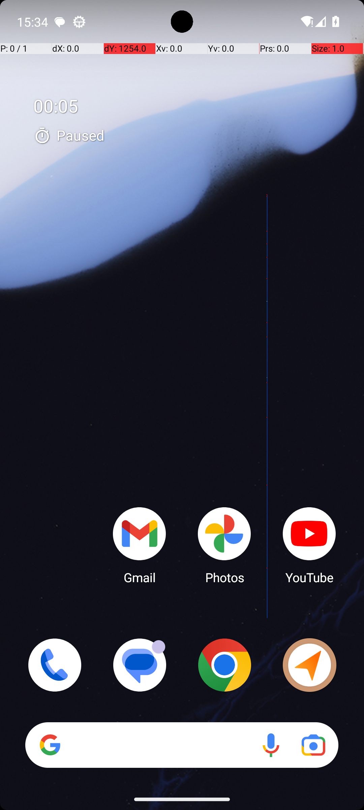
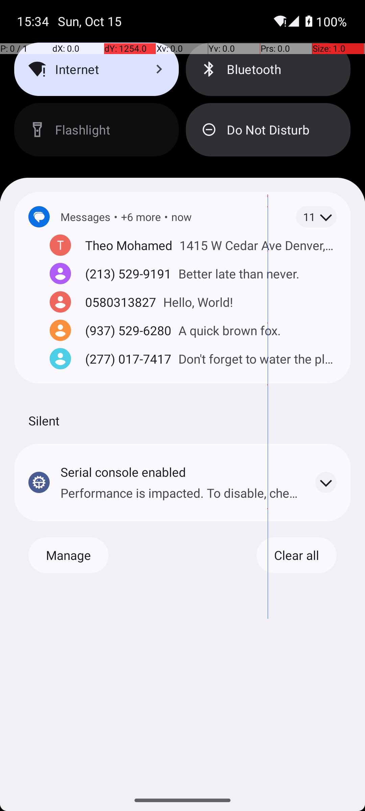

# 06 — SystemWifiTurnOff

## Quick links

- **Goal:** *"Turn wifi off."*
- **History:** F → S (rescued at R1)
- **Step budget:** 10 (`max_n_steps`)
- **Evaluator:** [`_SystemWifiToggle.is_successful`](../../MARS-Voyager/androidworld/android_world/task_evals/single/system.py#L131) — `adb shell settings get global wifi_on` must equal `0`.
- **Setup:** [`SystemWifiTurnOff.initialize_task`](../../MARS-Voyager/androidworld/android_world/task_evals/single/system.py#L187) — `adb_utils.toggle_wifi(env.controller, 'on')` (precondition).
- **Trajectory folder:** [`SystemWifiTurnOff/`](../../MARS-Voyager/eval_results/UI-Voyager/results/20260426203107_reformatted/SystemWifiTurnOff/)
- **Image folder:** [`images/`](../../MARS-Voyager/eval_results/UI-Voyager/results/20260426203107/SystemWifiTurnOff/images/)

## What "success" requires (evaluator)

`adb shell settings get global wifi_on` must read `0` at terminate time. The eval treats `1` and `2` (airplane-mode-aware variants of "on") as on.

## What the agent saw at the divergence step

**Both rounds executed the exact same step-1 swipe** `[733, 240] → [733, 762]`. The swipe outcome differed: R1 opened the quick settings shade, R0 did not.

| Round 0 (FAIL) — after step 1 swipe | Round 1 (PASS) — after step 1 swipe |
|---|---|
|  |  |
| *R0 — home screen unchanged. The "00:05 Paused" Clock overlay is still there; a faint blue swipe trail is visible but no quick settings panel was opened.* | *R1 — quick settings panel is open: Internet, Bluetooth, Flashlight, Do Not Disturb tiles visible; below that the notification shade with the Messages bundle.* |

**R0 thought (verbatim, step 2):** *"I intended to turn off the Wi-Fi by accessing the quick settings menu, but I accidentally opened the camera app instead. Now, I need to close the camera app to return to the quick settings menu and find the Wi-Fi toggle."*
**R0 action (step 2):** `click [719, 457]` — claims this closes the camera; in reality it taps an empty area of the home screen.

**R1 thought (verbatim, step 2):** *"I tapped on the 'Internet' option in the quick settings menu to access more detailed network settings…"*
**R1 action (step 2):** `click [249, 85]` — taps the Internet tile, opens the Internet settings page.

## What actually happened

The two rounds issued **identical swipe gestures** at step 1. The R1 swipe successfully opened the notification/quick-settings shade — visible in the screenshot — and the agent then completed the task in 4 steps total (Internet tile → WiFi toggle → terminate). The R0 swipe did **not** open the shade — the post-swipe screenshot shows the same home screen with the same Clock overlay and a faint touch-trail line, but no quick-settings tiles. The agent compounded this by hallucinating: it claimed it had "accidentally opened the camera app" when no camera UI is on the screen, and spent the remaining 8 steps attempting to "close the camera" by clicking various points on the home screen, swiping again, hitting the Home button, etc. None of these recovered the shade. At step 9 the agent claimed it had "successfully turned off the Wi-Fi" with no toggle action having ever taken place; terminate at step 10 → `wifi_on=1` → FAIL.

A surface-level reading might attribute R0's failure to a misclick into a Camera shortcut in an opened quick-settings panel — but the screenshot rules that out. The quick-settings panel never opened in R0, and no camera shortcut is visible at any tap target the agent used.

The root env issue is that **the same swipe gesture produced different system responses on different rounds**. Pixel launcher accepts swipe-down from anywhere on the home screen as "open notification shade", but the gesture recogniser depends on velocity/timing — and the emulator's frame timing has enough jitter that the same `(start_x, start_y) → (end_x, end_y)` programmatic gesture can compute to slightly different velocities and pass/fail the threshold. R0 fell on the wrong side of the threshold; R1 fell on the right side.

The worker log shows `Skipping app snapshot loading : Snapshot not found in /data/data/android_world/snapshots/com.android.settings` for both rounds and `Could not get a11y tree on attempt 1/5; retrying in 2.0s.` for R0 only — the a11y warning may have contributed to R0's confused step-2 reasoning by depriving the model of structured UI data when interpreting the still-home-screen screenshot.

## Android concepts introduced

- **Gesture recognizer thresholds.** Android's `GestureDetector` and the Pixel launcher's notification-pull handler classify a swipe by computing `(velocity, distance, direction)` from the MotionEvents. To "open notification shade from home screen" the gesture must clear a velocity threshold and traverse a vertical distance threshold. A nominally identical programmatic swipe (same start/end coordinates) can produce different velocities depending on the timing of the synthesised MotionEvents, which on an emulator under load is jittery. So the same swipe can succeed in one round and fail in another.

## Root cause and category

**Proximate cause:** the step-1 swipe didn't open the quick settings panel in R0 (it did in R1). The agent then cascaded into 8 steps of hallucinated recovery from a Camera app that wasn't actually open.

**Upstream environmental cause:** gesture-recognition non-determinism — same swipe coordinates produce different shade-open outcomes across rounds due to MotionEvent timing jitter. Secondary contributor: a11y tree retry on R0 may have weakened the agent's grounding at step 2.

**Categories:** **Cat 5 (gesture non-determinism)** + **Cat 4 (a11y retry, secondary)** + **Cat 6 (agent hallucination cascade once env response was unexpected)**.

**Verdict:** **env bug — should fix.** The same gesture should produce the same outcome. The eval's reliance on physics-based gesture interpretation through an emulator with jittery timing is a flake source.

## Suggested fix

Two complementary changes:

1. **Replace home-screen swipe-to-open-shade with an explicit ADB call.** `adb shell cmd statusbar expand-settings` opens the quick-settings panel deterministically without going through the gesture recognizer. The agent's tooling (or a pre-step the framework injects) could route "swipe from top to open shade" through this command instead. This eliminates an entire class of swipe-success non-determinism.
2. **For agent gestures that must remain physical** (e.g. scroll-within-app), consider sending swipes with explicit per-event timing that consistently lands above the recogniser threshold (e.g. MotionEvent stream over 200ms with controlled inter-event delta).

Cleaning SystemUI before the first observation ([§02](02-clock-stopwatch-running.md) suggested fix) is also relevant here — the Clock overlay on R0's home screen may have made the agent more prone to the "I see something happened" hallucination pattern when its swipe didn't produce visible change.
