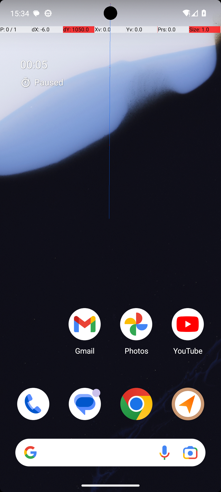
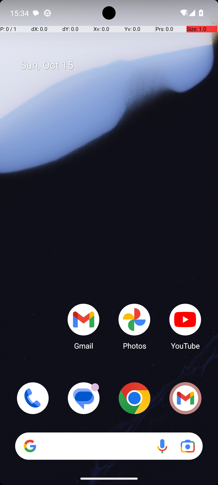

# 07 — SystemBrightnessMax

## Quick links

- **Goal:** *"Turn brightness to the max value."*
- **History:** F → F → S (rescued at R2)
- **Step budget:** 10 (`max_n_steps`)
- **Evaluator:** [`SystemBrightnessMax.is_successful`](../../MARS-Voyager/androidworld/android_world/task_evals/single/system.py#L41) — `adb shell settings get system screen_brightness` must equal max (255).
- **Setup:** [`SystemBrightnessMax.initialize_task`](../../MARS-Voyager/androidworld/android_world/task_evals/single/system.py#L110) — sets brightness to a low value as the precondition.
- **Trajectory folder:** [`SystemBrightnessMax/`](../../MARS-Voyager/eval_results/UI-Voyager/results/20260426203107_reformatted/SystemBrightnessMax/)
- **Image folder:** [`images/`](../../MARS-Voyager/eval_results/UI-Voyager/results/20260426203107/SystemBrightnessMax/images/)

## What "success" requires (evaluator)

A single ADB shell read at terminate time: `settings get system screen_brightness` must equal 255 (the max value). Direct system-state check, no UI consulted.

## What the agent saw at the divergence step

Divergence is at step 0 (the very first action). R0 picked the **Quick Settings strategy** (top-down swipe to open the panel, then look for the brightness slider there). R2 picked the **Settings app strategy** (bottom-up swipe to open the app drawer, then navigate Settings → Display → Brightness).

| Round 0 (FAIL) | Round 2 (PASS) |
|---|---|
|  |  |
| *R0 step 0 — home screen with prominent "00:05 Paused" Clock overlay; faint blue swipe-trail visible at top* | *R2 step 0 — home screen with the date "Sun, Oct 15" instead of any Clock overlay* |

**R0 action (step 1):** `swipe [499, 7] → [493, 444]` — top-down swipe (intended: open quick settings)
**R2 action (step 1):** `swipe [518, 739] → [518, 273]` — bottom-up swipe (effect: opens app drawer)

## What actually happened

R0's QS-strategy path didn't pan out. The step-1 swipe either failed to open the quick settings panel or opened a confused state — by step 3 the agent was claiming "I accidentally opened a different app or feature". Steps 3–5 were a sequence of recovery swipes; an LLM error occurred at step 4 (`History: Step4: Error calling LLM`), further degrading the trajectory. At step 6 the agent gave up and called `terminate(success)` while the screen showed something other than the brightness slider. `screen_brightness` was still at the precondition low value → FAIL.

R2's Settings-app strategy is more deliberate: app drawer → Settings → swipe to find Display → Display → Brightness level → drag the slider all the way right → terminate. Each step's screenshot showed the expected next-page state, so the agent's actions matched its perception. At terminate time `screen_brightness` was at max → PASS.

The flip from QS-strategy (R0/R1) to Settings-strategy (R2) is a model choice nudged by step-0 differences. R0/R1 home screens both had the prominent Clock overlay (per the same pattern as [§02](02-clock-stopwatch-running.md)/[§03](03-turn-off-wifi-bluetooth.md)/[§04](04-system-bluetooth-turn-on.md)/[§05](05-system-bluetooth-turn-off.md)/[§06](06-system-wifi-turn-off.md)); R2's home screen was clean. The Clock-overlay home screens biased the model toward "swipe down to handle this" interpretations; the clean home screen biased it toward "open app drawer and find Settings".

The LLM error at R0 step 4 is a separate flake source — the worker's vLLM call returned an empty/error response. The trajectory recovered (step 5 produced a valid response) but it consumed budget.

The worker log shows `Skipping app snapshot loading : Snapshot not found in /data/data/android_world/snapshots/com.android.settings` for all rounds — env-side conditions are otherwise comparable.

## Android concepts introduced

- **`Error calling LLM`.** The agent's vLLM endpoint returned an error or empty response for that step. The harness logs it and continues; the next step proceeds with a History entry of `"Error calling LLM"`. This burns a step and leaves the agent without its own prior reasoning to reference, often degrading the recovery.

## Root cause and category

**Proximate cause:** R0/R1 chose a less-reliable QS strategy that floundered; R2 chose a more reliable Settings-app strategy that succeeded. The model's strategy choice was sensitive to step-0 visual differences.

**Upstream environmental cause:** SystemUI residual Clock overlay (Cat 1) on R0/R1; absent on R2. R0 also had an LLM call error (an infra flake, Cat 6-adjacent) that consumed a step.

**Categories:** **Cat 1 (SystemUI residual)** + **Cat 6 (model-side strategy fragility, LLM error).**

**Verdict:** **env bug — should fix.** Same fix family as §02–§06: cleaning SystemUI before first observation removes the consistent biasing that pushes the model toward less-reliable strategies. The LLM error is an infra issue separate from this report's scope.

## Suggested fix

Apply the same SystemUI-clean fix from [§02](02-clock-stopwatch-running.md). Additionally, for tasks with multiple valid completion paths (QS vs Settings app), consider documenting the more reliable path in the agent's tool description so the model has a stronger prior toward the deliberate path even when nudged otherwise.
