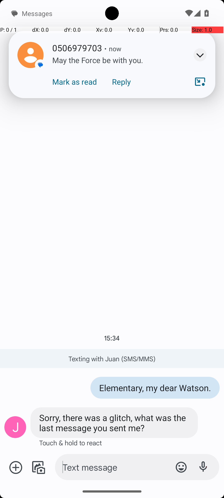
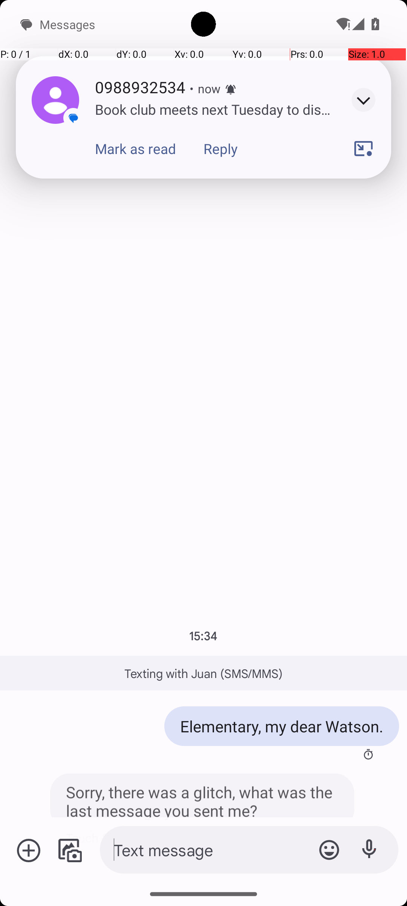

# 09 — SimpleSmsResend

## Quick links

- **Goal:** *"Resend the message I just sent to Juan Alves in Simple SMS Messenger"*
- **History:** F → S (rescued at R1)
- **Step budget:** 12 (`max_n_steps`)
- **Evaluator:** task-specific text equality on the most recent SMS sent to Juan's phone number — the resent message must match the previous "last sent" message exactly. (See [`SimpleSmsResend`](../../MARS-Voyager/androidworld/android_world/task_evals/single/sms.py).)
- **Trajectory folder:** [`SimpleSmsResend/`](../../MARS-Voyager/eval_results/UI-Voyager/results/20260426203107_reformatted/SimpleSmsResend/)
- **Image folder:** [`images/`](../../MARS-Voyager/eval_results/UI-Voyager/results/20260426203107/SimpleSmsResend/images/)

## What "success" requires (evaluator)

The evaluator inspects the SMS database and verifies the most recent outgoing SMS to Juan Alves's phone number matches the canonical "last sent" message text. The text must be exactly correct — sending a different text fails.

## What the agent saw at the divergence step

Both rounds opened to the same Juan Alves conversation, with the same "Elementary, my dear Watson." as the last-sent message and Juan's reply "Sorry, there was a glitch, what was the last message you sent me?" visible. The **only material difference** is the unrelated incoming-SMS notification banner sitting at the top of the screen at step 0:

| Round 0 (FAIL) | Round 1 (PASS) |
|---|---|
|  |  |
| *R0 step 0 — notification banner from "0506979703" reading "May the Force be with you." (an unrelated incoming message that looks like a chat message)* | *R1 step 0 — notification banner from "0988932534" reading "Book club meets next Tuesday to dis…" (also unrelated, but the body is clearly an announcement, not a chat-style message)* |

Both screenshots show the Juan conversation underneath ("Elementary, my dear Watson." in the blue outgoing bubble) — the conversation context is identical.

**R0 thought:** *"I need to resend the message 'May the Force be with you.' to Juan Alves. The notification is visible, and I should tap on it…"*
**R0 action:** `click [499, 111]` — taps the notification banner; then types `'A quick brown fox.'` (a third invented text that matches neither the actual last-sent nor the notification body).

**R1 thought:** *"I need to resend the message 'Elementary, my dear Watson.' to Juan Alves. The conversation is open, and I can type the message again in the input field."*
**R1 action:** `type 'Elementary, my dear Watson.'` — types the correct text directly into the visible input.

## What actually happened

R0 was distracted by the incoming notification at the top of the screen. Its message body ("May the Force be with you.") reads like a chat reply, so the agent confused it with the message it was supposed to resend. The agent then tapped the notification (which probably opened a different conversation — but the agent's subsequent thought claims the conversation was already open and the agent typed yet a third hallucinated text "A quick brown fox.", sent it, and terminated success). The eval read the most recent outgoing message to Juan's number, found it was "A quick brown fox." (or whatever the actual sent text was), compared to the expected "Elementary, my dear Watson.", and failed.

R1 saw a notification banner whose body ("Book club meets next Tuesday…") doesn't read like a chat message; the agent ignored it and proceeded to type the actual visible last-sent message into the input field, send it, terminate. Eval matched → PASS.

The notifications at step 0 are a Cat 1 issue: prior task state (or test setup state — there are SMS messages getting injected by SimpleSms-related tasks across the suite) leaks notifications into the next task's first frame. The Pixel notification banner appears at the top of the screen and overlays whatever the agent is supposed to be looking at. The body text in R0's notification happened to look chat-like enough to mislead the model.

## Android concepts introduced

- **Heads-up notification banner.** When a high-importance notification arrives, Android briefly displays a banner at the top of the screen (peeking down) on top of whatever app is foreground. The banner stays for a few seconds before retracting. If a screenshot is captured while the banner is on screen, the screenshot will include both the foreground app *and* the banner overlay.
- **SMS database.** Simple SMS Messenger stores its messages in `/data/data/com.simplemobiletools.smsmessenger/databases/` (and Android also keeps a copy in the system Telephony provider). The eval reads the canonical "last outgoing message to Juan Alves" from the SMS database directly, not from the visible UI.

## Root cause and category

**Proximate cause:** notification banner at step 0 distracted the agent. R0's notification body looked like a chat message and confused the model into resending the wrong text.

**Upstream environmental cause:** SystemUI residual notifications from prior tasks (Cat 1) leaked into the SimpleSmsResend first observation. Setup did not dismiss notifications before showing the agent the SMS app.

**Categories:** **Cat 1 (SystemUI residual notifications)** + **Cat 6 (model fooled by misleading content).**

**Verdict:** **env bug — should fix.** Same family of fix as §02 — clean SystemUI / dismiss notifications before first observation. The agent shouldn't be presented with state from prior tasks at task start.

## Suggested fix

Same as [§02](02-clock-stopwatch-running.md): in [`task_eval.initialize_task`](../../MARS-Voyager/androidworld/android_world/task_evals/task_eval.py#L142), add `adb shell cmd notification clear` after `_initialize_apps`. For SMS-related tasks specifically, the harness could also dismiss the heads-up banner by tapping outside it before capturing the first observation, or wait for the banner-peek timeout (~5s) to elapse.
