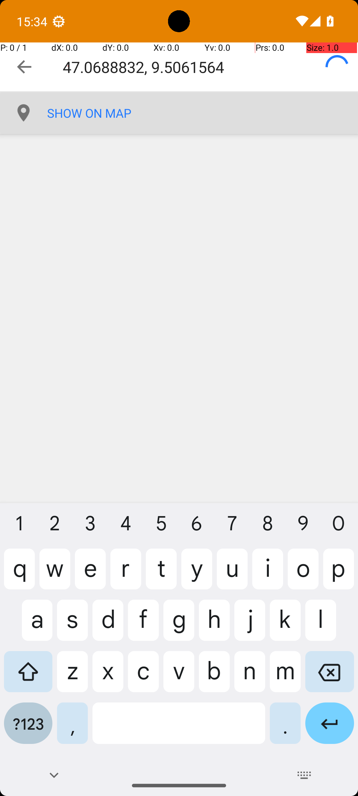
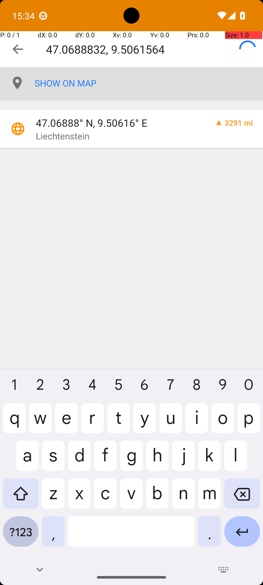

# 10 — OsmAndFavorite

## Quick links

- **Goal:** *"Add a favorite location marker for 47.0688832, 9.5061564 in the OsmAnd maps app."*
- **History:** F → S (rescued at R1)
- **Step budget:** 14 (`max_n_steps`)
- **Evaluator:** [`OsmAndFavorite`](../../MARS-Voyager/androidworld/android_world/task_evals/single/osmand.py) — checks the OsmAnd favorites database for a marker at the specified coordinates.
- **Trajectory folder:** [`OsmAndFavorite/`](../../MARS-Voyager/eval_results/UI-Voyager/results/20260426203107_reformatted/OsmAndFavorite/)
- **Image folder:** [`images/`](../../MARS-Voyager/eval_results/UI-Voyager/results/20260426203107/OsmAndFavorite/images/)

## What "success" requires (evaluator)

A favourite marker for the specified lat/lon must exist in OsmAnd's favourites store at terminate time.

## What the agent saw at the divergence step

Steps 0–5 are byte-identical across both rounds (open app drawer → find OsmAnd → tap → wait → tap search icon → type the coordinates). The screenshots returned to the agent for step 7's reasoning differ:

| Round 0 (FAIL) — step 6 (post-type) | Round 1 (PASS) — step 6 (post-type) |
|---|---|
|  |  |
| *R0 — search bar shows the typed coords; only a "SHOW ON MAP" link beneath. **No geocoded result row.*** | *R1 — same search bar with the same typed coords and "SHOW ON MAP" link, **plus** a geocoded result row at y≈265 reading "47.06888° N, 9.50616° E / Liechtenstein 3291 mi"* |

**R0 action (step 7):** `click [438, 86]` — taps inside the search bar (because no result row exists to tap). The agent's thought says "I confirmed the location" but the screenshot doesn't support that.
**R1 action (step 7):** `click [438, 219]` — taps the geocoded result row, which navigates to the location detail page with an "Add" favourite button.

## What actually happened

OsmAnd's coordinate-search UI is async: when text is typed into the search field, the app spawns a background task that geocodes the input against its offline map data and renders a result row when the geocode completes. The completion latency depends on emulator load and disk cache state — typically tens to hundreds of milliseconds.

The harness captures the next screenshot **immediately** after the agent's action returns. In R1 the screenshot was taken late enough that the geocoded row had rendered; in R0 it was taken early and only the static "SHOW ON MAP" UI element was present.

R0's agent, faced with no tappable result, fell into a 6-step **clear→retype→clear→retype loop** (steps 7–12, all `click [936, 80]` to clear or `type` to re-enter the same coordinates) before exhausting the step budget. The loop never broke out because each successive screenshot also failed to show a result row — possibly because the repeated clears reset the geocode pipeline before it could complete.

R1's path is straightforward once the result row is visible: tap result → tap "Add" → name the favourite → save → terminate. PASS.

The worker log shows `Skipping app snapshot loading : Snapshot not found in /data/data/android_world/snapshots/net.osmand.plus` for both rounds — env-side conditions are otherwise comparable.

## Android concepts introduced

- **Async UI rendering and screenshot timing.** Many Android apps perform work in background threads (network calls, disk reads, geocoding) and update the UI when that work finishes. The harness's "take a screenshot immediately after the agent's action returns" semantics can race with the app's pending UI updates, capturing a stale frame. The agent then reasons over that stale frame, takes an action that doesn't match the now-updated UI, and the trajectory drifts.
- **Action-then-screenshot timing.** AndroidWorld's controller submits the agent's action via gRPC, the action is dispatched to the device, and a screenshot is then captured. There is no built-in "wait until idle" between the action and the screenshot. Some apps (especially ones doing async work like OsmAnd's geocoder, OsmAnd's tile renderer, the Tasks app's RecyclerView refresh) routinely race this timing.

## Root cause and category

**Proximate cause:** OsmAnd's geocoded result row hadn't rendered by the time R0's post-type screenshot was captured. The agent then fell into a clear→retype loop because no tappable result was ever visible.

**Upstream environmental cause:** screenshot-after-action timing is not "wait until UI idle"; for apps that produce async result UI, the screenshot can capture an intermediate state. Pure Cat 5.

**Category:** **Cat 5 (pixel-level UI fluctuation, async render timing).**

**Verdict:** **env bug — should fix.** Same agent action ran into different rendered UI states across rounds; the eval can't be reliable when the harness can't reliably read the UI's settled state.

## Suggested fix

1. **Add an explicit wait-for-idle between action and screenshot.** Either poll the UIAutomator's `idle` signal, wait for the a11y tree to stop changing for a small window (e.g. 500ms), or expose a `wait` action that the agent can use after typing into search-style inputs. The Settings app's [`UiDevice.waitForIdle`](https://developer.android.com/reference/androidx/test/uiautomator/UiDevice#waitforidle) exposes this.
2. **For typing actions specifically**, add a small post-type settle delay (e.g. 750ms) before screenshot capture. Most search-as-you-type UIs settle within a second.
3. **Improve the `wait` tool's resolution** so the agent can request "wait until the screen stops changing" rather than a fixed 1s. The R0 trajectory had a `wait` at step 4 already; if that wait could be parameterized to "wait until idle" the cascade might have been avoided.
