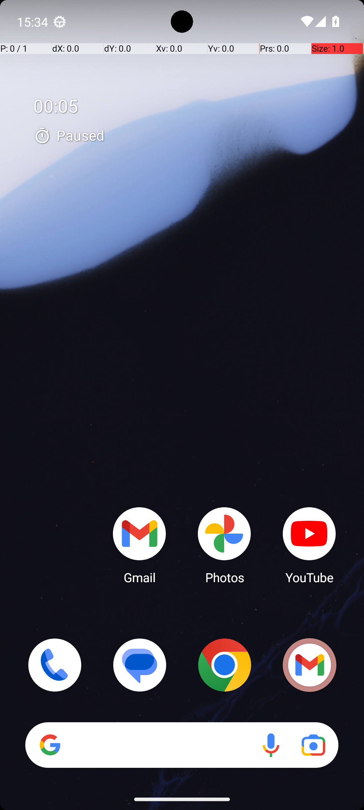
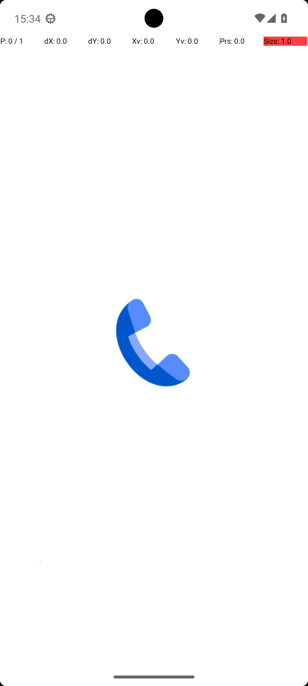

# 11 — ContactsAddContact

## Quick links

- **Goal:** *"Create a new contact for Emilia Gonzalez. Their number is +14240925675."*
- **History:** F → S (rescued at R1)
- **Step budget:** 12 (`max_n_steps`)
- **Evaluator:** [`ContactsAddContact`](../../MARS-Voyager/androidworld/android_world/task_evals/single/contacts.py) — checks the system Contacts provider for a contact named "Emilia Gonzalez" with number "+14240925675".
- **Trajectory folder:** [`ContactsAddContact/`](../../MARS-Voyager/eval_results/UI-Voyager/results/20260426203107_reformatted/ContactsAddContact/)
- **Image folder:** [`images/`](../../MARS-Voyager/eval_results/UI-Voyager/results/20260426203107/ContactsAddContact/images/)

## What "success" requires (evaluator)

A row in the system ContactsProvider matching the expected name + number. The eval also requires the agent to call `terminate` (max-steps-reached without terminate is scored as failure even if the contact exists).

## What the agent saw at the divergence step

Step 0 is identical (both rounds tap the Phone icon on home screen). The two rounds diverge at **step 2** based on what the Phone app's just-loaded splash screen looked like:

| Round 0 (FAIL) | Round 1 (PASS) |
|---|---|
|  |  |
| *R0 step 0 — home screen with prominent "00:05 Paused" Clock overlay* | *R1 step 1 — Phone app's splash screen showing only a centered blue phone icon (still loading)* |

**R0 step 2 thought:** *"…The three-dot menu icon at the top right is likely to contain options for managing contacts, including creating a new one."*
**R0 step 2 action:** `click [901, 93]` — taps the three-dot menu (a dead end for "create new contact" — the menu only has settings).

**R1 step 2 thought:** *"…The phone icon at the bottom right likely leads to the contacts section where I can add a new contact."*
**R1 step 2 action:** `click [499, 499]` — taps the centre of the screen (where the phone splash icon is), proceeding into the loaded Phone UI.

## What actually happened

Both rounds eventually navigate to the Contacts tab → "Create new contact" → fill in name + phone → save. R1 completes the flow in 11 steps and calls `terminate(success)`. R0 detours into the three-dot menu at step 2 (a dead end), needs an extra back-step, and ends up reaching the Save button at exactly step 12 — the **last step in its budget** — with a `click [788, 81]` to save and **no terminate call after it**.

The harness scores max-steps-reached without an explicit `terminate(success)` as failure. So even if the Save click successfully wrote the contact to the ContactsProvider (which it likely did), the eval scored R0 as FAIL because the agent exited via budget exhaustion rather than terminate.

The deciding factor between R0 and R1 was the model's choice of step-2 target. R0's step-0 home screen had the Clock overlay; the model entered the Phone app with a "look for menu options" prior. R1's step-1 splash had no distractions, and the model converged on the centre tap that proceeded into the loaded UI.

The worker log shows `Skipping app snapshot loading` for `com.android.contacts` and `Could not get a11y tree on attempt 1/5; retrying in 2.0s.` for both rounds — env-side conditions are otherwise comparable.

## Android concepts introduced

- **App splash screen.** Many Android apps show a splash (a logo or icon centered on a blank background) for 100s of milliseconds while their main activity initializes. Screenshots captured during the splash are not actionable — there are no real UI elements to tap, only the splash logo. Tapping during the splash is a no-op or unintended.
- **Step budget.** AndroidWorld assigns each task a `max_n_steps` based on `complexity * 10` (so complexity=1.2 → 12 steps). Reaching `max_n_steps` without an explicit `terminate(success)` is scored as failure regardless of underlying state. So a task that "almost completes" within budget still scores 0.

## Root cause and category

**Proximate cause:** R0 wasted 1-2 steps detouring into the three-dot menu (dead end), pushing it to budget exhaustion exactly at the Save click — no terminate signal → FAIL. R1 took a more direct path and had room to call terminate.

**Upstream environmental cause:** SystemUI residual Clock overlay (Cat 1) on R0 nudged the model toward "look for menu options" reasoning at step 2 instead of "tap the centre to proceed". A11y tree retry warnings on both rounds (Cat 4 contributing) plus a tight step budget (Cat 6 / harness design) compounded the issue.

**Categories:** **Cat 1 (SystemUI residual)** + **Cat 6 (tight budget + agent inefficiency).**

**Verdict:** **env bug — should fix.** Same SystemUI-clean fix from §02. Additionally, the harness could be more lenient: if the agent's last action was a Save-style click and the underlying state matches the goal, score it as success even without explicit terminate (or auto-terminate after the last action if budget is exhausted and conditions are met). That's a harness-design discussion separate from this report.

## Suggested fix

1. **SystemUI clean** before first observation (same as [§02](02-clock-stopwatch-running.md)).
2. **Optional harness change:** when budget is exhausted, run the eval check anyway and score as success if the goal is met. This rescues the "Save then terminate would have succeeded but ran out of budget" failure mode that this task hit.
