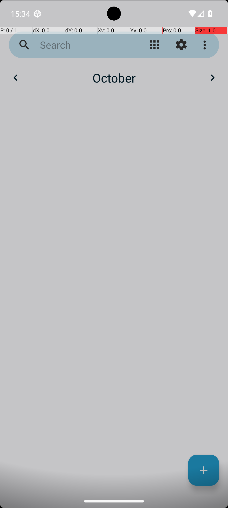

# 12 — SimpleCalendarAddOneEvent

## Quick links

- **Goal:** *"In Simple Calendar Pro, create a calendar event on 2023-10-20 at 18h with the title 'Call with Alice' and the description 'We will prepare for upcoming project milestones.'. The event should last for 30 mins."*
- **History:** F → S (rescued at R1)
- **Step budget:** 40 (`max_n_steps`)
- **Evaluator:** [`SimpleCalendarAddOneEvent`](../../MARS-Voyager/androidworld/android_world/task_evals/single/calendar/calendar.py#L85) — checks the Simple Calendar Pro database for a matching event with start time, duration, title, and description.
- **Trajectory folder:** [`SimpleCalendarAddOneEvent/`](../../MARS-Voyager/eval_results/UI-Voyager/results/20260426203107_reformatted/SimpleCalendarAddOneEvent/)
- **Image folder:** [`images/`](../../MARS-Voyager/eval_results/UI-Voyager/results/20260426203107/SimpleCalendarAddOneEvent/images/)

## What "success" requires (evaluator)

A row in the Simple Calendar Pro events DB matching all of: date 2023-10-20, start time 18:00, duration 30 min, title "Call with Alice", description as specified. Field equality on each.

## What the agent saw at the divergence step

Steps 0–1 are byte-identical (open app drawer → tap Simple Calendar Pro icon). The post-tap screenshot at step 2 shows the calendar app **mid-load** — the "October" header is rendered but the calendar grid is blank, the `+` FAB is present:

*Step 2 screenshot (same in R0 and R1) — calendar header shown, grid empty, app still finishing first-paint*

The two rounds reasoned over this same screenshot differently:

| Round 0 (FAIL) — step 3 | Round 1 (PASS) — step 3 |
|---|---|
| Thought: *"To create a new event, I need to tap the '+' button at the bottom right corner of the screen. This is typically how apps allow users to add new entries."* | Thought: *"The app is likely still loading or there's an issue with the initial load. Since the goal is to create a calendar event, I should first ensure the app is fully loaded and interactive."* |
| Action: `click [891, 923]` — tap '+' immediately on a not-fully-loaded UI | Action: `wait 2s` — let the app finish loading |

## What actually happened

R0's step-3 tap of the FAB happened **before the calendar had fully initialized**. Tapping a FAB during app initialization can hit different elements depending on the layout state — possibly hitting an animating view, possibly missing the button entirely, possibly opening a different dialog than the user intends. R0's subsequent steps reflect this: it claims to tap "October 20th" on the calendar, then taps the '+' again, then claims to tap "Event button at the bottom right" — repeated UI-mismatch confusion. The trajectory consumed all 34 of its allowed steps and never converged on a saved event matching the requirements.

R1's step-3 `wait 2s` cost one step but bought a fully-loaded calendar UI for the next observation. From there the agent clicked the '+' on a stable layout and proceeded through the standard new-event flow, completing in 22 steps.

The deciding factor is a single decision the model made at step 3: trust the screenshot literally vs. notice the mid-load state. There's no evidence either round had a different env condition at this step — the screenshots look comparable. This is more about model interpretation than env state, *but* the upstream cause is that **the harness presented a mid-load screenshot to the model in the first place**.

The worker log shows `Skipping app snapshot loading` for `com.simplemobiletools.calendar.pro` for both rounds and `Could not get a11y tree on attempt 1/5; retrying in 2.0s.` — env-side conditions are otherwise comparable.

## Android concepts introduced

- **First-paint vs interactive.** When an Android app launches, the first frame may render before the app's data layer (DB queries, network calls) has finished loading. The user sees the chrome (toolbar, FAB, header) but the content area is empty or skeleton. Tapping during this window can produce non-obvious behaviour because the UI hierarchy is still mutating.

## Root cause and category

**Proximate cause:** R0 tapped the FAB before the calendar was fully loaded; R1 waited 2s and then tapped on a stable UI. Same starting screenshot, different model decision.

**Upstream environmental cause:** the harness's "screenshot immediately after action" semantics presented a mid-load app screen to the model. Same root issue as [§10 OsmAndFavorite](10-osmand-favorite.md) — the harness has no wait-for-idle.

**Category:** **Cat 5 (mid-load UI snapshot, async render timing)** — primarily the same root issue as §10. R1's "wait" was a workaround that the agent happened to think of; R0 didn't.

**Verdict:** **env bug — should fix.** The harness should not be feeding mid-load app screens to the agent, or the agent's tooling should expose a "wait for idle" primitive.

## Suggested fix

Same family as [§10 OsmAndFavorite](10-osmand-favorite.md): add a wait-for-idle (or fixed-duration settle delay) after `click`-style actions, especially after launching an app from a fresh start. UIAutomator's `waitForIdle()` is the standard primitive. With this in place, R0 would have seen a fully-loaded calendar at step 2 and almost certainly taken the same direct path R1 took.
