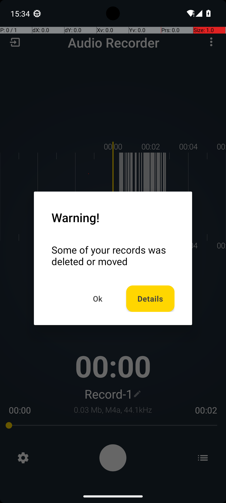

# 14 — AudioRecorderRecordAudioWithFileName

## Quick links

- **Goal:** *"Record an audio clip and save it with name '2023_06_24_training.m4a' using Audio Recorder app."*
- **History:** F → S (rescued at R1)
- **Step budget:** 20 (`max_n_steps`)
- **Evaluator:** [`AudioRecorderRecordAudioWithFileName`](../../MARS-Voyager/androidworld/android_world/task_evals/single/audio_recorder.py) — checks the Audio Recorder's saved-files directory for a file named exactly "2023_06_24_training.m4a".
- **Trajectory folder:** [`AudioRecorderRecordAudioWithFileName/`](../../MARS-Voyager/eval_results/UI-Voyager/results/20260426203107_reformatted/AudioRecorderRecordAudioWithFileName/)
- **Image folder:** [`images/`](../../MARS-Voyager/eval_results/UI-Voyager/results/20260426203107/AudioRecorderRecordAudioWithFileName/images/)

## What "success" requires (evaluator)

A file named exactly `2023_06_24_training.m4a` must exist in the Audio Recorder app's storage directory at terminate time. The filename match is exact — any prefix or suffix difference fails.

## What the agent saw at the divergence step

Steps 0–1 are identical: open app drawer → tap Audio Recorder. The post-launch screenshot at step 2 (the input to step-3 reasoning) is fundamentally different:

| Round 0 (FAIL) | Round 1 (PASS) |
|---|---|
|  |  |
| *R0 — Audio Recorder app showing a **"Warning! Some of your records was deleted or moved"** modal dialog with OK/Details buttons. Behind the dialog: full recording UI with "Record-1" filename, "00:00" timer, audio waveform visible.* | *R1 — Clean Audio Recorder splash: just a centered red REC button on dark blue background. No previous-recording state, no warning dialog.* |

**R0 step 3 thought:** *"…I am now at a prompt that shows a warning about deleted or moved records. To proceed with recording an audio clip, I need to dismiss this message by tapping 'OK.'"*
**R0 step 3 action:** `click [411, 601]` — dismisses the warning dialog. Now exposed to the recording UI which already had filename "Record-1" pre-populated.

**R1 step 3 thought:** *"…I need to ensure that the app is ready to start recording. By tapping the record button, I will initiate the recording process…"*
**R1 step 3 action:** `click [499, 499]` — taps the central REC button immediately to begin recording.

## What actually happened

R0 inherited a populated Audio Recorder database from earlier in the eval suite (an earlier task — likely [`AudioRecorderRecordAudio`](../../MARS-Voyager/eval_results/UI-Voyager/results/20260426203107_reformatted/AudioRecorderRecordAudio/) — created some recordings, and at some point between then and R0's start the underlying audio files were removed but the DB rows were not). When the app launched, it cross-checked DB rows vs disk files, found a mismatch, and posted the "Warning!" modal. The app's filename field defaulted to "Record-1" (the next sequence in the DB). After R0 dismissed the warning, it spent steps 5–19 trying to rename the auto-populated filename to the required `2023_06_24_training.m4a`, never successfully.

R1's app data was apparently in a clean enough state that no warning dialog was triggered and no prior-recording filename was pre-populated. The agent had a clean splash with just the REC button, started recording, stopped, named the file `2023_06_24_training.m4a` directly, and saved.

The cause of the differing app state: [`restore_snapshot`](../../MARS-Voyager/androidworld/android_world/utils/app_snapshot.py#L81) was skipped for `com.dimowner.audiorecorder` in both rounds (worker log: `Skipping app snapshot loading : Snapshot not found in /data/data/android_world/snapshots/com.dimowner.audiorecorder`), and there is no equivalent of `clear_app_data` for this task. So whatever DB state was left from prior tasks persisted into both rounds. The reason R0 saw the warning and R1 didn't is timing: R0 ran near `AudioRecorderRecordAudio` whose recordings were still in the DB but whose files might have been removed by a clean-up between tasks. By R1's run, either the DB had been further mutated or the files had been re-created — the env state happened to be more forgiving.

## Android concepts introduced

- **Stale-DB-vs-disk-files mismatch.** Many apps store metadata about user-created files in their own SQLite DB and store the files themselves in a media directory. If the directory is wiped externally (e.g. by `pm clear` on a *different* package that shares storage, or by a snapshot restore that targets only the app data and not media files) but the DB rows survive, the next launch sees rows pointing to non-existent files and typically posts an error/warning dialog. This is a class of "auxiliary table" persistence (Cat 2): the Audio Recorder DB contains state that init didn't reset.

## Root cause and category

**Proximate cause:** R0's Audio Recorder app launched into a "warning + pre-populated filename" state inherited from prior task runs. R0 spent its budget trying to rename the auto-named recording. R1 launched into a clean state.

**Upstream environmental cause:** snapshot restore was skipped (Cat 3) and no other init step resets the app's DB or shared_prefs (Cat 2). Auxiliary state from prior tasks leaked into the current task's UI.

**Categories:** **Cat 2 (aux state) + Cat 3 (snapshot restore failure).**

**Verdict:** **env bug — should fix.** The eval cannot rely on the agent successfully renaming a recording when the renaming UI is in different states across rounds. The env should present a clean Audio Recorder DB at task start.

## Suggested fix

1. **Add a `_close_audio_recorder_app` analogue** for AudioRecorder tasks that runs `clear_app_data` on `com.dimowner.audiorecorder` during init, or explicitly wipes the recordings directory + DB. The current `_initialize_apps` only attempts snapshot restore; for apps without a saved snapshot, no fallback init runs.
2. **More generally:** for any app where the eval depends on a clean state, init should fall back to `clear_app_data` when snapshot restore fails. A change to [`_initialize_apps`](../../MARS-Voyager/androidworld/android_world/task_evals/task_eval.py#L116) to do `clear_app_data` on `RuntimeError` from `restore_snapshot` would fix this entire class of "skipped snapshot → stale state" issue.
