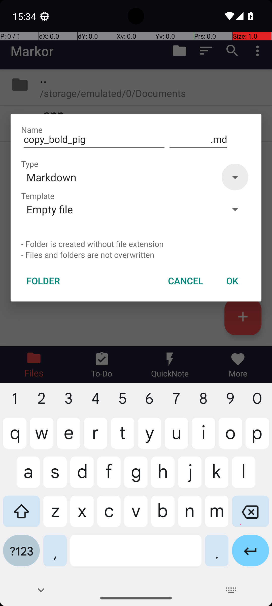
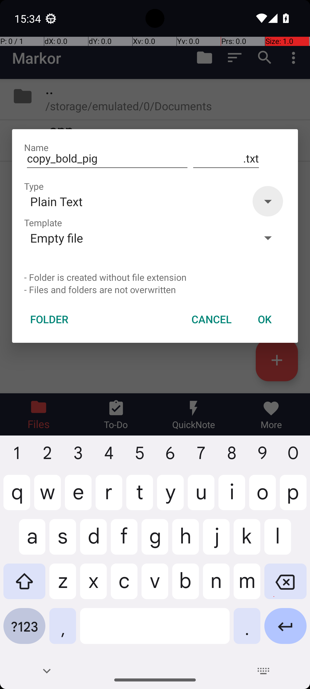

# 15 — MarkorCreateNoteFromClipboard

## Quick links

- **Goal:** *"Create a note in Markor named copy_bold_pig.txt. Perform a paste operation in the note and save the note."*
- **History:** F → S (rescued at R1)
- **Step budget:** 14 (`max_n_steps`)
- **Evaluator:** [`MarkorCreateNoteFromClipboard`](../../MARS-Voyager/androidworld/android_world/task_evals/single/markor.py) — checks that a file named exactly `copy_bold_pig.txt` exists in Markor's notes directory and contains the clipboard content.
- **Trajectory folder:** [`MarkorCreateNoteFromClipboard/`](../../MARS-Voyager/eval_results/UI-Voyager/results/20260426203107_reformatted/MarkorCreateNoteFromClipboard/)
- **Image folder:** [`images/`](../../MARS-Voyager/eval_results/UI-Voyager/results/20260426203107/MarkorCreateNoteFromClipboard/images/)

## What "success" requires (evaluator)

A file with the exact name `copy_bold_pig.txt` (extension `.txt` required) in Markor's notes directory, containing the system clipboard text the eval seeded earlier. Filename mismatch (e.g. `copy_bold_pig.md`) fails.

## What the agent saw at the divergence step

Steps 0–4 are identical (open app drawer → Markor → wait → tap "+" FAB → type filename "copy_bold_pig"). The post-type screenshot shows the Markor "Create new file" dialog — and the **default extension differs**:

| Round 0 (FAIL) | Round 1 (PASS) |
|---|---|
|  |  |
| *R0 — dialog shows Name "copy_bold_pig", **extension suffix ".md"**, Type "Markdown".* | *R1 — same dialog with same Name, but **extension suffix ".txt"**, Type "Plain Text".* |

R0 needs to change the type from Markdown → Plain Text to get `.txt`; R1 already has `.txt` as default and just needs to confirm.

**R0 step 6:** `click [841, 306]` — attempt to open the Type dropdown. It didn't open (or opened and the click missed the right item).
**R0 steps 7–14:** eight repeated clicks at `[870, 315]` and `[870, 310]` — same position over and over, the agent stuck trying to interact with the Type dropdown that wasn't responding to its taps.

**R1 step 6:** `click [858, 472]` — taps the OK button. Dialog closes, file is created as `copy_bold_pig.txt`.
**R1 steps 7–10:** focus the editor, paste, save, terminate. Done.

## What actually happened

Markor remembers the user's "last used file type" in its `SharedPreferences`. R0's preference was `Markdown` (default extension `.md`); R1's preference was `Plain Text` (default extension `.txt`). The eval's task setup did not reset this preference. Result: R0 had to change type before saving, R1 didn't.

R0's change-the-type attempts looped at the same coordinate eight times. The Type field is a Material dropdown; tapping the dropdown arrow opens a menu, then a second tap on the menu selects an option. R0 was tapping at `[870, 315]` repeatedly which is in the dropdown arrow region; either the click missed by a few pixels, or the dropdown was opening + closing on each tap without time to render its menu. The repetitive pattern with no observation in between suggests the model never saw the dropdown menu visible, so it kept assuming "I need to click the dropdown again".

The `Skipping app snapshot loading : Snapshot not found in /data/data/android_world/snapshots/net.gsantner.markor` warning appears for both rounds in the worker log — Markor's `/data/data/<pkg>` (including `shared_prefs/`) was not reset across rounds. Whatever the prior task left in Markor's prefs persisted.

## Android concepts introduced

- **Material dropdown menu interaction.** Material Design dropdowns in Android show an arrow on the right; tapping it expands a menu of options. A tap that lands just outside the arrow target may not open the menu at all. And once opened, the menu can collapse back if the next tap doesn't land on a menu item. Coordinate-driven agents that don't verify "did the menu open" between taps can stall on this kind of UI.

## Root cause and category

**Proximate cause:** Markor's default file-type preference differed across rounds; R0 needed to change it (and failed), R1 did not.

**Upstream environmental cause:** `shared_prefs` persistence — Markor's last-used file type carried over from prior tasks because snapshot restore was skipped and no `clear_app_data` was run.

**Categories:** **Cat 2 (shared_prefs persistence)** + **Cat 6 (agent stuck in dropdown-tap loop, didn't recognize the menu wasn't opening).**

**Verdict:** **env bug — should fix.** Same root cause as [§14 AudioRecorder](14-audio-recorder-filename.md): when snapshot restore fails, fall back to `clear_app_data` so the app starts with default prefs.

## Suggested fix

Same general fix from [§14](14-audio-recorder-filename.md): in [`_initialize_apps`](../../MARS-Voyager/androidworld/android_world/task_evals/task_eval.py#L116), on `restore_snapshot` failure, fall back to `clear_app_data` for the affected package. This guarantees default prefs (including default file type = Markdown — but at least it's deterministic, and the canonical task setup can then explicitly set `last_used_file_type = .txt` if needed).

A complementary fix on the Markor task evaluator side: have the task setup explicitly write the desired default file type into Markor's shared_prefs before launching the app, so the agent always sees `.txt` as default for `.txt` tasks and `.md` for `.md` tasks.
