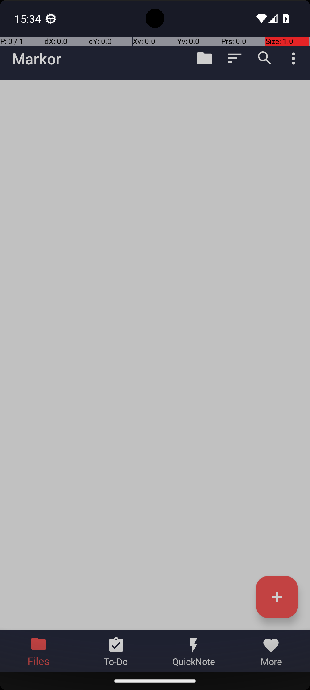
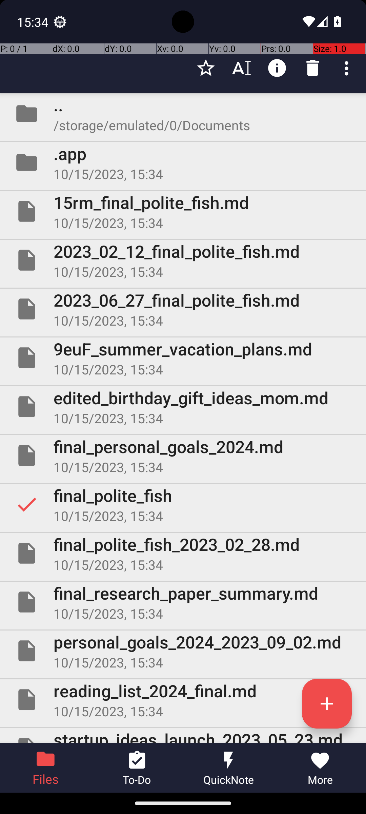
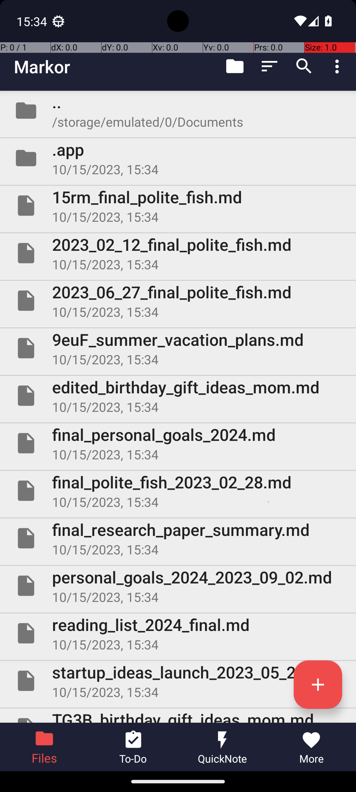

# 16 — MarkorDeleteNote

## Quick links

- **Goal:** *"Delete the note in Markor named final_polite_fish."*
- **History:** F → F → S (rescued at R2)
- **Step budget:** 10 (`max_n_steps`)
- **Evaluator:** [`MarkorDeleteNote.is_successful`](../../MARS-Voyager/androidworld/android_world/task_evals/single/markor.py#L303) — delegates to [`DeleteFile.is_successful`](../../MARS-Voyager/androidworld/android_world/task_evals/common_validators/file_validators.py#L154), which passes only when `final_polite_fish` no longer exists.
- **Setup:** [`MarkorDeleteNote.initialize_task`](../../MARS-Voyager/androidworld/android_world/task_evals/single/markor.py#L299) — clears Markor's note directory, creates the target file, then creates many similarly named noise files.
- **Trajectory folder:** [`MarkorDeleteNote/`](../../MARS-Voyager/eval_results/UI-Voyager/results/20260426203107_reformatted/MarkorDeleteNote/)
- **Image folder:** [`images/`](../../MARS-Voyager/eval_results/UI-Voyager/results/20260426203107/MarkorDeleteNote/images/)

## What "success" requires (evaluator)

The evaluator does not care what Markor shows on screen. It checks the device filesystem under Markor's notes directory and returns success only if the exact target file `final_polite_fish` is gone. Near matches such as `15rm_final_polite_fish.md` and `final_polite_fish_2023_02_28.md` must remain irrelevant noise files.

## What the agent saw at the divergence step

R1 and R2 share the same first two actions, but diverge immediately after launching Markor. R1 sees only Markor's splash/loading screen and taps the center again; R2 sees the Markor file list and scrolls.

| Round 1 (FAIL) | Round 2 (PASS) |
|---|---|
|  |  |
| *R1 step 2 — Markor is still on the splash/loading screen, so the agent taps the center of the screen.* | *R2 step 2 — Markor has loaded the empty-looking file-list shell, so the agent scrolls down to find the target.* |

**R1 step 3 thought:** *"I need to delete the file named "final_polite_fish" in the Markor app. To do this, I first need to open the app and locate the file. The current screen shows the Markor app icon, which is the first step in accessing the app."*
**R1 step 3 action:** `click [499, 499]`

**R2 step 3 thought:** *"I need to delete the file named "final_polite_fish." Since it's not visible in the current view, I should scroll through the list to locate it."*
**R2 step 3 action:** `swipe [499, 817] → [491, 219]`

Supporting R0 failure mode:

| R0 misclick | R0 after first delete |
|---|---|
|  |  |
| *R0 step 4 — target is selected, but the next click is `[870, 6]`, above the visible trash icon.* | *R0 step 7 — after confirming delete, the exact `final_polite_fish` row is gone, but the agent does not terminate and keeps acting on near-match files.* |

## What actually happened

R0 initially followed the right plan: open Markor, long-press `final_polite_fish`, and delete it. But at step 5 it clicked `[870, 6]`, far above the visible trash icon, wasting a step. It corrected the click at step 6, confirmed deletion at step 7, and the step-7 screenshot shows the exact target row is gone. Instead of terminating, it long-pressed the near-match file `final_polite_fish_2023_02_28.md`, opened another delete dialog, and exhausted the 10-step budget; the worker log records `Agent did not indicate task is done. Reached max number of steps.`

R1 failed earlier. After launching Markor, the screenshot was still the splash screen; the agent tapped the center and ended up in an existing editor view for `edited_birthday...`, not the file list. It then saved, scrolled, tapped the bottom toolbar trash icon, and terminated even though the target file had never been selected or deleted. R2 saw the file list after launch, scrolled once, selected the exact `final_polite_fish` row, tapped the visible trash icon, confirmed the dialog, and terminated.

The worker log around R0 includes two `Could not get a11y tree` retries before setup and `Skipping app snapshot loading : Snapshot not found in /data/data/android_world/snapshots/net.gsantner.markor`. The snapshot warning is expected for all Markor rounds in this run and matters because Markor app state outside `/storage/emulated/0/Documents/markor` can persist even though [`Markor.initialize_task`](../../MARS-Voyager/androidworld/android_world/task_evals/single/markor.py#L60) clears the note directory.

## Android concepts introduced

- **Last-opened document state.** Note editors often remember the last opened file and restore the editor screen on next launch. Clearing the notes directory does not necessarily clear app-level launch state stored in app data or `shared_prefs`; the app can reopen a stale editor even after the task's files were regenerated.

## Root cause and category

**Proximate cause:** R1 launched into stale/slow Markor state and never selected the target; R0 deleted the target but failed to terminate after wasting steps on a top-edge trash misclick and a near-match file.

**Upstream environmental cause:** Markor's app data/snapshot state was not reset (`Skipping app snapshot loading`), so the first useful Markor observation differed across rounds even though the task files were regenerated.

**Categories:** **Cat 2 (shared_prefs / last-opened editor state)** + **Cat 6 (agent over-actions and failure to terminate).**

**Verdict:** **mostly agent-side — env mitigation worth doing.** R1 is a real env presentation problem: the app launched into a different state. R0 is mostly agent error after a successful deletion. Resetting Markor app data would make the launch surface deterministic, but the agent still needs to terminate when the target disappears.

## Suggested fix

In [`_initialize_apps`](../../MARS-Voyager/androidworld/android_world/task_evals/task_eval.py#L116), fall back to `clear_app_data` for `net.gsantner.markor` when snapshot restore is skipped or missing, then recreate the Markor note directory and task files. For delete tasks specifically, consider an evaluator-side auto-success check at step-budget exhaustion when the target file is already gone; that would avoid marking "deleted but forgot to terminate" as a functional failure.
