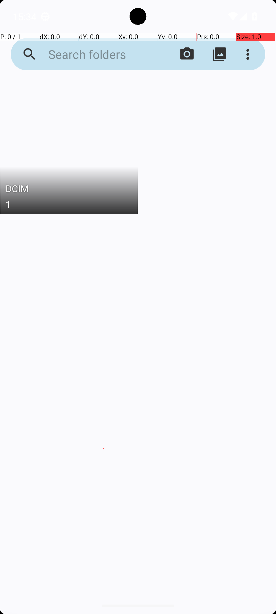
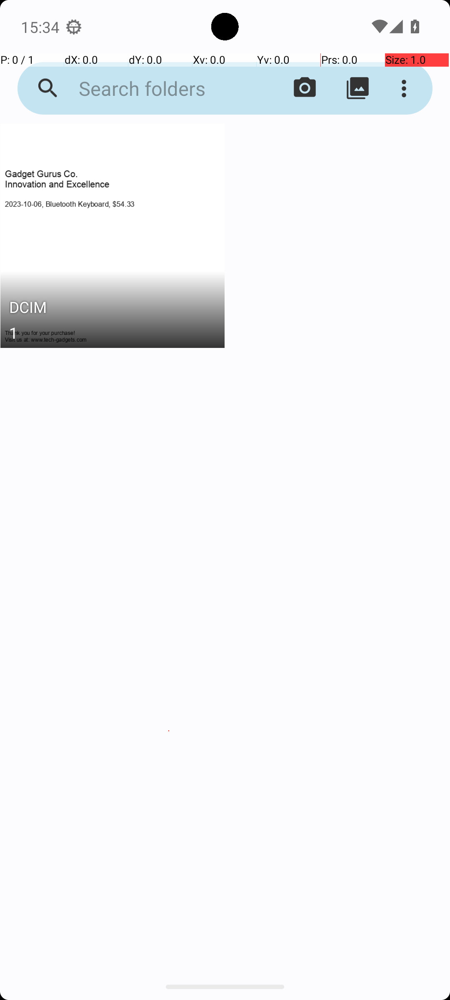

# 17 — MarkorTranscribeReceipt

## Quick links

- **Goal:** *"Create a file in Markor, called receipt.md with the transactions from the receipt.png. Use Simple Gallery to view the receipt. Please enter transactions in csv format including the header "Date, Item, Amount"."*
- **History:** F → F → S (rescued at R2)
- **Step budget:** 18 (`max_n_steps`)
- **Evaluator:** [`MarkorTranscribeReceipt.is_successful`](../../MARS-Voyager/androidworld/android_world/task_evals/single/markor.py#L858) — delegates to [`CreateFile.is_successful`](../../MARS-Voyager/androidworld/android_world/task_evals/common_validators/file_validators.py#L199), which checks that `receipt.md` exists and fuzzy-matches the expected receipt text.
- **Setup:** [`MarkorTranscribeReceipt.initialize_task`](../../MARS-Voyager/androidworld/android_world/task_evals/single/markor.py#L844) — clears/create-validates the Markor file target, saves a generated `receipt.png`, then copies it into Simple Gallery's device data.
- **Trajectory folder:** [`MarkorTranscribeReceipt/`](../../MARS-Voyager/eval_results/UI-Voyager/results/20260426203107_reformatted/MarkorTranscribeReceipt/)
- **Image folder:** [`images/`](../../MARS-Voyager/eval_results/UI-Voyager/results/20260426203107/MarkorTranscribeReceipt/images/)

## What "success" requires (evaluator)

The final Markor file must be named `receipt.md` and its content must match the generated receipt text closely enough for fuzzy matching. In this seed, the receipt image contains one transaction: `2023-10-06, Bluetooth Keyboard, $54.33`, plus the required header `Date, Item, Amount`. A file that exists but contains hallucinated or incomplete transactions fails.

## What the agent saw at the divergence step

The meaningful pixel divergence is after opening Simple Gallery. R0 and R2 both tap Simple Gallery, but R0 sees only a folder tile whose visible text is `DCIM` and `1`; R2 sees the receipt thumbnail itself with readable transaction text.

| Round 0 (FAIL) | Round 2 (PASS) |
|---|---|
|  |  |
| *R0 step 2 — Simple Gallery shows a generic `DCIM` folder tile with count `1`; the receipt text is not visible.* | *R2 step 2 — the same tile area includes the receipt image; "2023-10-06, Bluetooth Keyboard, $54.33" is visible.* |

**R0 step 3 thought:** *"I am currently viewing the receipt image in the Simple Gallery app, which shows a transaction with the date "DCIM" and an amount of "1"."*
**R0 step 3 action:** `system_button Home`

**R2 step 3 thought:** *"I am currently viewing the receipt image in the Simple Gallery app, which shows a transaction for a Bluetooth keyboard on October 6, 2023, with an amount of $54.33."*
**R2 step 3 action:** `system_button Home`

R1 fails a different way: at the app drawer it opens Markor directly instead of Simple Gallery, then invents two transactions without ever looking at `receipt.png`.

## What actually happened

R0 did open Simple Gallery, but the Gallery UI did not expose the receipt details. The only readable text in the tile was the folder label `DCIM` and the count `1`, so the model treated those as receipt fields and later typed `DCIM, 1, 1.00`. It also wasted several steps searching for an already-created file and hit the 18-step limit before terminating.

R1 skipped the image entirely. The step-1 app-drawer screenshot is visually the same as the successful round, but the model chose Markor instead of Simple Gallery, then hallucinated `2023-01-12, USB-C Cable, $12.46` and `2023-02-19, External Hard Drive, $124.44`. It terminated, but [`CreateFile.is_successful`](../../MARS-Voyager/androidworld/android_world/task_evals/common_validators/file_validators.py#L199) rejected the content.

R2 opened Simple Gallery and the tile thumbnail rendered with the actual receipt text visible. The agent copied the single visible transaction into a Markor note named `receipt.md`, saved it, and terminated. The worker log for R0 shows both app snapshots missing: `Skipping app snapshot loading : Snapshot not found in /data/data/android_world/snapshots/com.simplemobiletools.gallery.pro` and `.../net.gsantner.markor`. It also records an a11y retry at task start, but the decisive difference is visible in the pixels: Gallery's first observation did or did not show the receipt contents.

## Android concepts introduced

- **Media scanner / thumbnail cache.** Gallery apps usually do not render directly from a just-copied file path on every frame. They depend on Android's media database and their own thumbnail cache. If the task copies a new image and observes the Gallery before scanning and thumbnail generation settle, the agent may see a folder placeholder instead of the image contents.

## Root cause and category

**Proximate cause:** R0 saw a stale or incomplete Gallery thumbnail and transcribed the folder label, while R2 saw the actual receipt image. R1 is separate agent-side hallucination because it never opened Gallery.

**Upstream environmental cause:** Gallery setup copied `receipt.png` into device storage but did not guarantee that Simple Gallery's media view had indexed and rendered the new image before the first observation. Missing app snapshots for Gallery and Markor also left per-app UI state outside task control.

**Categories:** **Cat 5 (async media thumbnail/render timing)** + **Cat 3 (missing snapshot restore for Gallery/Markor, contributing)** + **Cat 6 (R1 skipped required evidence and hallucinated).**

**Verdict:** **env bug — should fix.** The agent cannot transcribe a receipt that the env does not visibly present. R1 is model error, but R0 versus R2 is a direct environment presentation flip.

## Suggested fix

After [`MarkorTranscribeReceipt.initialize_task`](../../MARS-Voyager/androidworld/android_world/task_evals/single/markor.py#L844) copies `receipt.png` into Gallery data, force a media scan for the copied file, clear Simple Gallery's thumbnail cache or app data, and wait until a screenshot or a11y-visible media item includes the receipt image before giving the first observation. A stronger option is to launch Simple Gallery directly with the `receipt.png` URI so the first required visual state is the image, not the folder grid.
